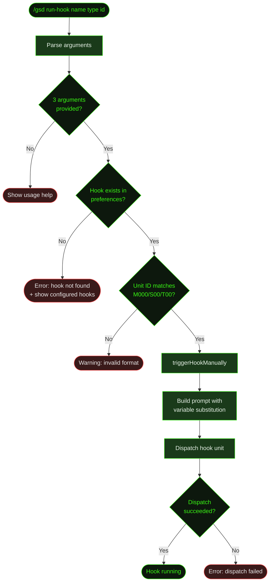

## What It Does

`/gsd run-hook` manually triggers a named post-unit hook for a specific unit. This bypasses the normal auto-mode flow where hooks fire automatically after unit completion — instead, you pick exactly which hook to run, on which unit type, for which unit ID.

Use this when you want to re-run a hook that already completed (e.g., run code review again after manual edits), or trigger a hook outside the normal auto-mode pipeline.

## Usage

```
/gsd run-hook <hook-name> <unit-type> <unit-id>
```

| Argument | Description | Example |
|----------|-------------|---------|
| `hook-name` | The name of the hook to trigger | `code-review` |
| `unit-type` | The type of unit that serves as the trigger context | `execute-task` |
| `unit-id` | The unit ID in `M001/S01/T01` format | `M001/S01/T03` |

### Unit Types

| Unit type | Unit ID format | Description |
|-----------|---------------|-------------|
| `execute-task` | `M001/S01/T01` | Task execution |
| `plan-slice` | `M001/S01` | Slice planning |
| `research-milestone` | `M001` | Milestone research |
| `complete-slice` | `M001/S01` | Slice completion |
| `complete-milestone` | `M001` | Milestone completion |

## How It Works



### Validation

The command runs three checks before dispatching:

1. **Argument count** — Requires exactly 3 positional arguments. Shows usage help with all unit types and examples if fewer are provided.
2. **Hook existence** — Looks up the hook name in `getHookStatus()`. If not found, shows an error with the full list of configured hooks.
3. **Unit ID format** — Validates against the pattern `M\d{3}/S\d{2,3}/T\d{2,3}`. Shows a warning if the format doesn't match.

### Dispatch

Once validated, the command:

1. Calls `triggerHookManually()` which resets active hook state, builds the prompt with `{milestoneId}`, `{sliceId}`, `{taskId}` variable substitution, and increments the cycle counter.
2. Dispatches the hook unit via `dispatchHookUnit()`, which bypasses normal pre-dispatch hooks — the manual trigger runs directly.
3. The hook runs as a fresh agent context window, just like it would during auto-mode.

### Idempotency Bypass

Unlike normal auto-mode hook execution, manual triggering via `/gsd run-hook` bypasses the artifact idempotency check. If the hook already produced its artifact (e.g., a review file), it still runs again. This is intentional — manual triggering implies you want to re-run.

## What Files It Touches

### Reads

| File | Purpose |
|------|---------|
| `.gsd/preferences.md` | Look up hook configuration by name |
| `.gsd/hook-state.json` | Current cycle counts for the hook |

### Writes

| File | Purpose |
|------|---------|
| `.gsd/hook-state.json` | Updated cycle count after dispatch |
| Hook-specific artifacts | Whatever the hook's prompt produces (e.g., review files) |

## Examples

Running a code review hook on a completed task:

```
> /gsd run-hook code-review execute-task M001/S01/T03

Manually triggering hook: code-review for execute-task M001/S01/T03
```

When the hook doesn't exist:

```
> /gsd run-hook spellcheck execute-task M001/S01/T01

✖ Hook "spellcheck" not found. Configured hooks:

Post-Unit Hooks (run after unit completes):
  code-review [enabled] → after: execute-task
```

## Related Commands

- [`/gsd hooks`](../hooks/) — View all configured hooks and their status
- [`/gsd prefs`](../prefs/) — Configure hooks in preferences
- [`/gsd auto`](../auto/) — Hooks run automatically during auto-mode execution
