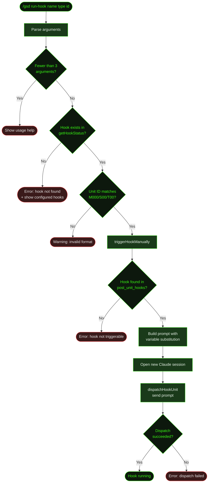

## What It Does

`/gsd run-hook` manually triggers a named post-unit hook for a specific unit. This bypasses the normal auto-mode flow where hooks fire automatically after unit completion — instead, you pick exactly which hook to run, on which unit type, for which unit ID.

Use this when you want to re-run a hook that already completed (e.g., run code review again after manual edits), or trigger a hook outside the normal auto-mode pipeline.

Note that `/gsd run-hook` only works with **post-unit hooks** (configured under `post_unit_hooks` in preferences). Pre-dispatch hooks appear in the hook list but cannot actually be triggered this way — passing a pre-dispatch hook name will fail before dispatch, because the trigger engine only searches post-unit hook configurations.

## Usage

```
/gsd run-hook <hook-name> <unit-type> <unit-id>
```

| Argument | Description | Example |
|----------|-------------|---------|
| `hook-name` | The name of the hook to trigger | `code-review` |
| `unit-type` | The type of unit that serves as the trigger context | `execute-task` |
| `unit-id` | The unit ID in `M001/S01/T01` format | `M001/S01/T03` |

### Unit ID Format

The unit ID must be in **task-level format** (`M001/S01/T01`) regardless of which unit type you specify. The validator enforces this pattern — slice-level (`M001/S01`) or milestone-level (`M001`) IDs will be rejected with a warning.

### Unit Types

The following unit types are recognized by the hook engine and appear in the usage help:

| Unit type | Description |
|-----------|-------------|
| `execute-task` | Task execution |
| `plan-slice` | Slice planning |
| `research-milestone` | Milestone research |
| `complete-slice` | Slice completion |
| `complete-milestone` | Milestone completion |

## How It Works



### Validation

The command runs three checks before dispatching:

1. **Argument count** — Requires at least 3 positional arguments. Shows usage help with all unit types and examples if fewer are provided.
2. **Hook existence** — Looks up the hook name via `getHookStatus()`. If not found, shows an error with the full list of configured hooks (both post-unit and pre-dispatch). Note: only post-unit hooks can actually be triggered — passing a pre-dispatch hook name passes this check but fails at the trigger step, because `triggerHookManually` only searches `post_unit_hooks` configurations.
3. **Unit ID format** — Validates against the pattern `M\d{3}/S\d{2,3}/T\d{2,3}` (task-level only). Returns a warning and stops if the format doesn't match. Slice-level IDs like `M001/S01` are not accepted even when the unit type implies a slice-level context.

### Dispatch

Once validated, the command:

1. Calls `triggerHookManually()` which sets the active hook state, populates a single-entry hook queue, performs `{milestoneId}`, `{sliceId}`, `{taskId}` variable substitution on the hook's prompt, and increments the cycle counter.
2. Opens a **new Claude session** via `dispatchHookUnit()`. If auto-mode is not already active, it starts in step mode first.
3. Applies a model override if the hook's configuration specifies one.
4. Writes a lock file (`auto.lock`), starts a hard timeout (default 30 minutes), and sends the prompt.
5. The hook runs in the new session window, just like it would during auto-mode.

### Idempotency Bypass

Unlike normal auto-mode hook execution, manual triggering via `/gsd run-hook` bypasses the artifact idempotency check. If the hook already produced its artifact (e.g., a review file), it still runs again. This is intentional — manual triggering implies you want to re-run regardless of prior output.

## What Files It Touches

### Reads

| File | Purpose |
|------|---------|
| `.gsd/preferences.md` | Look up hook configuration and prompt by name |
| `.gsd/hook-state.json` | Restore existing cycle counts before incrementing |

### Writes

| File | Purpose |
|------|---------|
| `.gsd/auto.lock` | Session lock file updated for the hook unit |
| `.gsd/hook-state.json` | Cycle count for this hook+trigger persisted to disk |
| Hook-specific artifacts | Whatever the hook's prompt produces (e.g., review files in the task directory) |

## Examples

Running a code review hook on a completed task:

```
> /gsd run-hook code-review execute-task M001/S01/T03

Manually triggering hook: code-review for execute-task M001/S01/T03
```

When the hook doesn't exist:

```
> /gsd run-hook spellcheck execute-task M001/S01/T01

Hook "spellcheck" not found. Configured hooks:

Post-Unit Hooks (run after unit completes):
  code-review [enabled] → after: execute-task
```

When no arguments are provided, the full usage help is shown:

```
> /gsd run-hook

Usage: /gsd run-hook <hook-name> <unit-type> <unit-id>

Unit types:
  execute-task       - Task execution (unit-id: M001/S01/T01)
  plan-slice         - Slice planning (unit-id: M001/S01)
  research-milestone - Milestone research (unit-id: M001)
  complete-slice     - Slice completion (unit-id: M001/S01)
  complete-milestone - Milestone completion (unit-id: M001)

Examples:
  /gsd run-hook code-review execute-task M001/S01/T01
  /gsd run-hook lint-check plan-slice M001/S01
```

## Related Commands

- [`/gsd hooks`](../hooks/) — View all configured hooks and their status
- [`/gsd prefs`](../prefs/) — Configure hooks in preferences
- [`/gsd auto`](../auto/) — Hooks run automatically during auto-mode execution
