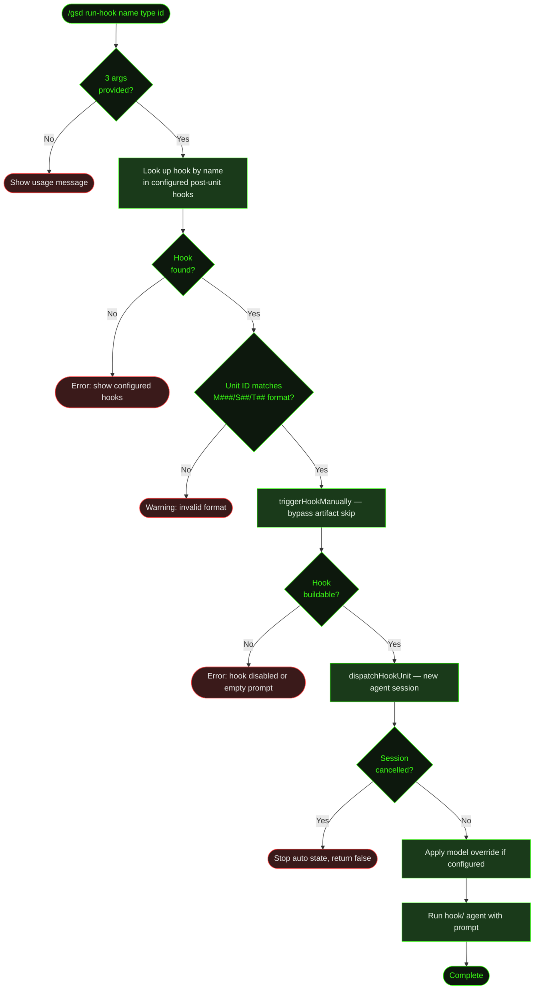

## What It Does

`/gsd run-hook` fires a named post-unit hook on demand, outside of the normal auto-mode dispatch loop. You give it the hook name, a unit type, and a unit ID, and GSD creates a new agent session running that hook's prompt — exactly as auto-mode would, except it bypasses the artifact-based skip check, so the hook runs even if the artifact file already exists.

The main use cases are:

- **Testing a new hook configuration** before turning it loose in auto mode
- **Re-running a review** on work that was already committed, without re-executing the task
- **Debugging hook prompts** — see exactly what the hook agent produces in isolation

`/gsd run-hook` only works with post-unit hooks (`post_unit_hooks` in preferences). Pre-dispatch hooks intercept before dispatch and cannot be manually invoked. To view all configured hooks and their current state, use [`/gsd hooks`](../hooks/).

## Usage

```
/gsd run-hook <hook-name> <unit-type> <unit-id>
```

All three arguments are required:

| Argument | Description |
|----------|-------------|
| `hook-name` | The `name` field of the hook as defined in preferences |
| `unit-type` | The unit type to simulate as the trigger |
| `unit-id` | The task-level unit ID, in `M001/S01/T01` format |

Running the command without arguments shows usage:

```
/gsd run-hook
→ Usage: /gsd run-hook <hook-name> <unit-type> <unit-id>
```

**Valid unit types:**

| Unit type | Trigger context |
|-----------|----------------|
| `execute-task` | Task execution |
| `plan-slice` | Slice planning |
| `research-milestone` | Milestone research |
| `complete-slice` | Slice completion |
| `complete-milestone` | Milestone completion |

The unit type is used to perform prompt substitutions (`{milestoneId}`, `{sliceId}`, `{taskId}`) — it does not filter which hooks are eligible. The hook runs regardless of what `after` fields it declares in preferences.

## How It Works


```mermaid
flowchart TD
    Start(["/gsd run-hook name type id"]) --> ArgCheck{3 args\nprovided?}
    ArgCheck -->|No| ShowUsage([Show usage message])
    ArgCheck -->|Yes| HookLookup[Look up hook by name\nin configured post-unit hooks]
    HookLookup --> HookExists{Hook\nfound?}
    HookExists -->|No| ShowHooks([Error: show configured hooks])
    HookExists -->|Yes| ValidateId{Unit ID matches\nM###/S##/T## format?}
    ValidateId -->|No| InvalidId([Warning: invalid format])
    ValidateId -->|Yes| TriggerManually[triggerHookManually — bypass artifact skip]
    TriggerManually --> TriggerResult{Hook\nbuildable?}
    TriggerResult -->|No| TriggerFail([Error: hook disabled or empty prompt])
    TriggerResult -->|Yes| Dispatch[dispatchHookUnit — new agent session]
    Dispatch --> SessionResult{Session\ncancelled?}
    SessionResult -->|Yes| StopAuto([Stop auto state, return false])
    SessionResult -->|No| SetModel[Apply model override if configured]
    SetModel --> RunHook[Run hook/<name> agent with prompt]
    RunHook --> Done([Complete])

    style Start fill:#0d180d,stroke:#39ff14,color:#39ff14
    style ArgCheck fill:#0d180d,stroke:#39ff14,color:#39ff14
    style HookExists fill:#0d180d,stroke:#39ff14,color:#39ff14
    style ValidateId fill:#0d180d,stroke:#39ff14,color:#39ff14
    style TriggerResult fill:#0d180d,stroke:#39ff14,color:#39ff14
    style SessionResult fill:#0d180d,stroke:#39ff14,color:#39ff14
    style ShowUsage fill:#3a1a1a,stroke:#ff4444,color:#e8e8e8
    style ShowHooks fill:#3a1a1a,stroke:#ff4444,color:#e8e8e8
    style InvalidId fill:#3a1a1a,stroke:#ff4444,color:#e8e8e8
    style TriggerFail fill:#3a1a1a,stroke:#ff4444,color:#e8e8e8
    style StopAuto fill:#3a1a1a,stroke:#ff4444,color:#e8e8e8
    style HookLookup fill:#1a3a1a,stroke:#39ff14,color:#e8f4e8
    style TriggerManually fill:#1a3a1a,stroke:#39ff14,color:#e8f4e8
    style Dispatch fill:#1a3a1a,stroke:#39ff14,color:#e8f4e8
    style SetModel fill:#1a3a1a,stroke:#39ff14,color:#e8f4e8
    style RunHook fill:#1a3a1a,stroke:#39ff14,color:#e8f4e8
    style Done fill:#0d180d,stroke:#39ff14,color:#39ff14
```

### Hook lookup and validation

GSD looks up the hook by name across all configured post-unit hooks. If the hook isn't found, the command prints all configured hooks so you can check the name. The unit ID must match the full task-level format `M001/S01/T01` — slice-level or milestone-level IDs are not accepted.

### Bypassing artifact skip logic

In auto mode, a hook is skipped if its `artifact` file already exists at the resolved path. `run-hook` bypasses this check — the hook always runs, regardless of whether the artifact is already there. This is the key difference from the automatic path: it lets you re-run a hook on work that was already reviewed or processed without deleting the artifact file first.

### Prompt substitutions

Hook prompts support three substitution variables that are resolved from the provided unit ID before the agent session starts:

| Variable | Resolves to |
|----------|-------------|
| `{milestoneId}` | The milestone component (e.g. `M001`) |
| `{sliceId}` | The slice component (e.g. `S01`) |
| `{taskId}` | The task component (e.g. `T01`) |

### Synthetic unit type

The hook runs under the synthetic unit type `hook/<hook-name>` (e.g. `hook/code-review`). This is the same unit type used in auto mode. It appears in logs and the activity directory with this label.

### Model override

If the hook configuration includes a `model` field, GSD switches the active session model before dispatching the hook agent. If the specified model isn't available, GSD falls back to the current session model and shows a warning.

## What Files It Touches

`/gsd run-hook` does not write configuration files. It reads hook definitions from preferences and writes only what the hook agent produces.

### Reads

| File | Purpose |
|------|---------|
| `~/.gsd/PREFERENCES.md` | Global hook definitions |
| `.gsd/PREFERENCES.md` | Project-local hook definitions (merged with global) |

### Writes (hook agent output — varies by hook configuration)

| File | Purpose |
|------|---------|
| `.gsd/milestones/<M>/slices/<S>/tasks/<T>-<artifact>` | Hook artifact output, if `artifact` is configured |
| `.gsd/hook-state.json` | Updated cycle count for the triggered hook |

## Examples

Manually triggering a code-review hook on task T01:

```
> /gsd run-hook code-review execute-task M001/S01/T01

● Manually triggering hook: code-review for execute-task M001/S01/T01
  ... hook agent runs with configured prompt ...
```

What happens when the hook name doesn't match:

```
> /gsd run-hook typo-review execute-task M001/S01/T01

✗ Hook "typo-review" not found. Configured hooks:
  Post-Unit Hooks (run after unit completes):
    code-review [enabled] → after: execute-task
    security-scan [enabled] → after: complete-slice
```

What happens when the unit ID is malformed:

```
> /gsd run-hook code-review execute-task M001/S01

⚠ Invalid unit ID format: "M001/S01". Expected format: M004/S04/T03
```

A hook prompt using variable substitutions — given `M002/S03/T07`, the prompt resolves before the agent session starts:

```yaml
post_unit_hooks:
  - name: code-review
    after: [execute-task]
    prompt: |
      Review the changes made in {milestoneId}/{sliceId}/{taskId}.
      Focus on correctness and security.
      Write REVIEW.md if the work looks good.
      Write NEEDS-REWORK.md if issues need addressing.
    artifact: REVIEW.md
    retry_on: NEEDS-REWORK.md
    model: claude-opus-4-6
```

Running `code-review` on `M002/S03/T07` sends the agent:

```
Review the changes made in M002/S03/T07.
Focus on correctness and security.
Write REVIEW.md if the work looks good.
Write NEEDS-REWORK.md if issues need addressing.
```

## Related Commands

- [`/gsd hooks`](../hooks/) — View all configured hooks and their current state
- [`/gsd auto`](../auto/) — Auto mode that triggers post-unit hooks automatically after each unit
- [`/gsd prefs`](../prefs/) — Edit preferences where `post_unit_hooks` and `pre_dispatch_hooks` are defined
- [`/gsd status`](../status/) — Progress dashboard showing current unit and hook activity
- [`/gsd quick`](../quick/) — Execute a quick task immediately without hooks or dispatch overhead
