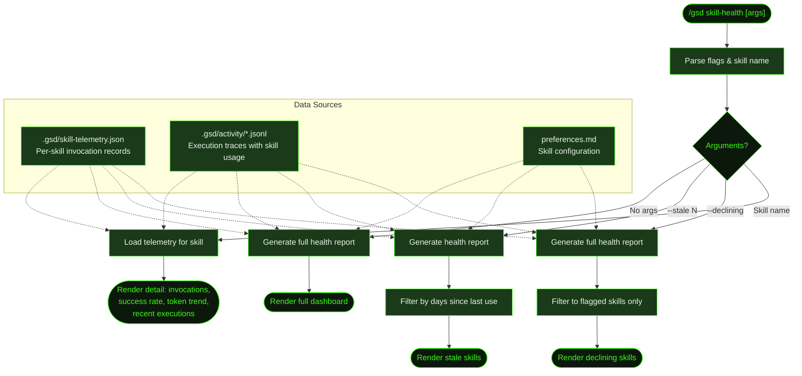

## What It Does

`/gsd skill-health` displays a dashboard of skill usage and performance metrics. It shows which skills are active, how often they're invoked, their success rates, token cost trends, and flags skills with declining performance or staleness. This is a read-only display command — it doesn't modify any files.

The dashboard helps you decide which skills to keep, avoid, or investigate. If a skill's success rate is dropping or its token costs are climbing, you can dig into the detail view to understand why.

## Usage

```
/gsd skill-health                  # Full dashboard — all skills
/gsd skill-health frontend-design  # Detail view for a specific skill
/gsd skill-health --declining      # Show only skills flagged for declining performance
/gsd skill-health --stale 30       # Show skills unused for 30+ days
```

## How It Works



### Data Sources

The health report is derived from three sources:

1. **Skill telemetry** (`.gsd/skill-telemetry.json`) — Records each skill invocation: skill name, timestamp, success/failure, token count, and duration.
2. **Activity logs** (`.gsd/activity/*.jsonl`) — Execution traces that include which skills were loaded during each unit.
3. **Preferences** — Skill configuration (always_use, prefer, avoid lists) provides context for whether a skill is intentionally unused or unexpectedly idle.

### Dashboard Metrics

| Metric | What It Shows |
|--------|---------------|
| **Invocations** | Total times the skill was loaded |
| **Success rate** | Percentage of invocations where the skill's verification passed |
| **Token trend** | Whether average token usage is increasing, stable, or decreasing |
| **Last used** | How recently the skill was invoked |
| **Flagged** | Whether the skill shows declining performance (success rate dropping or token costs rising) |

### Declining Detection

A skill is flagged as declining when its recent success rate is lower than its historical average, or when its recent token costs are significantly higher than the historical average. The `--declining` flag filters the dashboard to show only flagged skills.

### Staleness Detection

The `--stale N` flag shows skills that haven't been invoked in N or more days. This helps identify skills that may need updating or removal — a skill unused for 90 days might be for a framework you no longer use.

## What Files It Touches

### Reads

| File | Purpose |
|------|---------|
| `.gsd/skill-telemetry.json` | Per-skill invocation history |
| `.gsd/activity/*.jsonl` | Execution traces for skill usage context |
| `~/.gsd/preferences.md` | Global skill configuration |
| `.gsd/preferences.md` | Project skill configuration |

## Examples

Full dashboard:

```
> /gsd skill-health

GSD Skill Health Dashboard

  Skill               Invocations  Success  Token Trend  Last Used    Status
  ─────────────────────────────────────────────────────────────────────────────
  frontend-design     12           92%      stable       2 days ago   ✓
  test                8            100%     stable       1 day ago    ✓
  review              6            83%      ↑ rising     3 days ago   ⚠ declining
  lint                5            100%     stable       1 day ago    ✓
  swiftui             2            50%      ↑ rising     14 days ago  ⚠ declining
  debug-like-expert   1            100%     —            30 days ago  stale
```

Detail view:

```
> /gsd skill-health review

Skill: review
  Invocations: 6
  Success rate: 83% (5/6)
  Average tokens: 4,200 (↑ from 3,100 historical)
  Last used: 3 days ago
  Status: declining — token costs rising

  Recent executions:
    2026-03-14  M002/S02/T03  ✓  3,800 tokens
    2026-03-12  M002/S02/T01  ✓  4,600 tokens
    2026-03-10  M002/S01/T04  ✗  5,200 tokens  (verification failed)
    2026-03-08  M001/S03/T02  ✓  3,400 tokens
```

## Related Commands

- [`/gsd prefs`](../prefs/) — Configure which skills to use, prefer, or avoid
- [`/gsd doctor`](../doctor/) — Validates preference file structure including skill references
- [`/gsd status`](../status/) — Overall project progress (skill-health focuses on skill metrics)
