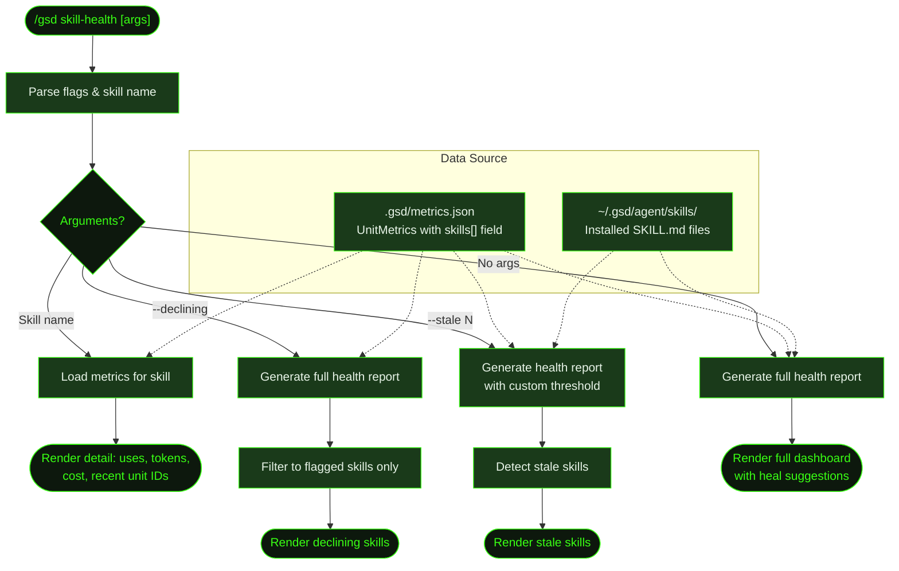

## What It Does

`/gsd skill-health` displays a dashboard of skill usage and performance metrics. It shows which skills are active, how often they're loaded, their success rates, token cost trends, and flags skills with declining performance or long periods of disuse. This is a read-only display command — it doesn't modify any files.

The dashboard helps you decide which skills to keep, investigate, or archive. If a skill's success rate is dropping or its token costs are climbing, you can run a detail view to see exactly which units were affected. Heal suggestions are generated automatically — proposed fixes that you review before applying.

## Usage

```
/gsd skill-health                  # Full dashboard — all skills
/gsd skill-health frontend-design  # Detail view for a specific skill
/gsd skill-health --declining      # Show only skills flagged for declining performance
/gsd skill-health --stale 30       # Show skills unused for 30+ days
```

## How It Works



### Data Source

All metrics come from a single source: `.gsd/metrics.json`. Each entry in the ledger is a `UnitMetrics` record that includes a `skills` field — the list of skills that were loaded during that unit. Skills are captured at dispatch time (all installed skills) and refined during execution (only those whose `SKILL.md` was explicitly read via the read tool).

There is no separate `skill-telemetry.json` file. Skill health is derived entirely from the unit metrics ledger.

### Dashboard Metrics

| Metric | What It Shows |
|--------|---------------|
| **Uses** | Total units where the skill was loaded |
| **Success%** | Proxy for quality: units where `toolCalls < assistantMessages × 20` (low retry rate) |
| **Avg Tokens** | Mean token count across units where the skill was active |
| **Trend** | Whether recent token usage is `rising`, `declining`, or `stable` (requires 10+ uses) |
| **Last Used** | Days since the skill appeared in a unit |
| **Avg Cost** | Mean cost per unit where the skill was loaded |

### Flagging Thresholds

A skill is flagged (`⚠`) when it has at least 5 uses and either:

- **Success rate below 70%** — too many units with excessive tool calls
- **Token trend rising 20%+** — recent average tokens are significantly higher than the previous window (requires 10+ uses for trend detection)

The `--declining` flag filters the full dashboard to show only flagged skills. If no skills are flagged, it prints `No skills flagged for declining performance.`

### Staleness Detection

The `--stale N` flag shows skills that haven't appeared in any unit within N days. Without a custom threshold, staleness is reported at **60 days**. Staleness is checked against all installed `SKILL.md` files, not just those with usage data — a skill you installed and never ran will appear as stale from day one.

### Heal Suggestions

The health report includes a **Heal Suggestions** section. When a skill is flagged or stale, the report proposes an action:

- **Declining success** — `Review SKILL.md for outdated patterns` (warning or critical by severity)
- **Rising tokens** — `Skill may be causing inefficient execution patterns` (info; requires 10+ uses)
- **Stale** — `Consider archiving or updating` (info)

These are display suggestions only. To generate a structured fix proposal, GSD runs a separate heal-skill analysis post-unit (see below).

### Heal-Skill Post-Unit Analysis

After each auto-mode unit, GSD can optionally run a heal-skill analysis. It reads the skill that was loaded, compares actual execution against the skill's guidance, and classifies the drift:

- **None** — agent followed the skill correctly → writes "No drift detected" to the unit artifact and stops
- **Minor** — agent found a better approach but the skill isn't wrong → appends a note to `.gsd/KNOWLEDGE.md` and stops
- **Significant** — skill has outdated or incorrect guidance → writes a structured proposal to `.gsd/skill-review-queue.md`

The agent never modifies a skill file directly. This human review step is intentional: research shows that curated skills outperform auto-generated ones by +16.2pp.

A review queue entry looks like this:

```markdown
### frontend-design (flagged 2026-03-14)
- **Unit:** M002/S02/T03
- **Issue:** Skill recommends CSS custom properties but agent used inline styles throughout
- **Root cause:** Outdated pattern — inline styles cause specificity issues with the theme system
- **Discovery method:** Build error referencing theme override conflicts
- **Proposed fix:**
  - File: SKILL.md
  - Section: Styling Conventions
  - Current: "Apply styles via the `style` prop for component-level overrides"
  - Suggested: "Use CSS custom properties via `className` for all theming"
- **Action:** [ ] Reviewed [ ] Updated [ ] Dismissed
```

## What Files It Touches

### Reads

| File | Purpose |
|------|---------|
| `.gsd/metrics.json` | Unit metrics ledger — source of all skill usage data |
| `~/.gsd/agent/skills/*/SKILL.md` | Installed skills, for staleness checking and detail view path |

### Writes

| File | Purpose |
|------|---------|
| `.gsd/skill-review-queue.md` | Heal suggestions written by post-unit heal-skill analysis (not by this command directly) |
| `.gsd/KNOWLEDGE.md` | Minor drift notes appended by post-unit heal-skill analysis |

## Examples

Full dashboard:

```
> /gsd skill-health

Skill Health Report
════════════════════════════════════════════════════════════
Generated: 2026-03-19T10:00:00.000Z
Units with skill data: 34

Skill                    Uses  Success%  Avg Tokens  Trend     Last Used
────────────────────────────────────────────────────────────────────────
frontend-design          12      92%       28.4k    stable    2 days ago
test                      8     100%       19.1k    stable    1 day ago
review                    6      83%       42.0k    rising    3 days ago ⚠
lint                      5     100%       12.3k    stable    1 day ago
swiftui                   2      50%       31.0k    stable    14 days ago
debug-like-expert         1     100%        9.8k    stable    30 days ago

Declining Skills (flagged for review):
  ⚠  review: Token usage trending upward (20%+ increase)

Heal Suggestions:
  🟡 review: Token usage trending upward. Skill may be causing inefficient execution patterns.
```

Declining-only view:

```
> /gsd skill-health --declining

Skill                    Uses  Success%  Avg Tokens  Trend     Last Used
────────────────────────────────────────────────────────────────────────
review                    6      83%       42.0k    rising    3 days ago ⚠
```

Detail view for a specific skill:

```
> /gsd skill-health review

Skill Detail: review
══════════════════════════════════════════════════
Total uses: 6
Total tokens: 252.0k
Total cost: $0.38
Avg tokens/use: 42.0k
Avg cost/use: $0.063

Recent uses:
  2026-03-14  M002/S02/T03          28.4k tokens  $0.042
  2026-03-12  M002/S02/T01          46.1k tokens  $0.069
  2026-03-10  M002/S01/T04          52.0k tokens  $0.078
  2026-03-08  M001/S03/T02          34.0k tokens  $0.051

SKILL.md: ~/.gsd/agent/skills/review/SKILL.md
Last modified: 2026-02-10
```

Stale skills (unused 30+ days):

```
> /gsd skill-health --stale 30

Stale Skills (unused for 60+ days):
  ⏸  debug-like-expert
  ⏸  graphql-patterns
```

## Prompts Used

- [`heal-skill`](../../prompts/heal-skill/) — Skill drift analysis prompt

## Related Commands

- [`/gsd prefs`](../prefs/) — Configure skill discovery and `avoid_skills` list
- [`/gsd hooks`](../hooks/) — View registered post-unit hooks including heal-skill
- [`/gsd doctor`](../doctor/) — Validates planning directory structure and milestone health
- [`/gsd visualize`](../visualize/) — Full visualizer including the Health tab with skill metrics
