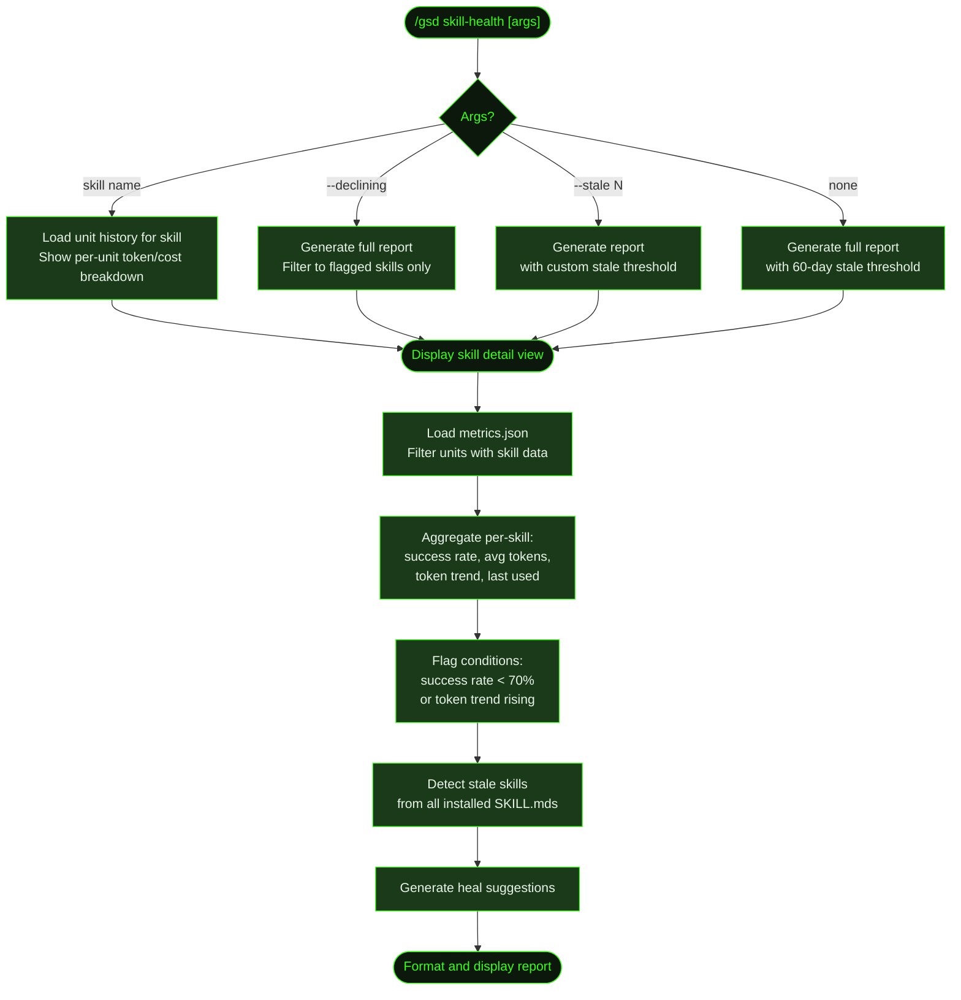

## What It Does

`/gsd skill-health` surfaces how your skills are performing across every unit GSD has run. It reads telemetry from `metrics.json` and produces a tabular report showing each skill's total uses, success rate, average token consumption, token trend, and days since last use. Skills that are underperforming or going stale are flagged automatically.

The dashboard answers two questions:

1. **Is this skill helping or hurting?** A declining success rate or rising token trend signals that a skill's guidance may be outdated — agents are deviating from it or retrying more often.
2. **Is this skill still relevant?** Skills unused for 60+ days are marked stale, which can prompt you to archive or update them.

When performance issues are detected, `/gsd skill-health` generates heal suggestions — targeted notes about what to review in the skill file. These don't modify anything automatically; the heal-skill pipeline writes proposals to `.gsd/skill-review-queue.md` for human review before any skill is changed. That human-gated cycle is intentional: SkillsBench research (Feb 2026) shows curated skills outperform auto-generated ones by over 16 percentage points, and the advantage comes from maintaining that oversight.

## Usage

```
/gsd skill-health                  # Full dashboard — all skills
/gsd skill-health <name>           # Detail view for a single skill
/gsd skill-health --declining      # Show only flagged skills
/gsd skill-health --stale N        # Override stale threshold (days)
```

Running without arguments shows the full dashboard. Providing a skill name (without `--` flags) switches to detail view for that skill, showing recent unit history and the path to its `SKILL.md`.

## How It Works


```mermaid
flowchart TD
    Start(["/gsd skill-health [args]"]) --> Parse{Args?}
    Parse -->|skill name| Detail[Load unit history for skill<br/>Show per-unit token/cost breakdown]
    Parse -->|--declining| Filter[Generate full report<br/>Filter to flagged skills only]
    Parse -->|--stale N| Custom[Generate report<br/>with custom stale threshold]
    Parse -->|none| Full[Generate full report<br/>with 60-day stale threshold]

    Detail --> Show([Display skill detail view])
    Filter --> Show
    Custom --> Show
    Full --> Show

    Show --> Metrics[Load metrics.json<br/>Filter units with skill data]
    Metrics --> Aggregate[Aggregate per-skill:<br/>success rate, avg tokens,<br/>token trend, last used]
    Aggregate --> Flag[Flag conditions:<br/>success rate < 70%<br/>or token trend rising]
    Flag --> Stale[Detect stale skills<br/>from all installed SKILL.mds]
    Stale --> Suggestions[Generate heal suggestions]
    Suggestions --> Format([Format and display report])

    style Start fill:#0d180d,stroke:#39ff14,color:#39ff14
    style Parse fill:#0d180d,stroke:#39ff14,color:#39ff14
    style Detail fill:#1a3a1a,stroke:#39ff14,color:#e8f4e8
    style Filter fill:#1a3a1a,stroke:#39ff14,color:#e8f4e8
    style Custom fill:#1a3a1a,stroke:#39ff14,color:#e8f4e8
    style Full fill:#1a3a1a,stroke:#39ff14,color:#e8f4e8
    style Metrics fill:#1a3a1a,stroke:#39ff14,color:#e8f4e8
    style Aggregate fill:#1a3a1a,stroke:#39ff14,color:#e8f4e8
    style Flag fill:#1a3a1a,stroke:#39ff14,color:#e8f4e8
    style Stale fill:#1a3a1a,stroke:#39ff14,color:#e8f4e8
    style Suggestions fill:#1a3a1a,stroke:#39ff14,color:#e8f4e8
    style Show fill:#0d180d,stroke:#39ff14,color:#39ff14
    style Format fill:#0d180d,stroke:#39ff14,color:#39ff14
```

### Telemetry Collection

Skill usage is recorded per-unit in `metrics.json`. The telemetry system distinguishes two categories:

- **Actively loaded** — skills whose `SKILL.md` was explicitly read by the agent during execution. These are the most meaningful signal.
- **Available** — skills present in the system prompt at dispatch time. Used as a fallback when no skills were actively loaded.

At unit completion, the skill list is attached to the `UnitMetrics` entry. The health dashboard aggregates across all entries to build per-skill statistics.

### Success Rate Heuristic

GSD doesn't record retries explicitly. Success rate is approximated by comparing tool call count to assistant message count: a unit is considered successful if `toolCalls < assistantMessages × 20`. Units with high tool-call-to-message ratios suggest the agent was thrashing or retrying more than expected.

A skill is flagged when its success rate drops below **70%** across at least 5 uses.

### Token Trend

Token trend compares the average tokens per unit in the most recent 5 uses against the 5 uses before that. A **20%+ increase** is classified as `rising` and triggers a flag. A **20%+ decrease** is `declining`. Everything else is `stable`.

Trend analysis requires at least 10 uses total before it kicks in.

### Staleness Detection

Staleness is checked against all installed skill directories — not just skills with usage data. A skill is stale if it hasn't appeared in any unit within the threshold (default: 60 days). The scanner checks three locations:

- `~/.agents/skills/` (primary)
- `~/.claude/skills/` (Claude Code)
- `~/.gsd/agent/skills/` (legacy, only if migration hasn't completed)

### Heal Suggestions

When skills are flagged, the report includes heal suggestions categorized by trigger:

| Trigger | Meaning |
|---------|---------|
| `declining_success` | Success rate dropped below threshold — review SKILL.md for outdated patterns |
| `rising_tokens` | Token usage trending upward — skill may be causing inefficient execution |
| `stale` | Not used within threshold — consider archiving or updating |

Suggestions are informational. Acting on them requires running the heal-skill pipeline, which appends entries to `.gsd/skill-review-queue.md` for human review. The queue format includes the specific file, section, current text, and proposed replacement — so nothing changes until you explicitly approve.

## What Files It Touches

### Reads

| File | Purpose |
|------|---------|
| `.gsd/metrics.json` | Unit telemetry with per-skill usage data |
| `~/.agents/skills/*/SKILL.md` | Detects installed skills for staleness check |
| `~/.claude/skills/*/SKILL.md` | Alternate skills location (Claude Code) |
| `~/.gsd/agent/skills/*/SKILL.md` | Legacy location (pre-migration) |

### Writes

| File | Purpose |
|------|---------|
| `.gsd/skill-review-queue.md` | Heal suggestions written here by the heal-skill pipeline (not by this command directly) |

## Examples

Full dashboard with one flagged skill:

```
Skill Health Report
════════════════════════════════════════════════════════════
Generated: 2026-04-12T09:15:00.000Z
Units with skill data: 47

Skill                    Uses  Success%  Avg Tokens  Trend     Last Used
────────────────────────────────────────────────────────────────────────────────
test                       22      91%        42.1K  stable    2 days ago
lint                       18      61%        38.7K  rising    today      ⚠
tdd                         7     100%        55.3K  stable    5 days ago

Stale Skills (unused for 60+ days):
  ⏸  create-skill

Declining Skills (flagged for review):
  ⚠  lint: Success rate 61% (below 70% threshold)

Heal Suggestions:
  🟡 lint: Success rate dropped to 61% over 18 uses. Review SKILL.md for outdated patterns.
  🔵 create-skill: Not used in 60+ days. Consider archiving or updating.
```

Detail view for a single skill:

```
> /gsd skill-health lint

Skill Detail: lint
══════════════════════════════════════════════════
Total uses: 18
Total tokens: 696,600
Total cost: $0.42
Avg tokens/use: 38,700
Avg cost/use: $0.023

Recent uses:
  2026-04-12  M004/S02/T03         41.2K tokens  $0.025
  2026-04-11  M004/S02/T01         39.8K tokens  $0.024
  2026-04-10  M004/S01/T05         36.1K tokens  $0.022

SKILL.md: /Users/alice/.agents/skills/lint/SKILL.md
Last modified: 2026-02-14
```

Filtered view showing only declining skills:

```
> /gsd skill-health --declining

Skill                    Uses  Success%  Avg Tokens  Trend     Last Used
────────────────────────────────────────────────────────────────────────────────
lint                       18      61%        38.7K  rising    today      ⚠
```

No data yet:

```
> /gsd skill-health

No skill telemetry data yet. Run auto-mode to start collecting.
Skill usage is recorded per-unit in metrics.json.
```

## Prompts Used

- [`heal-skill`](../../prompts/heal-skill/) — Post-unit drift analysis prompt invoked when the skill health check detects potential deviation between execution behavior and SKILL.md guidance

## Related Commands

- [`/gsd doctor`](../doctor/) — Runtime health checks for the project workspace (separate from skill health)
- [`/gsd logs`](../logs/) — Browse metrics and activity logs that back the skill health data
- [`/gsd prefs`](../prefs/) — Configure `avoid_skills` to suppress stale skills from dispatch
- [`/gsd hooks`](../hooks/) — View post-unit hooks including the skill-health check hook
