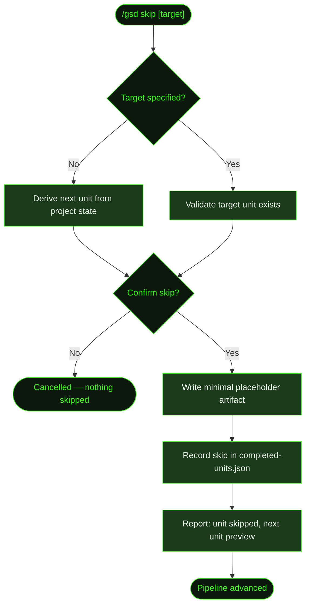

## What It Does

`/gsd skip` prevents a unit from being dispatched by auto-mode. It marks the unit as completed in GSD's idempotency log without executing it, so the dispatch loop skips over it and moves to the next unit in the pipeline.

This is the manual counterpart to stuck detection's automatic pipeline advancement. When a unit repeatedly fails verification (hitting the 3-dispatch limit), GSD can either write a blocker placeholder and auto-advance or stop for manual intervention. `/gsd skip` is how you intervene deliberately — telling GSD to bypass a unit you've already handled manually, or one you don't need executed at all.

You can also use it proactively to skip optional units — for example, bypassing `run-uat` for a slice where UAT is handled externally, or skipping `reassess-roadmap` when you know the roadmap doesn't need changes after a particular slice completes.

## Usage

```
/gsd skip
/gsd skip <unit-id>
/gsd skip <unit-type>
```

| Argument | Behavior |
|----------|----------|
| (none) | Skip the unit that would be dispatched next |
| `M001/S02/T03` | Skip a specific task by its milestone/slice/task ID |
| `research-slice` | Skip the current `research-slice` unit |
| `run-uat` | Skip the current `run-uat` unit |
| `reassess-roadmap` | Skip the current `reassess-roadmap` unit |

Run `/gsd status` first if you're not sure what unit would be dispatched next.

## How It Works



### Skip sequence

1. **Resolve target** — If no argument is given, `deriveState()` reads the `.gsd/` directory to determine which unit would be dispatched next. If a unit ID or type is given, GSD validates it matches a dispatchable unit in the current project state.
2. **Confirm** — GSD shows you the unit it's about to skip (type, ID, milestone/slice path) and asks for confirmation before proceeding.
3. **Write placeholder artifact** — For the unit to pass dispatch verification, its expected artifact must exist on disk. GSD writes a minimal stub at the artifact path (e.g., a `T03-SUMMARY.md` with `[skipped]` content, or a `S01-UAT.md` with a skip notice). This prevents the auto-mode dispatch loop from re-queuing the unit.
4. **Record in completed-units log** — The skip is written to `.gsd/completed-units.json` with a `skipped` status and timestamp. This is the same idempotency log auto-mode uses to prevent re-dispatch after a crash.
5. **Report** — Displays confirmation of the skip and what will be dispatched next when auto-mode resumes.

### What counts as a skippable unit

Any unit type in the dispatch table can be skipped:

| Unit type | When you might skip it |
|-----------|------------------------|
| `research-milestone` | You've already researched the codebase manually |
| `research-slice` | Slice approach is clear; research adds no value |
| `run-uat` | UAT is handled by your own test suite or CI |
| `reassess-roadmap` | Roadmap is settled; you don't want reassessment |
| `execute-task` | Task was handled manually outside GSD |
| `replan-slice` | You'd rather update the plan yourself than let GSD rewrite it |
| `validate-milestone` | Validation is handled externally |

Task units (`execute-task`) should generally use [`/gsd doctor fix`](../doctor/) or manual task completion (check the task checkbox in the plan) rather than skip — skip is more appropriate for whole-slice or whole-milestone units.

### Skip vs. stuck detection

When auto-mode detects a unit is stuck (same unit re-dispatched 3 times without completing), it automatically writes a blocker placeholder to advance the pipeline. `/gsd skip` gives you the same outcome manually — before the stuck counter even triggers, or after you've investigated and decided not to retry.

If you want auto-mode to *never* dispatch a particular unit type on this project, use a [`skip` pre-dispatch hook](../hooks/) in preferences instead — this is permanent and preference-driven, rather than one-off.

## What Files It Touches

### Reads

| File | Purpose |
|------|---------|
| `.gsd/STATE.md` | Derive active milestone, slice, and task |
| `.gsd/<MID>/<SID>/<SID>-PLAN.md` | Validate target unit against current slice plan |
| `.gsd/completed-units.json` | Check for existing skip or completion records |

### Writes

| File | Purpose |
|------|---------|
| `.gsd/completed-units.json` | Skip record added with `skipped` status and timestamp |

### Creates (placeholder artifacts)

The artifact path written depends on the unit type being skipped:

| Unit type | Placeholder written |
|-----------|---------------------|
| `research-slice` | `.gsd/<MID>/<SID>/<SID>-RESEARCH.md` (skip stub) |
| `execute-task` | `.gsd/<MID>/<SID>/tasks/<TID>-SUMMARY.md` (skip stub) |
| `run-uat` | `.gsd/<MID>/<SID>/<SID>-UAT-RESULT.md` (skip stub) |
| `reassess-roadmap` | `.gsd/<MID>/<SID>/<SID>-ASSESSMENT.md` (skip stub) |
| `validate-milestone` | `.gsd/<MID>/<MID>-VALIDATION.md` (skip stub) |

## Examples

Skipping the next unit interactively:

```
> /gsd skip

● Next unit: run-uat
  Slice: M001/S02 (Recipe CRUD API)
  Artifact: .gsd/milestones/M001/slices/S02/S02-UAT-RESULT.md

  Skip this unit? (y/N) y

✓ Skipped: run-uat for M001/S02
  Placeholder written to S02-UAT-RESULT.md
  Next unit: reassess-roadmap
```

Skipping a specific task that was completed manually:

```
> /gsd skip M001/S02/T03

● Unit: execute-task M001/S02/T03 (Deploy preview environment)

  Skip this unit? (y/N) y

✓ Skipped: execute-task M001/S02/T03
  Placeholder written to T03-SUMMARY.md
  Next unit: execute-task M001/S02/T04 (Wire preview URL to PR comments)
```

Skipping slice reassessment when the roadmap is settled:

```
> /gsd skip reassess-roadmap

● Unit: reassess-roadmap
  Milestone: M001 (Core Recipe Platform)
  After slice: S02 (Recipe CRUD API)

  Skip this unit? (y/N) y

✓ Skipped: reassess-roadmap
  Next unit: research-slice M001/S03
```

Checking what's next without skipping:

```
> /gsd next --dry-run

● Dry-run preview:
  Next unit:  run-uat
  ID:         M001/S02
  Phase:      summarizing
  ...
```

## Related Commands

- [`/gsd doctor`](../doctor/) — Auto-repair structural issues without skipping units
- [`/gsd auto`](../auto/) — Resumes after a skip; the skipped unit won't be re-dispatched
- [`/gsd undo`](../undo/) — Revert the last completed unit (inverse of skip for units already run)
- [`/gsd next --dry-run`](../next/) — Preview what would be dispatched next without executing or skipping
- [`/gsd forensics`](../forensics/) — Investigate *why* a unit is stuck before deciding to skip
- [`/gsd hooks`](../hooks/) — Configure permanent `skip` hooks for unit types you never want dispatched
