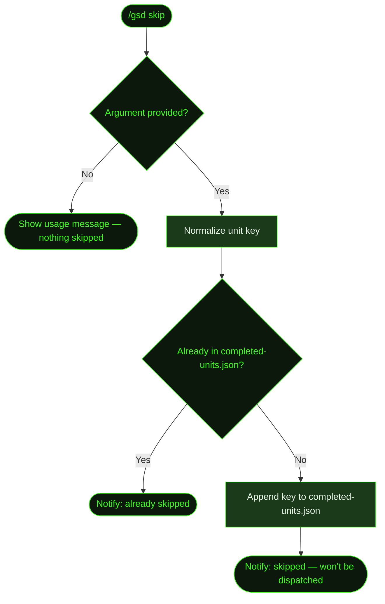

## What It Does

`/gsd skip` marks a unit as already handled so auto-mode won't dispatch it. It appends the unit's key to `.gsd/completed-units.json` — the same idempotency log the dispatch loop checks before queuing any unit. Once a key is recorded there, auto-mode skips over it permanently.

This is useful when you've already handled a task manually, when a unit type adds no value for a particular slice, or when a unit is stuck and you'd rather bypass it than retry. Unlike stuck detection (which attempts a graduated recovery — cache invalidation and retry, then stops auto-mode on repeated failure), `/gsd skip` lets you bypass a unit proactively — before it ever causes a problem.

You can also use it to permanently bypass optional unit types — for example, skipping `plan-slice` for a slice where you've already written the plan by hand, or skipping `research-slice` when the approach is already clear.

## Usage

```
/gsd skip <unit-id>
```

The `<unit-id>` argument is required. Accepted formats:

| Format | Example | Resolved key |
|--------|---------|-------------|
| Full unit key | `execute-task/M001/S01/T03` | `execute-task/M001/S01/T03` |
| Milestone/slice/task path | `M001/S01/T03` | `execute-task/M001/S01/T03` |
| Task ID only (uses active context) | `T03` | `execute-task/<active-MID>/<active-SID>/T03` |
| Slice ID only (uses active context) | `S02` | `plan-slice/<active-MID>/S02` |
| Bare unit type | `research-slice` | `research-slice` (used as-is) |

Run [`/gsd status`](../status/) first if you're not sure what unit is current or what key to use.

## How It Works



### Skip sequence

1. **Validate argument** — If no argument is given, GSD prints a usage hint and exits without modifying anything.
2. **Normalize key** — GSD resolves shorthand into a full unit key:
   - A bare task ID like `T03` is expanded to `execute-task/<active-MID>/<active-SID>/T03` by reading the current project state.
   - A bare slice ID like `S02` becomes `plan-slice/<active-MID>/S02`.
   - A path like `M001/S01/T03` becomes `execute-task/M001/S01/T03`.
   - If the argument already contains `execute-task`, `plan-`, `research-`, or `complete-`, it's used as-is.
3. **Deduplicate** — If the resolved key is already in `completed-units.json`, GSD notifies you and exits without writing.
4. **Append and save** — The key is appended to the JSON array and written back to `.gsd/completed-units.json`.
5. **Notify** — GSD reports the skipped key and confirms it won't be dispatched.

There is no confirmation dialog — the skip takes effect immediately.

### What counts as a skippable unit

Any unit key that auto-mode would look up in `completed-units.json` can be skipped:

| Unit type | When you might skip it |
|-----------|------------------------|
| `execute-task` | Task was handled manually outside GSD |
| `plan-slice` | You've already written the slice plan by hand |
| `plan-milestone` | Milestone planning was done manually |
| `research-slice` | Slice approach is clear; research adds no value |
| `research-milestone` | You've already researched the codebase manually |
| `discuss-milestone` | Milestone discussion already happened outside auto-mode |
| `replan-slice` | Slice replan is unnecessary for this iteration |
| `complete-slice` | Slice wrap-up is unnecessary for this iteration |
| `complete-milestone` | Milestone completion handled externally |
| `validate-milestone` | Validation is handled externally |
| `run-uat` | UAT already performed manually |

### Skip vs. stuck detection

When auto-mode detects a unit is stuck (same unit dispatched 3+ consecutive times, repeated errors, or A→B→A→B oscillation), it enters a graduated recovery:

- **Level 1**: GSD checks whether the expected artifact already exists on disk, invalidates caches, and retries.
- **Level 2**: If stuck is detected again, GSD stops auto-mode entirely with an error notification.

`/gsd skip` gives you a different escape hatch — you add the unit key to `completed-units.json` manually, so the dispatch loop moves past it on the next cycle. This is useful before a stuck condition is triggered, or when you've investigated and decided not to retry at all.

If you want auto-mode to *never* dispatch a particular unit type on this project, configure a `skip` pre-dispatch hook in [`/gsd hooks`](../hooks/) instead — that approach is declarative and preference-driven rather than a one-off key entry.

## What Files It Touches

### Reads

| File | Purpose |
|------|---------|
| `.gsd/completed-units.json` | Load existing keys to check for duplicates |

### Writes

| File | Purpose |
|------|---------|
| `.gsd/completed-units.json` | Resolved unit key appended to the array |

The file contains a flat JSON array of key strings:

```json
["execute-task/M001/S01/T03", "research-slice/M001/S02", "plan-slice/M001/S03"]
```

No placeholder artifacts are written to slice or task directories — the key entry in `completed-units.json` is sufficient to prevent re-dispatch.

## Examples

Skipping a specific task that was completed manually:

```
> /gsd skip T03

✓ Skipped: execute-task/M001/S01/T03. Will not be dispatched in auto-mode.
```

Skipping using the full task path:

```
> /gsd skip M001/S02/T05

✓ Skipped: execute-task/M001/S02/T05. Will not be dispatched in auto-mode.
```

Skipping slice research when the approach is already clear:

```
> /gsd skip research-slice

✓ Skipped: research-slice. Will not be dispatched in auto-mode.
```

Skipping using the full unit key:

```
> /gsd skip execute-task/M001/S03/T01

✓ Skipped: execute-task/M001/S03/T01. Will not be dispatched in auto-mode.
```

Attempting to skip an already-skipped unit:

```
> /gsd skip T03

● Already skipped: execute-task/M001/S01/T03
```

Calling without an argument:

```
> /gsd skip

● Usage: /gsd skip <unit-id>  (e.g., /gsd skip execute-task/M001/S01/T03 or /gsd skip T03)
```

## Related Commands

- [`/gsd status`](../status/) — Check current project state to find the right unit ID to skip
- [`/gsd auto`](../auto/) — Resume after a skip; the skipped unit won't be re-dispatched
- [`/gsd undo`](../undo/) — Revert the last completed unit (inverse of skip for units already run)
- [`/gsd doctor`](../doctor/) — Auto-repair structural issues without skipping units
- [`/gsd hooks`](../hooks/) — Configure permanent `skip` hooks for unit types you never want dispatched
