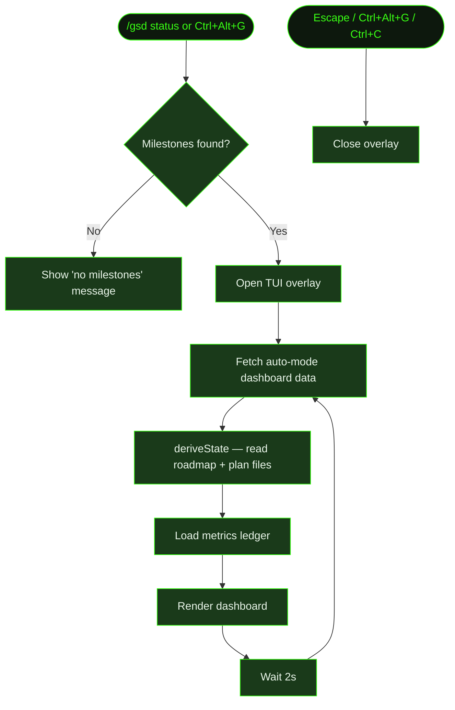

## What It Does

`/gsd status` opens a TUI dashboard overlay that shows the current state of your project at a glance — what auto-mode is doing right now, milestone and slice progress, task breakdown for the active slice, completed units, and cost metrics. The dashboard refreshes every 2 seconds.

The dashboard is read-only. It doesn't modify any files or interrupt a running auto-mode session. You can open it while auto-mode is running to monitor progress without disrupting execution. When no session is active, it still shows project state (phase, milestone, slice, tasks remaining) from the planning files on disk.

## Usage

```
/gsd status
```

Also available via keyboard shortcut: **Ctrl+Alt+G** (toggles the dashboard overlay on and off).

## How It Works

The dashboard derives state from planning files on disk and overlays real-time data from the running auto-mode session.



### State derivation

The dashboard builds its view from two data sources:

1. **Planning files** — `deriveState()` reads roadmap and plan files directly from disk to determine current phase, active milestone, active slice, and task completion state. This is the same source-of-truth traversal the dispatch engine uses.
2. **Live session data** — `getAutoDashboardData()` returns in-memory state from the running auto-mode session: what unit is executing right now, how long it's been running, which units completed this session, and whether the session is active, paused, or idle.

For cost and token metrics, the dashboard reads the metrics ledger (in-memory, populated by the running session) and aggregates it by phase, slice, and model.

### Dashboard layout

The overlay renders at 70% of terminal width (minimum 60 columns, maximum 90% of terminal height), anchored to the center. Content wider than 128 columns is capped and centered. It contains these sections:

- **Header** — "GSD Dashboard" title, blinking `● AUTO` / `⏸ PAUSED` / `idle` status indicator, elapsed time, and ETA if estimable. Shows the active worktree name when running inside a worktree.
- **Current unit** — What's actively running (unit type and ID), how long it's been executing. Shows "No unit running · /gsd auto to start" when idle.
- **Parallel workers** — Visible only when subagent workers are active. Shows batch ID, worker agent, task preview, and elapsed time per worker.
- **Pending captures badge** — Shown when there are pending captures awaiting triage.
- **Milestone progress** — Active milestone ID and title, followed by filled progress bars for Tasks (active slice), Slices (current milestone), and Milestones (overall).
- **Slice breakdown** — Every slice with status icon (✓ done / ▸ active / ○ pending) and risk level. For the active slice, each task is listed with its own status icon.
- **Completed units** — Last 10 units from this session in reverse order with duration. Units that triggered context-pressure wrap-up are flagged with `→ wrap-up`; truncated units show a section count indicator.
- **Cost & Usage** — Total cost, tokens, tool calls, and unit count. Token breakdown by input / output / cache-read / cache-write. Cost broken down by phase and by slice. Per-slice cost projection for remaining work (if budget ceiling is configured). Cost broken down by model.

### Keyboard navigation

| Key | Action |
|-----|--------|
| `↑` / `k` | Scroll up |
| `↓` / `j` | Scroll down |
| `g` | Jump to top |
| `G` | Jump to end |
| `Escape` / `Ctrl+Alt+G` / `Ctrl+C` | Close the overlay |

### Live refresh

The dashboard polls every 2 seconds. If auto-mode completes a unit while the dashboard is open, you'll see it move to the Completed section within a couple of seconds. The refresh is skipped if a previous refresh is still in flight, preventing pile-up on slow disks. Terminal resize events also trigger an immediate re-render.

### Overlay behavior

The dashboard renders as a TUI overlay — it floats on top of the current terminal content. Dismiss it with **Escape** or toggle it with **Ctrl+Alt+G**. When dismissed, the terminal returns to its previous state.

## What Files It Touches

Entirely read-only — the dashboard never writes to any file.

### Reads

| File | Purpose |
|------|---------|
| `M*/ROADMAP.md` | Slice structure, ordering, and completion state |
| `M*/S*/PLAN.md` | Task breakdown within the active slice |
| `M*/S*/T*/SUMMARY.md` | Completed task summaries (for blocker detection) |
| Metrics ledger (in-memory) | Token counts, costs, and unit timing from the running session |

## Examples

Checking progress during an active auto-mode run:

```
> /gsd status

  ╭──────────────────────────────────────────────────────────╮
  │  GSD Dashboard  ● AUTO                        1h 14m     │
  │                                                           │
  │  Now: Execute T02  (current: 8m)                         │
  │                                                           │
  │  M001: Core Recipe Platform                              │
  │                                                           │
  │  Tasks      ████████████░░░░░░░░░░░░░░  50%   1/2        │
  │  Slices     ████████████████░░░░░░░░░░  62%   5/8        │
  │  Milestones ████████░░░░░░░░░░░░░░░░░░  25%   1/4        │
  │                                                           │
  │  ✓ S01: Database schema and auth           low            │
  │  ▸ S02: Recipe CRUD API                    medium         │
  │      ✓ T01: Recipe model                                 │
  │      ▸ T02: List endpoint                                │
  │      ○ T03: Delete endpoint                              │
  │  ○ S03: Recipe search and filtering        low            │
  │  ○ S04: Image upload pipeline              high           │
  │                                                           │
  │  ──────────────────────────────────────────────────────  │
  │  Completed                                               │
  │                                                           │
  │  ✓ Execute T01                                    14m     │
  │  ✓ Plan S02                                        3m     │
  │  ✓ Complete S01                                    2m     │
  │                                                           │
  │  ──────────────────────────────────────────────────────  │
  │  Cost & Usage                                            │
  │                                                           │
  │  $3.66 total  ·  127K tokens  ·  48 tools  ·  12 units  │
  │  in: 98K  out: 18K  cache-r: 9K  cache-w: 2K            │
  │                                                           │
  │  ──────────────────────────────────────────────────────  │
  │              ↑↓ scroll · g/G top/end · esc close         │
  ╰──────────────────────────────────────────────────────────╯
```

Opening the dashboard when auto-mode is idle:

```
> /gsd status

  ╭───────────────────────────────────────────────────────╮
  │  GSD Dashboard  idle                                  │
  │                                                        │
  │  No unit running · /gsd auto to start                 │
  │  ...                                                   │
  ╰───────────────────────────────────────────────────────╯
```

For a more advanced visualization with dependency graphs, timeline, metrics breakdown, and export options, see [`/gsd visualize`](../visualize/).

## Related Commands

- [`/gsd visualize`](../visualize/) — Advanced 10-tab TUI visualizer (progress, timeline, deps, metrics, health, agent, changes, knowledge, captures, export)
- [`/gsd auto`](../auto/) — Autonomous execution (dashboard monitors it)
- [`/gsd parallel`](../parallel/) — Parallel milestone orchestration (with its own `status` subcommand)
- [`/gsd`](../gsd/) — Step mode (check status between units)
