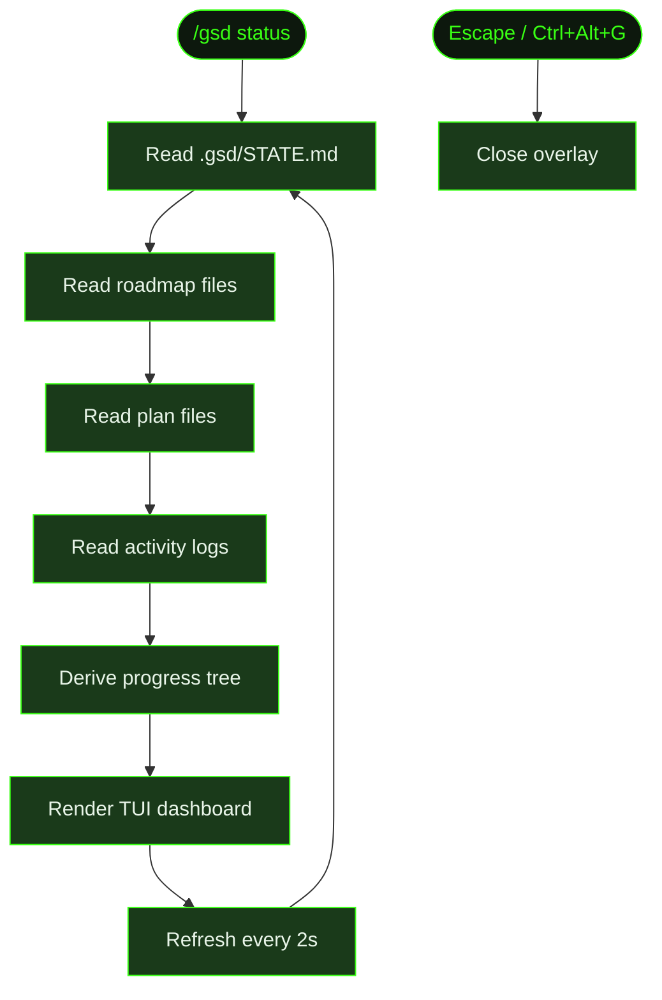

## What It Does

`/gsd status` opens a TUI dashboard overlay that shows the current state of your project at a glance — milestone progress, slice breakdown, task completion status, timing, and cost metrics. It reads the `.gsd/` directory and renders a live progress tree that refreshes every 2 seconds.

The dashboard is read-only. It doesn't modify any files or interrupt a running auto-mode session. You can open it while auto mode is running to monitor progress without disrupting execution.

## Usage

```
/gsd status
```

Also available via keyboard shortcut: **Ctrl+Alt+G** (toggles the dashboard overlay on and off).

## How It Works

The dashboard reads the same state files that the dispatch engine uses, then renders them as a structured progress tree.



### State derivation

The dashboard builds its progress tree by reading:

1. **`.gsd/STATE.md`** — The quick-glance status file with current milestone, slice, task, and phase.
2. **Roadmap files** (`M*-ROADMAP.md`) — Slice ordering and completion checkboxes.
3. **Plan files** (`S*-PLAN.md`) — Task breakdown within each slice.
4. **Activity logs** (`.gsd/activity/`) — JSONL records of unit execution times, token counts, and costs.

From these, it derives: which units are complete, which is in progress, what's remaining, and aggregate metrics.

### Dashboard layout

The dashboard shows:

- **Milestone header** — Name, ID, and overall progress percentage.
- **Slice breakdown** — Each slice with its completion status (pending, in progress, complete) and task count.
- **Current unit** — What's actively running, how long it's been executing.
- **Completed units** — Each finished unit with duration and cost.
- **Session totals** — Aggregate tokens, cost, and wall-clock time.

### Live refresh

The dashboard refreshes every 2 seconds by re-reading the `.gsd/` files. This means if auto mode completes a task while the dashboard is open, you'll see it update within a couple of seconds. No manual refresh needed.

### Overlay behavior

The dashboard renders as a TUI overlay — it floats on top of the current terminal content. Dismiss it with **Escape** or toggle it with **Ctrl+Alt+G**. When dismissed, the terminal returns to its previous state.

## What Files It Touches

Entirely read-only — the dashboard never writes to any file.

| Reads | Purpose |
|-------|---------|
| `.gsd/STATE.md` | Current phase and active units |
| `M*-ROADMAP.md` | Slice structure and completion |
| `S*-PLAN.md` | Task structure and completion |
| `.gsd/activity/*.jsonl` | Execution logs for timing and cost |

## Examples

Checking progress during a Cookmate milestone:

```
> /gsd status

  ┌─────────────────────────────────────────────┐
  │  M001: Core Recipe Platform       62%       │
  ├─────────────────────────────────────────────┤
  │                                             │
  │  ✓ S01: Database schema and auth            │
  │    ✓ T01  Prisma schema         12m  $0.48  │
  │    ✓ T02  NextAuth setup        18m  $0.72  │
  │    ✓ T03  Signup/login pages    22m  $0.91  │
  │                                             │
  │  ▶ S02: Recipe CRUD API                     │
  │    ✓ T01  Recipe model          14m  $0.55  │
  │    ▶ T02  List endpoint          8m  ...    │
  │    ○ T03  Delete endpoint                   │
  │                                             │
  │  ○ S03: Recipe search and filtering         │
  │  ○ S04: Image upload pipeline               │
  │                                             │
  ├─────────────────────────────────────────────┤
  │  Session: 1h 14m │ $3.66 │ 127K tokens     │
  └─────────────────────────────────────────────┘
```

For a more advanced visualization with dependency graphs, metrics breakdown, and export options, see [`/gsd visualize`](../visualize/).

## Related Commands

- [`/gsd visualize`](../visualize/) — Advanced multi-tab visualizer
- [`/gsd auto`](../auto/) — Autonomous execution (dashboard monitors it)
- [`/gsd`](../gsd/) — Step mode (check status between units)
