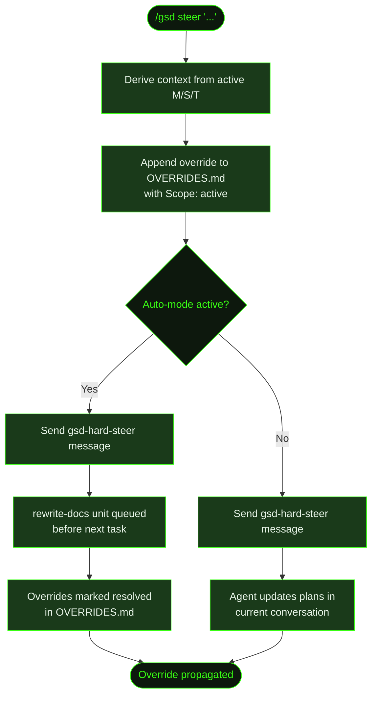

## What It Does

`/gsd steer` registers a plan override that changes the direction of ongoing work. You describe the change in plain English, and GSD saves it to `OVERRIDES.md` and injects it into all future task prompts. This is how you course-correct without stopping auto-mode.

The behavior differs depending on whether auto-mode is running. When active, the override triggers a `rewrite-docs` unit that updates all plan documents before the next task. When inactive, the agent is instructed to update plans manually in the current conversation.

Overrides are tagged with execution context — the active milestone, slice, and task IDs are recorded in the `Applied-at` field so the system knows exactly when and where the override was applied.

## Usage

```
/gsd steer <change description>
```

The description is plain English. Quotes are optional — everything after `steer` is captured.

```
/gsd steer switch from REST to GraphQL for the recipe API
/gsd steer "skip mobile responsive work — desktop only for MVP"
/gsd steer use Tailwind instead of custom CSS
```

## How It Works



### Override Registration

1. **Context derivation** — The command calls `deriveState()` to get the active milestone, slice, and task IDs. These are stored in the `Applied-at` field as `M001/S01/T02` (or `none` for components without an active counterpart).
2. **Append to OVERRIDES.md** — The override text, timestamp, and execution context are appended to `.gsd/OVERRIDES.md`. New overrides always start with `**Scope:** active` — this flag signals that the override hasn't been propagated yet.
3. **Prompt injection** — Active overrides (scope `active`) are automatically injected into every future task prompt until they are resolved by the `rewrite-docs` unit.

### Override Entry Format

Each override is stored as a markdown section. New files start with a `# GSD Overrides` header:

```markdown
## Override: 2025-01-15T10:30:00.000Z

**Change:** switch from REST to GraphQL for the recipe API
**Scope:** active
**Applied-at:** M002/S01/T02

---
```

After the `rewrite-docs` unit runs, `**Scope:** active` is changed to `**Scope:** resolved`. The `rewrite-docs` completion check inspects OVERRIDES.md — once no `**Scope:** active` entries remain, the unit is considered complete.

### Auto-mode Active Path

When auto-mode is running, the command sends a `gsd-hard-steer` message to the active agent. This message:

- Tells the agent the override has been saved and will be injected into all future task prompts
- Instructs the agent to finish current work respecting the override
- Queues a **`rewrite-docs` unit** before the next task dispatch — this unit reads `OVERRIDES.md` and propagates changes through the active slice plan, incomplete task plans, and `DECISIONS.md`, then marks each override as resolved

### Auto-mode Inactive Path

When auto-mode is not running, the `gsd-hard-steer` message instructs the agent to:

- Read `OVERRIDES.md` immediately
- Update the current plan documents to reflect the change
- Focus on the active slice plan, incomplete task plans, and `DECISIONS.md`

This path works in step mode (`/gsd`, [`/gsd next`](../next/)) or during a [`/gsd discuss`](../discuss/) conversation.

## What Files It Touches

### Creates

| File | Purpose |
|------|---------|
| `.gsd/OVERRIDES.md` | Created with `# GSD Overrides` header if it doesn't exist |

### Reads

| File | Purpose |
|------|---------|
| `.gsd/` directory | Scanned by `deriveState()` to get active milestone/slice/task for the `Applied-at` field |

### Writes

| File | Purpose |
|------|---------|
| `.gsd/OVERRIDES.md` | Override entry appended with timestamp and `Applied-at` context |
| Slice plans, task plans, `DECISIONS.md` | Updated by the `rewrite-docs` unit (auto-mode) or agent directly (step mode) |

## Examples

Steering during auto-mode:

```
> /gsd steer switch from REST to GraphQL for the recipe API

● Override registered: "switch from REST to GraphQL for the recipe API". Will be applied before next task dispatch.
```

Steering when auto-mode is not running:

```
> /gsd steer skip mobile responsive work — desktop only for MVP

● Override registered: "skip mobile responsive work — desktop only for MVP". Update plan documents to reflect this change.
```

Checking what's stored in OVERRIDES.md:

```markdown
# GSD Overrides

User-issued overrides that supersede plan document content.

---

## Override: 2025-01-15T10:30:00.000Z

**Change:** switch from REST to GraphQL for the recipe API
**Scope:** active
**Applied-at:** M002/S01/T02

---
```

## Related Commands

- [`/gsd auto`](../auto/) — Auto-mode that respects overrides
- [`/gsd capture`](../capture/) — Lighter-weight thought capture (no plan rewrite)
- [`/gsd queue`](../queue/) — Reorder or add future milestones
- [`/gsd discuss`](../discuss/) — Discuss changes before committing to an override
