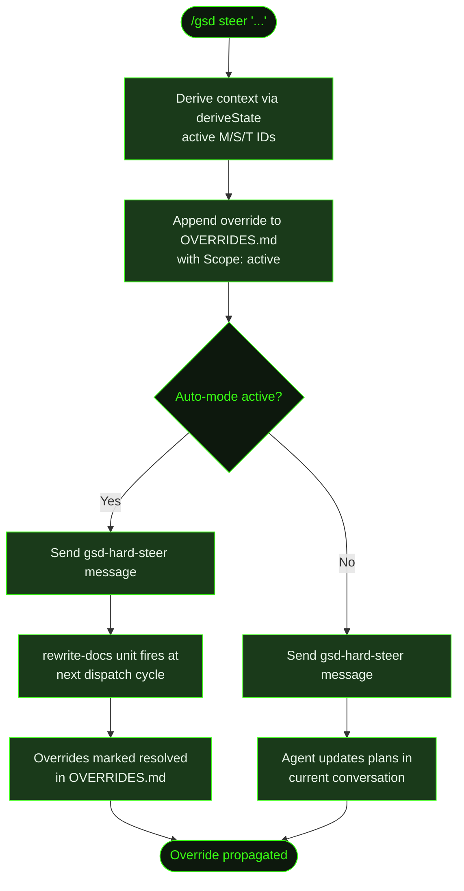

## What It Does

`/gsd steer` registers a plain-English override that changes the direction of ongoing work. GSD saves it to `.gsd/OVERRIDES.md`, injects it into all future task prompts, and tells the agent what to do next — all without stopping anything.

The behavior differs depending on whether auto-mode is running. When active, the dispatch loop's first rule detects the pending override at the next cycle and fires a `rewrite-docs` unit before any other work runs — that unit updates all active plan documents and marks the override resolved. When auto-mode is not running, the `gsd-hard-steer` message instructs the agent to update plans directly in the current conversation.

Overrides are tagged with execution context — the active milestone, slice, and task IDs are recorded in the `Applied-at` field so the system knows exactly when and where the override was applied.

## Usage

```
/gsd steer <change description>
```

The description is plain English. Quotes are optional — everything after `steer` is captured.

```
/gsd steer switch from REST to GraphQL for the recipe API
/gsd steer "skip mobile responsive work — desktop only for MVP"
/gsd steer use Tailwind instead of custom CSS
```

## How It Works



### Override Registration

1. **Context derivation** — Calls `deriveState()` to get the active milestone, slice, and task IDs. These are stored in the `Applied-at` field as `M001/S01/T02` (or `none` for components without an active counterpart).
2. **Append to OVERRIDES.md** — The override text, timestamp, and execution context are appended to `.gsd/OVERRIDES.md`. New overrides always start with `**Scope:** active` — this flag signals the override hasn't been propagated yet.
3. **Prompt injection** — Active overrides (scope `active`) are automatically injected into every future task prompt as an "Active Overrides" section that supersedes any conflicting plan content. This injection is built by reading `OVERRIDES.md` at dispatch time for each unit.

### Override Entry Format

Each override is stored as a markdown section. New files start with a `# GSD Overrides` header:

```markdown
## Override: 2025-01-15T10:30:00.000Z

**Change:** switch from REST to GraphQL for the recipe API
**Scope:** active
**Applied-at:** M002/S01/T02

---
```

After the `rewrite-docs` unit runs, `**Scope:** active` is changed to `**Scope:** resolved`. The post-unit handler calls `resolveAllOverrides()` (a global regex replace across `OVERRIDES.md`) immediately after the unit completes, then resets the attempt counter to zero.

### Auto-mode Active Path

When auto-mode is running, the command sends a `gsd-hard-steer` message to the active agent. This message:

- Confirms the override has been saved and will be injected into all future task prompts
- Instructs the agent to finish current work respecting the override
- Notes that a document rewrite unit will run before the next task

The dispatch loop's **first rule** is `rewrite-docs (override gate)`. At every cycle, it calls `loadActiveOverrides()` — if any exist, it dispatches a `rewrite-docs` unit before any other work. The `rewrite-docs` unit reads `OVERRIDES.md` and propagates changes across all active plan documents.

The unit updates these document types based on what the override affects:

| Document | What changes |
|----------|-------------|
| Incomplete task plans (`T##-PLAN.md`) | Rewrites `[ ]` tasks to align with the override; may add or remove tasks. Completed (`[x]`) tasks are never modified. |
| Slice plans (`S##-PLAN.md`) | Updates Goal, Demo, and Verification sections. Updates Files Likely Touched if scope changes. Completed task entries are left intact. |
| `DECISIONS.md` | Appends a new entry documenting the override; prior decisions are marked superseded, not deleted. |
| `REQUIREMENTS.md` | Updates requirement descriptions if the override changes what "done" means. |
| `PROJECT.md` | Updated only if the override changes project-level facts. |
| `<MID>-ROADMAP.md` | Included in the document list; updated if the override changes roadmap scope or structure. |
| `<MID>-CONTEXT.md` | Listed as reference only — never modified by `rewrite-docs`. |

A circuit breaker limits rewrite attempts to 3 per override set (`MAX_REWRITE_ATTEMPTS = 3`). If the dispatch rule fires 3 times without the unit successfully resolving the overrides, it calls `resolveAllOverrides()` directly — force-flipping all `**Scope:** active` entries to `resolved` via regex — and skips dispatching the unit entirely, preventing an infinite rewrite loop.

### Auto-mode Inactive Path

When auto-mode is not running, the `gsd-hard-steer` message instructs the agent to:

- Read `OVERRIDES.md` immediately
- Update the current plan documents to reflect the change
- Focus on the active slice plan, incomplete task plans, and `DECISIONS.md`

This path works in step mode ([`/gsd`](../gsd/), [`/gsd next`](../next/)) or during a [`/gsd discuss`](../discuss/) conversation.

## What Files It Touches

### Creates

| File | Purpose |
|------|---------|
| `.gsd/OVERRIDES.md` | Created with `# GSD Overrides` header if it doesn't exist |

### Reads

| File | Purpose |
|------|---------|
| `.gsd/` directory | Scanned by `deriveState()` to get active milestone/slice/task for the `Applied-at` field |

### Writes

| File | Purpose |
|------|---------|
| `.gsd/OVERRIDES.md` | Override entry appended with timestamp and `Applied-at` context; `**Scope:** active` entries flipped to `resolved` after rewrite-docs completes |
| Slice plans, task plans, `DECISIONS.md`, `REQUIREMENTS.md`, `PROJECT.md`, `<MID>-ROADMAP.md` | Updated by the `rewrite-docs` unit (auto-mode) or agent directly (step mode) |

## Examples

Steering during auto-mode:

```
> /gsd steer switch from REST to GraphQL for the recipe API

● Override registered: "switch from REST to GraphQL for the recipe API". Will be applied before next task dispatch.
```

Steering when auto-mode is not running:

```
> /gsd steer skip mobile responsive work — desktop only for MVP

● Override registered: "skip mobile responsive work — desktop only for MVP". Update plan documents to reflect this change.
```

Checking what's stored in OVERRIDES.md:

```markdown
# GSD Overrides

User-issued overrides that supersede plan document content.

---

## Override: 2025-01-15T10:30:00.000Z

**Change:** switch from REST to GraphQL for the recipe API
**Scope:** active
**Applied-at:** M002/S01/T02

---
```

After `rewrite-docs` completes, `**Scope:** active` becomes `**Scope:** resolved` and the entry is preserved for the project history.

## Prompts Used

- [`rewrite-docs`](../../prompts/rewrite-docs/) — Document rewrite prompt used to propagate overrides across plan files

## Related Commands

- [`/gsd auto`](../auto/) — Auto-mode that detects and processes active overrides at every dispatch cycle
- [`/gsd capture`](../capture/) — Lighter-weight thought capture (no plan rewrite)
- [`/gsd queue`](../queue/) — Reorder or add future milestones
- [`/gsd discuss`](../discuss/) — Discuss changes before committing to an override
