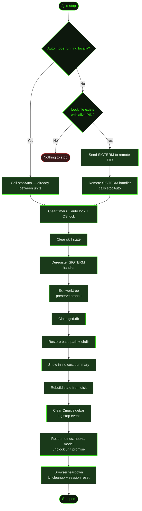

## What It Does

`/gsd stop` gracefully terminates a running auto-mode session. It clears the session lock at `.gsd/auto.lock`, tears down the worktree (while preserving the branch and all commits), closes the SQLite database, and displays an inline session cost summary.

Unlike [`/gsd pause`](../pause/), which preserves state for later resume, stop is a full teardown. The next `/gsd auto` starts a fresh session.

## Usage

```
/gsd stop
```

No flags. Works in two contexts:

- **Local** — If auto mode is running in the current terminal, stops it directly. Because stop is called between dispatch cycles (not mid-execution), the current unit will have already finished.
- **Remote** — If auto mode is running in *another* terminal, GSD reads the PID stored in `.gsd/auto.lock` and sends SIGTERM to that process. The running session's SIGTERM handler triggers `stopAuto()`, which cleans up and exits gracefully.

## How It Works



### Teardown sequence

1. **Clear timeout handles** — Cancels any active unit timeout, wrap-up warning, idle watchdog, and continue-here interval timers. Also clears all in-flight tool records.
2. **Clear session lock** — Removes `.gsd/auto.lock` via the crash-recovery subsystem (`clearLock`) and releases the OS-level exclusive lock held via `proper-lockfile` (`releaseSessionLock`). Together these prevent a concurrent session from starting.
3. **Clear skill state** — Resets skill snapshot and telemetry accumulated during the session.
4. **Deregister SIGTERM handler** — Removes the SIGTERM handler registered at auto-mode start.
5. **Exit worktree** — If worktree isolation was active, exits the `.gsd/worktrees/<MID>/` working copy. The `milestone/<MID>` branch and all its commits are preserved — only the working copy is removed.
6. **Close database** — Flushes pending metrics and closes the SQLite database at `.gsd/gsd.db`.
7. **Restore base path** — Resets to the original project root and changes the working directory back.
8. **Cost summary** — Shows total cost, token count, and units completed for the session as an inline notification.
9. **Rebuild state** — Re-derives GSD state from disk so the status display reflects the stopped session.
10. **Cmux sidebar** — Clears the Cmux sidebar and logs a stop event to the event log (logged as a warning if the stop reason starts with `Blocked:`).
11. **Debug summary** — If debug mode was enabled for the session, writes a full debug summary log to disk and notifies with the path.
12. **Reset metrics and hooks** — Resets session metrics, routing history, hook state, and removes the persisted hook state file.
13. **Remove paused session** — Removes `.gsd/runtime/paused-session.json` if it exists, preventing stale pause state from a previous `/gsd pause` from leaking into the next session.
14. **Restore original model** — If the model was changed during the session (e.g. by auto model selection), restores it to the model active when auto-mode started.
15. **Unblock pending unit promise** — Calls `resolveAgentEnd` to unblock the auto-loop's awaited unit promise, allowing it to detect `active === false` and exit cleanly. Without this step, the auto-loop would hang indefinitely and block the interactive session.

**Finally block (critical invariants):** Regardless of any errors in the steps above, the teardown always: tears down any open browser process to prevent orphaned Chrome instances; clears in-flight tools, slice progress cache, activity log state, and level-change callbacks; resets proactive healing; clears the UI status badge, progress widget, and footer; and calls `s.reset()` to zero out all session state.

### Remote stop

When you run `/gsd stop` in a terminal where auto mode isn't running, GSD reads `.gsd/auto.lock`. If the file exists and its recorded PID is still alive, GSD sends `SIGTERM` to that process. The running session's registered SIGTERM handler calls `stopAuto()`, which performs the full teardown sequence above and exits cleanly.

If the lock file exists but the PID is no longer alive (a stale lock from a crash), GSD cleans up the stale lock file and reports that nothing is running.

### Lock file layers

`.gsd/auto.lock` contains JSON metadata (PID, start time, active unit) written by the crash-recovery subsystem — this is the file read for remote stop. Separately, `proper-lockfile` holds an OS-level exclusive lock on the `.gsd/` directory itself (manifested as a `.gsd.lock/` sibling directory), preventing two sessions from starting concurrently. Both are cleared on stop.

## What Files It Touches

### Reads

| File | Purpose |
|------|---------|
| `.gsd/auto.lock` | Detect whether auto mode is running remotely; read PID for SIGTERM |
| `.gsd/gsd.db` | Flush and close the SQLite metrics database |

### Deletes

| File | Purpose |
|------|---------|
| `.gsd/auto.lock` | Removed on clean shutdown |
| `.gsd.lock/` | Proper-lockfile OS-lock directory removed alongside `auto.lock` |
| `.gsd/worktrees/<MID>/` | Worktree working copy removed (branch and commits preserved) |
| `.gsd/runtime/paused-session.json` | Removed if it exists — prevents stale pause state from a previous `/gsd pause` |

## Examples

Stopping auto mode after several completed units:

```
> /gsd stop

● Auto-mode stopped — User requested stop. Session: $4.82 · 432,095 tokens · 5 units
```

Remote stop from another terminal:

```
> /gsd stop

● Sent stop signal to auto-mode session (PID 48291). It will shut down gracefully.
```

When no session is active (stale or missing lock):

```
> /gsd stop

● Auto-mode is not running.
```

## Related Commands

- [`/gsd auto`](../auto/) — Start autonomous execution
- [`/gsd pause`](../pause/) — Suspend instead of terminate
- [`/gsd status`](../status/) — Monitor a running session without interrupting it
- [`/gsd next`](../next/) — Execute one unit and pause for input
