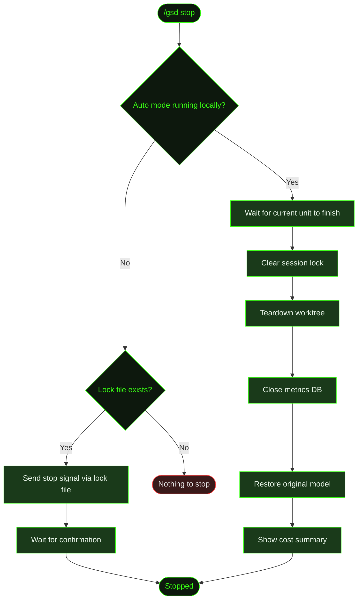

## What It Does

`/gsd stop` gracefully terminates a running auto-mode session. It clears the session lock, tears down the worktree (while preserving the branch and all commits), closes the metrics database, restores the original model configuration, and displays a session cost summary.

Unlike [`/gsd pause`](../pause/), which preserves state for later resume, stop is a full teardown. The next `/gsd auto` starts a fresh session.

## Usage

```
/gsd stop
```

No flags. Works in two contexts:

- **Local** — If auto mode is running in the current terminal, stops it directly after the current unit finishes.
- **Remote** — If auto mode is running in *another* terminal, detects the session lock file and sends a stop signal. The running session picks up the signal and shuts down gracefully.

## How It Works



### Teardown sequence

1. **Wait for current unit** — If a task is mid-execution, GSD lets it finish rather than interrupting. The unit's work is committed normally.
2. **Clear session lock** — Removes the lock file from `.gsd/runtime/`, releasing the session for future runs.
3. **Teardown worktree** — If worktree isolation was active, removes the `.gsd/worktrees/<MID>/` directory. The `milestone/<MID>` branch and all its commits are preserved — only the working copy is removed.
4. **Close metrics DB** — Flushes pending metrics and closes the database connection.
5. **Restore model** — If auto mode switched to a different model for execution, restores the original model configuration.
6. **Cost summary** — Displays total tokens used, estimated cost, wall-clock time, and units completed during the session.

### Remote stop

When you run `/gsd stop` in a terminal where auto mode isn't running, GSD checks for a session lock file. If one exists (meaning auto mode is running in another terminal), it writes a stop signal to the lock file. The running session checks for this signal between unit dispatches and shuts down gracefully.

## What Files It Touches

| Action | Files |
|--------|-------|
| Reads | `.gsd/runtime/` lock files, metrics DB |
| Deletes | `.gsd/runtime/` session lock |
| Removes | `.gsd/worktrees/<MID>/` directory (preserves the branch) |

## Examples

Stopping auto mode after several completed units:

```
> /gsd stop

● Waiting for current unit to finish...
  ✓ T03 complete — committed

● Stopping auto mode
  ✓ Session lock cleared
  ✓ Worktree removed (.gsd/worktrees/M001/)
  ✓ Branch milestone/M001 preserved (8 commits)

● Session Summary
  ┌────────────────────────────────┐
  │ Units completed:  5            │
  │ Duration:         47m 12s      │
  │ Input tokens:     342,891      │
  │ Output tokens:    89,204       │
  │ Estimated cost:   $4.82        │
  └────────────────────────────────┘
```

Remote stop from another terminal:

```
> /gsd stop

● Auto mode detected in another session (PID 48291)
  Sending stop signal...
  ✓ Stop confirmed — session ended
```

## Related Commands

- [`/gsd auto`](../auto/) — Start autonomous execution
- [`/gsd pause`](../pause/) — Suspend instead of terminate
