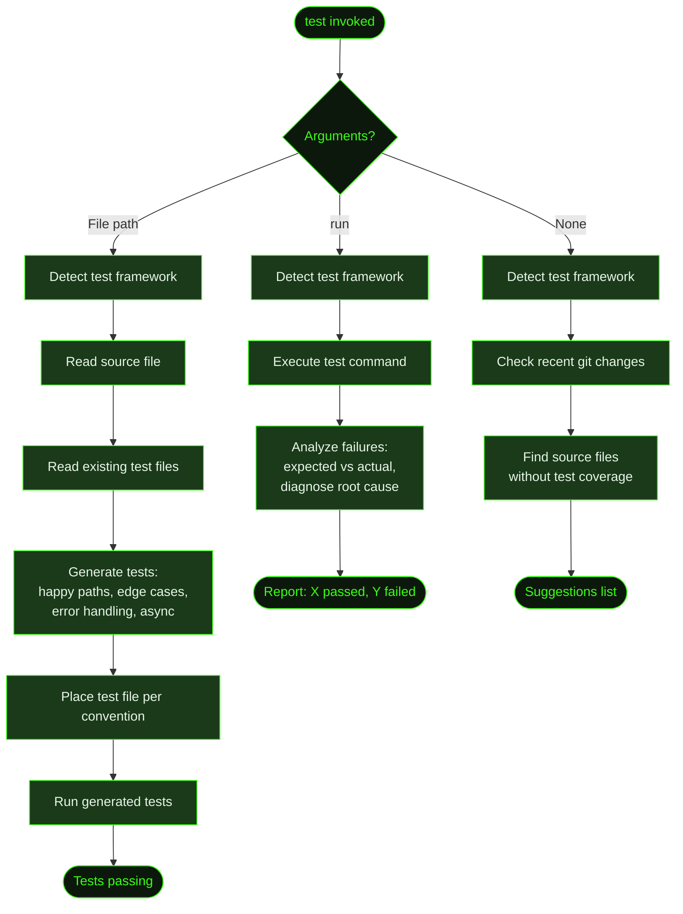

## What It Does

The `test` skill generates tests for source files or runs your existing test suite. It auto-detects the testing framework in use and adapts its output to match the project's existing test conventions — structure, imports, assertions, and file layout.

You can invoke it three ways: give it a file path to generate tests for that file, give it `run` to execute the suite and analyze failures, or invoke with no argument to get a suggestion of what to test based on recent changes.

The skill ships bundled with GSD and is loaded automatically when the task context matches test generation or execution. You can also control it explicitly via [`/gsd prefs`](../prefs/).

## Usage

The skill activates automatically on matching tasks. To invoke it explicitly:

```
test <file>      # Generate tests for a specific source file
test run         # Run the existing test suite and analyze results
test             # Suggest what to test based on recent changes
```

Examples:

```
test src/lib/parser.ts
test src/components/UserCard.tsx
test run
test
```

## How It Works



### Framework Detection

Before generating or running anything, the skill detects the test framework in use by scanning:

1. **`package.json`** — `scripts.test` for the test command; `devDependencies` for jest, vitest, mocha, ava, tap, node:test, playwright, cypress
2. **Config files** — `jest.config.*`, `vitest.config.*`, `.mocharc.*`, `pytest.ini`, `pyproject.toml`, `go.mod`, `Cargo.toml`
3. **Existing test files** — Scans for `*.test.*`, `*.spec.*`, `*_test.*`, `test_*.*` to infer conventions

It reads 1–2 existing test files to capture the import style, describe/it block structure, assertion patterns, and mock approach. Generated tests mirror this exactly.

### Test Generation

For a given source file, the skill generates tests covering:

| Category | What's Covered |
|----------|----------------|
| **Happy paths** | Normal inputs produce correct outputs |
| **Edge cases** | Empty inputs, boundary values, single-element collections |
| **Error handling** | Invalid inputs, missing params, type mismatches |
| **Async behavior** | Successful resolution, rejection, timeout scenarios |
| **Dependencies** | Mocked external dependencies with interaction verification |

Generated tests are placed following the project's convention (co-located, `__tests__/`, `tests/`) and named per the project's naming convention (`.test.ts`, `.spec.js`, `_test.go`, etc.).

**Generated tests are always run immediately.** If they fail, the skill fixes the test code, not the source.

### Failure Analysis

When running the test suite, the skill captures full output and for each failure reports:

- Failing test name and file
- The assertion that failed (expected vs actual)
- A specific diagnosis of why it failed
- A concrete fix suggestion (test bug or source bug)

## What Files It Touches

### Reads

| File | Purpose |
|------|---------|
| Source file (argument) | Analyze exports, functions, types, and error handling patterns |
| Existing test files | Match project's test conventions before generating |
| `package.json` | Detect test framework and available test libraries |
| `jest.config.*` / `vitest.config.*` | Test runner configuration |
| `pytest.ini` / `pyproject.toml` | Python test configuration |

### Creates

| File | Purpose |
|------|---------|
| `*.test.ts` / `*.spec.js` / etc. | Generated test file, placed per project convention |

## Examples

Generating tests for a TypeScript source file:

```
test src/lib/parser.ts

● Detected framework: vitest (vitest.config.ts)
● Reading: src/lib/parser.ts
● Reading: src/lib/__tests__/tokenizer.test.ts (convention reference)

● Writing: src/lib/__tests__/parser.test.ts

  Generated 14 tests:
    ✓ parse() — valid JSON input
    ✓ parse() — empty string returns null
    ✓ parse() — malformed input throws ParseError
    ✓ parse() — nested objects
    ✓ parseAsync() — resolves on valid input
    ✓ parseAsync() — rejects on timeout
    ... 8 more

● Running tests
  14 passed, 0 failed
```

Running the existing test suite:

```
test run

● Detected framework: jest
● Running: npm test

  Test Results: 47 passed, 2 failed, 0 skipped

  Failures:
  1. UserCard > renders with missing avatar
     Expected: 
     Received: null
     Diagnosis: Component doesn't fall back to default avatar when prop is undefined
     Fix: Add defaultProps or nullish coalescing: src={avatar ?? '/default.png'}

  2. api/users > POST /users — duplicate email
     Expected: status 409
     Received: status 500
     Diagnosis: Unique constraint error from DB isn't caught and mapped to 409
     Fix: Add try/catch around db.insert() and check for unique constraint code
```

Getting test suggestions:

```
test

● Recent changes (last 5 commits):
  src/lib/validator.ts — modified, no test file exists
  src/components/Form.tsx — modified, tests exist (may need updating)
  src/api/routes.ts — modified, no test file exists

  Suggested:
  1. src/lib/validator.ts — new file, no coverage
  2. src/api/routes.ts — modified recently, no tests
  3. src/components/Form.tsx — may need test updates

  Run `test <file>` to generate tests for any of these.
  Run `test run` to run the existing suite.
```

## Related Commands

- [`/gsd skill-health`](../skill-health/) — View `test` skill usage stats and success rate over time
- [`/gsd prefs`](../prefs/) — Configure `always_use_skills`, `prefer_skills`, or `avoid_skills` to control when `test` activates
- [`/gsd add-tests`](../add-tests/) — Post-phase test generation tied to GSD slice UAT criteria
- [`/gsd doctor`](../doctor/) — Validates GSD project health including skill configuration
