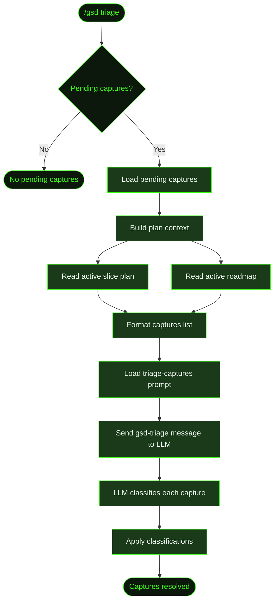

## What It Does

`/gsd triage` processes pending captures that were saved with [`/gsd capture`](../capture/). It loads all unresolved captures, builds context from the current plan state, and dispatches an LLM triage prompt that classifies each capture and determines the right action.

The triage is an LLM-assisted process — the model reads each capture alongside the active slice plan and milestone roadmap, then decides whether each item is a quick task, should be injected into the current slice, deferred to a future milestone, requires a replan, or is just a note.

If there are no pending captures, the command exits immediately with a notification.

## Usage

```
/gsd triage
```

No arguments. Triages all pending captures at once.

## How It Works



### Context Building

The triage prompt needs context to make good classification decisions. The command loads:

1. **Active slice plan** — The current `S0X-PLAN.md` showing what tasks are in progress and what's planned. This helps the LLM decide if a capture should be injected into the current slice.
2. **Active roadmap** — The milestone's `MXXX-ROADMAP.md` showing the full slice breakdown. This helps the LLM decide if a capture belongs in a different slice or should be deferred.

If no active slice or roadmap exists, placeholder text `(no active slice plan)` or `(no active roadmap)` is used instead.

### Prompt Dispatch

The captures are formatted as a bullet list:

```
- **CAP-a1b2c3d4**: "consider adding rate limiting" (captured: 2025-01-15T10:30:00Z)
- **CAP-f9e8d7c6**: "login form error messages" (captured: 2025-01-15T11:00:00Z)
```

This list, along with the plan context, is injected into the `triage-captures` prompt template. The assembled prompt is sent as a `gsd-triage` message with `triggerTurn: true`, which starts a new LLM turn to process the triage.

### LLM Classification

The LLM returns a JSON array of triage results. Each result contains:

| Field | Type | Description |
|-------|------|-------------|
| `captureId` | string | The capture ID (e.g., `CAP-a1b2c3d4`) |
| `classification` | string | One of: `quick-task`, `inject`, `defer`, `replan`, `note` |
| `rationale` | string | Why this classification was chosen |
| `affectedFiles` | string[] | Optional — files impacted by the change |
| `targetSlice` | string | Optional — which slice to inject into |

### Response Parsing

The triage output parser handles messy LLM responses gracefully:

- Clean JSON arrays
- JSON wrapped in fenced code blocks
- JSON with leading/trailing prose
- Single objects (wrapped into an array)
- Malformed JSON (returns empty array — caller falls back to `note`)

Valid entries are kept even when others fail to parse.

## What Files It Touches

### Reads

| File | Purpose |
|------|---------|
| `.gsd/CAPTURES.md` | Loads pending captures |
| `.gsd/milestones/MXXX/slices/SXX/SXX-PLAN.md` | Active slice plan for context |
| `.gsd/milestones/MXXX/MXXX-ROADMAP.md` | Active roadmap for context |

### Writes

| File | Purpose |
|------|---------|
| `.gsd/CAPTURES.md` | Captures updated with classification, resolution, and resolved timestamp |

## Examples

Triaging pending captures in a Cookmate project:

```
> /gsd triage

● Triaging 3 pending captures...

  CAP-a1b2c3d4: "consider adding rate limiting to the API"
    → defer — Not in scope for M002, queued for future work

  CAP-f9e8d7c6: "login form needs better error messages"
    → inject — Added to S03 plan as a new task

  CAP-b3c4d5e6: "remember to update the changelog"
    → note — Informational, no action needed

● Triage complete
  1 deferred, 1 injected, 1 noted
```

When no captures are pending:

```
> /gsd triage

● No pending captures to triage.
```

## Related Commands

- [`/gsd capture`](../capture/) — Save thoughts for later triage
- [`/gsd steer`](../steer/) — Direct plan override (bypasses triage)
- [`/gsd queue`](../queue/) — Add future milestones for deferred work
- [`/gsd quick`](../quick/) — Execute quick-task captures immediately
