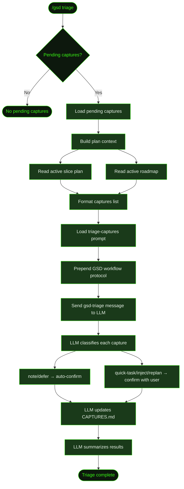

## What It Does

`/gsd triage` processes pending captures that were saved with [`/gsd capture`](../capture/). It loads all unresolved captures, builds context from the current plan state, and dispatches an LLM session that classifies each capture and walks you through confirming the results.

The triage is an LLM-driven conversation — the model reads each capture alongside the active slice plan and milestone roadmap, then proposes whether each item is a quick task, should be injected into the current slice, deferred to a future milestone, requires a replan, or is just a note. Low-impact classifications (`note` and `defer`) are auto-confirmed. Actionable ones (`quick-task`, `inject`, `replan`) require your confirmation before CAPTURES.md is updated.

If there are no pending captures, the command exits immediately with a notification.

## Usage

```
/gsd triage
```

No arguments. Triages all pending captures at once.

## How It Works



### Context Building

The triage prompt needs context to make good classification decisions. The command loads:

1. **Active slice plan** — The current `SXX-PLAN.md` showing what tasks are in progress and what's planned. This helps the LLM decide if a capture should be injected into the current slice or done as a quick task.
2. **Active roadmap** — The milestone's `MXXX-ROADMAP.md` showing the full slice breakdown. This helps the LLM decide if a capture belongs in a different slice or should be deferred.

If no active slice or roadmap exists, placeholder text `(no active slice plan)` or `(no active roadmap)` is used instead.

### Prompt Dispatch

The captures are formatted as a bullet list:

```
- **CAP-a1b2c3d4**: "consider adding rate limiting" (captured: 2025-01-15T10:30:00.000Z)
- **CAP-f9e8d7c6**: "login form error messages" (captured: 2025-01-15T11:00:00.000Z)
```

This list, along with the plan context, is injected into the `triage-captures` prompt template. The assembled prompt is prepended with the GSD workflow protocol (read from `~/.gsd/agent/GSD-WORKFLOW.md`, or the path in `GSD_WORKFLOW_PATH` if set) and sent as a `gsd-triage` message with `triggerTurn: true`, which starts a new LLM session to run the triage.

### LLM Classification

The LLM classifies each capture into one of five types:

| Classification | Meaning |
|----------------|---------|
| `quick-task` | Small, self-contained — can be done in minutes without modifying the plan |
| `inject` | Belongs in the current slice but wasn't planned — a new task is added |
| `defer` | Belongs in a future slice or milestone — not urgent now |
| `replan` | Changes the shape of remaining work in the current slice — existing incomplete tasks may need rewriting |
| `note` | Informational only — no action needed |

The LLM follows these priority guidelines when classifying:
- Prefer **quick-task** when work is clearly small and self-contained.
- Prefer **inject** over **replan** when only a new task is needed (not a rewrite of existing ones).
- Prefer **defer** over **inject** when the work doesn't belong in the current slice's scope.
- Use **replan** only when remaining incomplete tasks need to change — not just for adding work.
- If unsure between quick-task and inject: will this take more than 10 minutes? If yes, inject.

### Confirmation Flow

After classifying, the LLM presents each result to you and asks for confirmation:

- **note** and **defer** — auto-confirmed silently. These are low-impact and don't modify the plan.
- **quick-task**, **inject**, and **replan** — presented via `ask_user_questions` with the proposed classification, rationale, and affected files. You can confirm the proposal or choose a different classification.

You can also skip a capture entirely, leaving it `pending` for a future triage run.

### CAPTURES.md Updates

For each confirmed capture, the LLM updates its section in `.gsd/CAPTURES.md`:

```markdown
### CAP-a1b2c3d4
**Text:** consider adding rate limiting to the API
**Captured:** 2025-01-15T10:30:00.000Z
**Status:** resolved
**Classification:** defer
**Resolution:** deferred to a future slice
**Rationale:** Not in scope for current slice — depends on unbuilt infrastructure
**Resolved:** 2025-01-15T14:00:00.000Z
```

After triage, actionable captures (`inject`, `replan`, `quick-task`) accumulate as unexecuted resolutions. When their resolutions are later executed, an `**Executed:**` timestamp is appended:

```markdown
**Executed:** 2025-01-15T15:00:00.000Z
```

### Resolution Execution

Triage classifies captures but does not execute them. Execution happens separately — via auto-mode dispatch or manual action. The `executeTriageResolutions` function runs after a triage-captures unit completes, scanning for resolved captures with actionable classifications that haven't been executed yet:

- **inject** — Reads the active slice plan, finds the highest existing task ID, and appends a new task entry before the `## Files Likely Touched` section:
  ```markdown
  - [ ] **T05: <capture text>** `est:30m`
    - Why: Injected from capture CAP-a1b2c3d4 during triage
    - Do: <capture text>
    - Done when: Capture intent fulfilled
  ```
  Marks the capture as executed on success.

- **replan** — Writes a `SXX-REPLAN-TRIGGER.md` marker file in the slice directory. The next dispatch cycle detects this file and enters the `replanning-slice` phase. The trigger file records the source capture ID, text, rationale, and a timestamp.

- **quick-task** — Collected and dispatched as a self-contained unit. A dedicated prompt (`buildQuickTaskPrompt`) is generated from the capture text and executed without modifying any plan files. The capture is marked as executed after the unit completes.

- **defer** — When the resolution text references a milestone ID that doesn't yet exist on disk, `ensureDeferMilestoneDir` creates the milestone directory and seeds it with a `MXXX-CONTEXT-DRAFT.md` listing the deferred captures. This ensures `deriveState()` discovers the milestone and routes to the discussion phase.

Each executed capture is stamped with `**Executed:**` in `CAPTURES.md` to prevent double-execution on retries or restarts.

### Auto-Mode Triage

When auto-mode fires triage programmatically (between tasks), the confirmation UI differs. Instead of a conversational LLM session, the triage results are parsed and presented via `showTriageConfirmation` — an interactive widget using `showNextAction`. Each actionable capture is displayed one at a time with its proposed classification and rationale; you select from all five classifications (proposed is shown as recommended) or skip the capture to leave it pending.

The same auto-confirm rule applies: `note` and `defer` are resolved automatically without prompting. File overlap detection also runs in this path: if a capture's affected files overlap with files planned for upcoming tasks, a warning is surfaced before you confirm. If you change the proposed classification, that override is recorded in the resolution text.

## What Files It Touches

### Creates

| File | Purpose |
|------|---------|
| `.gsd/milestones/MXXX/MXXX-CONTEXT-DRAFT.md` | Seeded when a `defer` target milestone doesn't exist yet — lists deferred captures so `deriveState()` enters the discussion phase |
| `.gsd/milestones/MXXX/slices/SXX/SXX-REPLAN-TRIGGER.md` | Written when a `replan` capture is executed — triggers the replanning-slice phase on next dispatch |

### Reads

| File | Purpose |
|------|---------|
| `.gsd/CAPTURES.md` | Loads pending captures |
| `.gsd/milestones/MXXX/slices/SXX/SXX-PLAN.md` | Active slice plan for context |
| `.gsd/milestones/MXXX/MXXX-ROADMAP.md` | Active roadmap for context |
| `~/.gsd/agent/GSD-WORKFLOW.md` | GSD workflow protocol prepended to the triage prompt (override with `GSD_WORKFLOW_PATH`) |

### Writes

| File | Purpose |
|------|---------|
| `.gsd/CAPTURES.md` | Captures updated with classification, resolution, rationale, resolved timestamp, and eventually an executed timestamp |
| `.gsd/milestones/MXXX/slices/SXX/SXX-PLAN.md` | New task appended when an `inject` capture is executed |

## Examples

Triaging three pending captures:

```
> /gsd triage

● Triaging 3 pending captures...
```

The LLM then runs the triage session. For `note` and `defer` captures, it confirms automatically. For `quick-task`, `inject`, and `replan` captures, it shows a confirmation prompt where you can approve the proposal, choose a different classification, or skip it. After all captures are processed, it summarizes the results:

```
Triage complete.
3 captures processed: 1 quick-task ready for execution, 1 deferred to S03, 1 noted.
```

When no captures are pending:

```
> /gsd triage

● No pending captures to triage.
```

## Prompts Used

- [`triage-captures`](../../prompts/triage-captures/) — Capture triage prompt

## Related Commands

- [`/gsd capture`](../capture/) — Save thoughts for later triage
- [`/gsd steer`](../steer/) — Direct plan override (bypasses triage, applies immediately)
- [`/gsd queue`](../queue/) — Add future milestones for deferred work
- [`/gsd quick`](../quick/) — Execute a quick one-off task immediately
