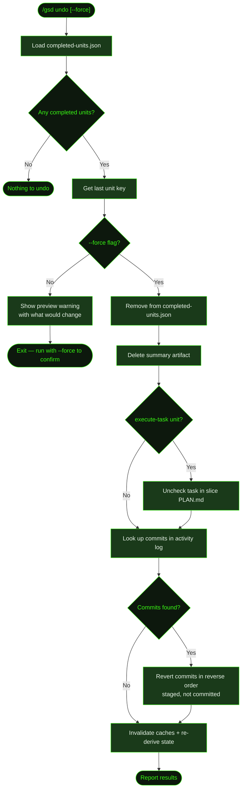

## What It Does

`/gsd undo` rolls back the most recently completed unit. It removes the unit from GSD's idempotency log, deletes its summary artifact, unchecks its task checkbox in the slice plan (for `execute-task` units), and attempts to revert the associated git commits.

This is the inverse of a completed dispatch — useful when a unit ran but produced wrong output, when you need to re-execute a task with different context, or when a chain of units needs to be rewound. Run it multiple times to undo multiple units in reverse order.

Because undo reaches into your git history, it requires explicit confirmation. Running `/gsd undo` without flags shows you exactly what would happen and asks you to re-run with `--force` to proceed.

## Usage

```
/gsd undo
/gsd undo --force
```

| Invocation | Behavior |
|------------|----------|
| `/gsd undo` | Preview mode — shows what will be undone, no changes made |
| `/gsd undo --force` | Execute — removes state, deletes artifacts, reverts commits |

Run `/gsd status` first if you're unsure which unit was last completed.

## How It Works



### Undo sequence

1. **Load state** — Reads `.gsd/completed-units.json`. If the file is missing or empty, undo exits immediately with an info notice.
2. **Preview (without `--force`)** — Shows the unit type and ID that would be undone, and lists every action that would be taken. No changes are made.
3. **Remove from completed log** — The unit's key is removed from `.gsd/completed-units.json`. This is what allows auto-mode to re-dispatch the unit.
4. **Delete summary artifact** — The artifact produced by the unit is deleted from disk. For task-level units (`M001/S01/T01`), this is the `<TID>-SUMMARY.md` inside the tasks directory. For slice-level units (`M001/S01`), GSD looks for files matching `<SID>-SUMMARY.md` or `<SID>-COMPLETE.md` in the slice directory.
5. **Uncheck task in PLAN** — For `execute-task` units, the corresponding checkbox in the slice's `PLAN.md` is flipped from `[x]` back to `[ ]`. This keeps the plan file consistent with the reverted state.
6. **Revert git commits** — GSD reads the most recent `.gsd/activity/*.jsonl` file for the unit and extracts commit SHAs from git output embedded in the activity log. Commits are reverted in reverse order using `git revert`. Reverts are **staged but not committed** — you review the diff and commit or reset yourself. If a revert conflict occurs, the remaining commits are skipped and undo continues.
7. **Re-derive state** — Caches are invalidated and `deriveState()` re-reads the `.gsd/` tree so subsequent commands reflect the reverted state.

### What "staged, not committed" means

When undo reverts git commits, it stages the reverse changes but leaves them uncommitted. This gives you a chance to inspect the diff before deciding:

```bash
git diff --cached   # review what undo staged
git commit          # commit the revert permanently
git reset HEAD      # unstage if you want to handle it differently
```

This design avoids creating a "revert commit" you didn't ask for, and it lets you combine the revert with other changes in a single commit.

### Activity log lookup

GSD records agent activity in `.gsd/activity/` as `.jsonl` files named by date and unit (e.g., `2026-03-14-execute-task-M001-S01-T01.jsonl`). Each line is a JSON message. Undo finds commit SHAs by scanning `tool_result` blocks in the most recent matching file — specifically the `[branch sha]` tokens that git prints after a successful commit. Duplicate SHAs are deduplicated automatically.

If no activity file exists for the unit (e.g., the unit was completed in a previous GSD version or via `/gsd skip`), the git revert step is skipped silently. State cleanup and artifact deletion still happen.

### Scope

Undo only operates on the **last** unit in the completed log — it has no `--target` option. To undo multiple units, run `/gsd undo --force` repeatedly. The completed log is ordered by dispatch time, so undo always works backwards through the execution history.

## What Files It Touches

### Reads

| File | Purpose |
|------|---------|
| `.gsd/completed-units.json` | Identify the last completed unit |
| `.gsd/activity/<date>-<type>-<id>.jsonl` | Look up git commit SHAs for the unit |

### Writes

| File | Purpose |
|------|---------|
| `.gsd/completed-units.json` | Last unit key removed |
| `.gsd/<MID>/slices/<SID>/<SID>-PLAN.md` | Task checkbox unchecked (execute-task units only) |

### Deletes

| File | Condition |
|------|-----------|
| `.gsd/<MID>/slices/<SID>/tasks/<TID>-SUMMARY.md` | Task-level unit (`M001/S01/T01`) |
| `.gsd/<MID>/slices/<SID>/<SID>-SUMMARY.md` | Slice-level unit (`M001/S01`) |
| `.gsd/<MID>/slices/<SID>/<SID>-COMPLETE.md` | Slice-level unit (alternate suffix) |

## Examples

Previewing an undo without committing to it:

```
> /gsd undo

⚠ Will undo: execute-task (M001/S01/T01)
  This will:
    - Remove from completed-units.json
    - Delete summary artifacts
    - Uncheck task in PLAN (if execute-task)
    - Attempt to revert associated git commits

  Run /gsd undo --force to confirm.
```

Confirming and executing the undo:

```
> /gsd undo --force

✓ Undone: execute-task (M001/S01/T01)
    - Removed from completed-units.json
    - Deleted summary artifact
    - Unchecked task in PLAN
    - Reverted 2 commit(s) (staged, not committed)
  Review with 'git diff --cached' then 'git commit' or 'git reset HEAD'
```

Undoing a slice-level unit (e.g., a `run-uat` that was run but produced bad results):

```
> /gsd undo --force

✓ Undone: run-uat (M001/S02)
    - Removed from completed-units.json
    - Deleted summary artifact
```

Nothing to undo:

```
> /gsd undo

ℹ Nothing to undo — no completed units.
```

## Related Commands

- [`/gsd skip`](../skip/) — Mark a unit as completed without executing it (forward direction)
- [`/gsd auto`](../auto/) — Resume dispatch after undo; the reverted unit will be re-dispatched
- [`/gsd status`](../status/) — Check which unit was last completed before running undo
- [`/gsd forensics`](../forensics/) — Investigate what a unit produced before deciding to undo it
- [`/gsd doctor`](../doctor/) — Repair structural issues without reverting execution history
