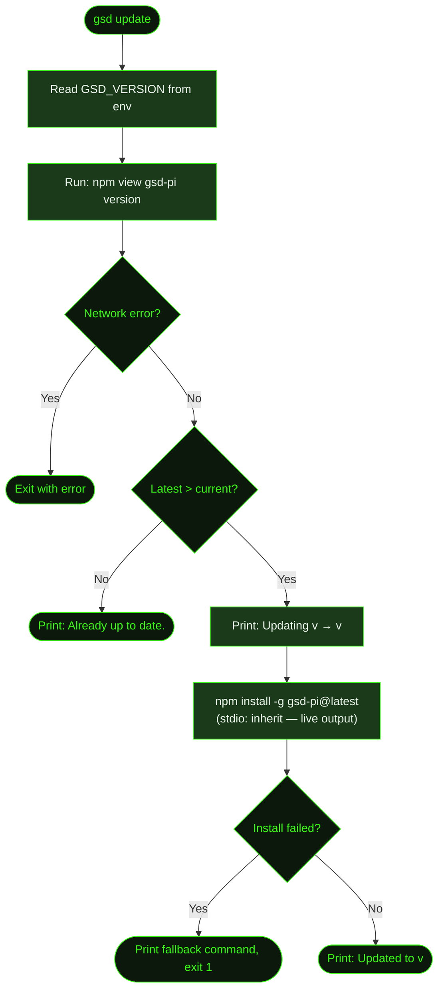

## What It Does

`/gsd update` updates GSD to the latest published version of `gsd-pi`. It checks the npm registry, compares the installed version against the latest, downloads and installs the update, and reports what changed.

You can run it two ways: as `gsd update` in your terminal (no session needed), or as `/gsd update` inside a running session. Both routes perform the same update — the difference is how output is rendered and whether you need to restart afterwards.

GSD also performs a non-blocking version check on startup. If a newer version is available, a small banner appears before the session starts — it never blocks your workflow or prompts for input.

## Usage

From your terminal:

```bash
gsd update
```

Inside a running session:

```
/gsd update
```

No arguments — it always updates to the latest stable release.

## How It Works

### Terminal Update Flow (`gsd update`)



The full pipeline:

1. **Read current version** — Checks the `GSD_VERSION` environment variable (set at startup from `package.json`).
2. **Query npm registry** — Runs `npm view gsd-pi version` to fetch the latest published version.
3. **Compare** — If already up to date, exits immediately with a confirmation message.
4. **Install** — Runs `npm install -g gsd-pi@latest` with live output streamed to the terminal (`stdio: 'inherit'`).
5. **Report** — Prints the new version on success, or exits with a manual fallback command on failure.

### In-Session Update Flow (`/gsd update`)

Same steps as the terminal flow, but uses `execSync` with output captured (`stdio: ['ignore', 'pipe', 'ignore']`) and results delivered through the session's notification system. After a successful update, you need to **restart your GSD session** to load the new version — the running session is not hot-reloaded.

### Startup Version Check

When GSD launches in interactive mode, it runs a non-blocking background check:

1. **Cache check** — Reads `~/.gsd/.update-check`. If checked within the last 24 hours, uses the cached result immediately (no network request).
2. **Registry fetch** — If the cache is stale, fetches `https://registry.npmjs.org/gsd-pi/latest` using the Fetch API with a 5-second timeout. Silently ignores network errors.
3. **Cache write** — Saves the fetched version and timestamp for next time.
4. **Banner** — If a newer version is found, prints a two-line banner to stderr before the session starts. The banner is informational only — it never blocks launch or prompts for input.

The startup check only runs in interactive mode. Print mode and subagent spawns skip it.

### Version Comparison

GSD uses its own semver comparison (no external dependency). The `compareSemver` function splits both versions on `.`, pads shorter arrays with zeros, and compares numerically field by field. Returns `1` if `a > b`, `-1` if `a < b`, `0` if equal.

## What Files It Touches

### Reads

| File | Purpose |
|------|---------|
| `~/.gsd/.update-check` | Cached result of last registry check (JSON: `lastCheck`, `latestVersion`) |

### Writes

| File | Purpose |
|------|---------|
| `~/.gsd/.update-check` | Updated with latest version and timestamp after each registry fetch |

No files in your project's `.gsd/` directory are read or written.

## Examples

Updating from the terminal:

```bash
$ gsd update
Current version: v2.36.0
Checking npm registry...
Updating: v2.36.0 → v2.37.0

added 1 package, changed 1 package, and audited 142 packages in 8s

Updated to v2.37.0
```

Already up to date:

```bash
$ gsd update
Current version: v2.37.0
Checking npm registry...
Already up to date.
```

Inside a session:

```
/gsd update
# Current version: v2.36.0
# Checking npm registry...
# Updated to v2.37.0. Restart your GSD session to use the new version.
```

Startup banner when an update is waiting (printed to stderr before the session starts):

```
  Update available: v2.36.0 → v2.37.0
  Run npm update -g gsd-pi or /gsd update to upgrade
```

## Related Commands

- [`/gsd doctor`](../doctor/) — Runtime health checks including version diagnostics
- [`/gsd prefs`](../prefs/) — Model selection, timeouts, and budget settings
- [`/gsd help`](../gsd/) — Categorized command reference for all GSD subcommands
