## What It Does

`/gsd visualize` opens a full-featured TUI visualizer that goes beyond the simple progress dashboard of [`/gsd status`](../status/). It provides 7 tabs, each offering a different view of your project's execution data: progress with filtering, dependency graphs, cost and token metrics, a chronological timeline, agent model information, a changelog of file modifications, and export to JSON or markdown.

Like the status dashboard, the visualizer is completely read-only. It reads `.gsd/` state files, activity logs, and git history — it never modifies anything.

## Usage

```
/gsd visualize
```

Requires an interactive terminal with sufficient width for the tabbed layout. No flags.

## How It Works

The visualizer loads all project data once on startup, then renders the 7-tab interface. Each tab draws from the same underlying data set — different views of the same execution history.

```mermaid
flowchart TD
    Start(["/gsd visualize"]) --> LoadState[Load .gsd/ state files]
    LoadState --> LoadActivity[Load activity JSONL logs]
    LoadActivity --> LoadGit[Load git history]
    LoadGit --> BuildData[Build unified data model]
    BuildData --> Tabs

    subgraph Tabs[Tab Views]
        direction LR
        T1[Progress]
        T2[Dependencies]
        T3[Metrics]
        T4[Timeline]
        T5[Agent]
        T6[Changes]
        T7[Export]
    end

    Tabs --> Render[Render active tab]
    Render --> Input{User input}
    Input -->|Switch tab| Render
    Input -->|Escape| Done([Close])

    style Start fill:#0d180d,stroke:#39ff14,color:#39ff14
    style Input fill:#0d180d,stroke:#39ff14,color:#39ff14
    style LoadState fill:#1a3a1a,stroke:#39ff14,color:#e8f4e8
    style LoadActivity fill:#1a3a1a,stroke:#39ff14,color:#e8f4e8
    style LoadGit fill:#1a3a1a,stroke:#39ff14,color:#e8f4e8
    style BuildData fill:#1a3a1a,stroke:#39ff14,color:#e8f4e8
    style Render fill:#1a3a1a,stroke:#39ff14,color:#e8f4e8
    style T1 fill:#1a3a1a,stroke:#39ff14,color:#e8f4e8
    style T2 fill:#1a3a1a,stroke:#39ff14,color:#e8f4e8
    style T3 fill:#1a3a1a,stroke:#39ff14,color:#e8f4e8
    style T4 fill:#1a3a1a,stroke:#39ff14,color:#e8f4e8
    style T5 fill:#1a3a1a,stroke:#39ff14,color:#e8f4e8
    style T6 fill:#1a3a1a,stroke:#39ff14,color:#e8f4e8
    style T7 fill:#1a3a1a,stroke:#39ff14,color:#e8f4e8
    style Tabs fill:#0d180d,stroke:#39ff14,color:#39ff14
    style Done fill:#0d180d,stroke:#39ff14,color:#39ff14
```



### The 7 tabs

**1. Progress** — A filterable view of milestone, slice, and task progress. Similar to [`/gsd status`](../status/) but with search and filter controls. Filter by status (complete, in-progress, pending), slice, or task type.

**2. Dependencies** — A graph view showing how slices depend on each other. Slices with `depends:[]` metadata in the roadmap are rendered as a directed graph. Helps identify which slices are blocked and which can proceed independently.

**3. Metrics** — Cost and token breakdown by unit, slice, and milestone. Shows input tokens, output tokens, estimated cost per unit, and cumulative totals. Useful for understanding which tasks are expensive and where token budget is going.

**4. Timeline** — A chronological view of all executed units, ordered by start time. Shows duration, gaps between units, and parallel execution when applicable. Gives a clear picture of how the project unfolded over time.

**5. Agent** — Information about the models used during execution: which model handled each unit, model switching events, and configuration details. Useful when debugging unexpected behavior or comparing output quality across models.

**6. Changes** — A changelog of files modified during the milestone, grouped by unit. Shows which files each task created, modified, or deleted. Essentially a structured view of the git history filtered to GSD-managed commits.

**7. Export** — Export the project data to JSON or markdown format. The JSON export includes the full execution history, metrics, and file changes. The markdown export produces a human-readable project report.

### Data sources

The visualizer pulls from three categories of data:

- **State files** — `.gsd/STATE.md`, roadmap files, plan files, and summaries. These provide the structural view: what milestones, slices, and tasks exist and their completion status.
- **Activity logs** — `.gsd/activity/*.jsonl` files containing timestamped records of each unit's execution: start/end times, token counts, cost estimates, model used, and outcome.
- **Git history** — Commit log filtered to GSD-managed commits (those with structured commit messages from auto-commit). Provides the file-level change data for the Changes tab.

### Overlay behavior

Like the status dashboard, the visualizer renders as a TUI overlay. Navigate between tabs with arrow keys or number keys (1-7). Press **Escape** to close and return to the normal terminal.

## What Files It Touches

Entirely read-only.

| Reads | Purpose |
|-------|---------|
| `.gsd/STATE.md` | Current project state |
| `M*-ROADMAP.md` | Slice structure and dependencies |
| `S*-PLAN.md` | Task structure |
| `T*-SUMMARY.md` | Unit outcomes |
| `.gsd/activity/*.jsonl` | Execution logs (timing, cost, tokens) |
| Git commit history | File changes per unit |

## Examples

Opening the visualizer on a Cookmate project with two completed slices:

```
> /gsd visualize

  ┌──────────────────────────────────────────────────────┐
  │ [1]Progress [2]Deps [3]Metrics [4]Timeline           │
  │ [5]Agent [6]Changes [7]Export                        │
  ├──────────────────────────────────────────────────────┤
  │                                                      │
  │  Tab 3: Metrics                                      │
  │                                                      │
  │  Cost by slice                                       │
  │  ├─ S01: Database schema and auth    $2.11           │
  │  │  ├─ T01  Research         $0.32   (22K tokens)    │
  │  │  ├─ T02  Prisma schema    $0.48   (31K tokens)    │
  │  │  ├─ T03  NextAuth         $0.72   (48K tokens)    │
  │  │  └─ T04  Summary          $0.59   (39K tokens)    │
  │  └─ S02: Recipe CRUD API     $1.55                   │
  │     ├─ T01  Recipe model     $0.55   (36K tokens)    │
  │     ├─ T02  List endpoint    $0.62   (41K tokens)    │
  │     └─ T03  Delete endpoint  $0.38   (25K tokens)    │
  │                                                      │
  │  Total: $3.66 │ 242K tokens │ 1h 14m                 │
  │                                                      │
  └──────────────────────────────────────────────────────┘
```

## Related Commands

- [`/gsd status`](../status/) — Simpler progress dashboard
- [`/gsd auto`](../auto/) — The execution engine that generates the data this visualizer displays
