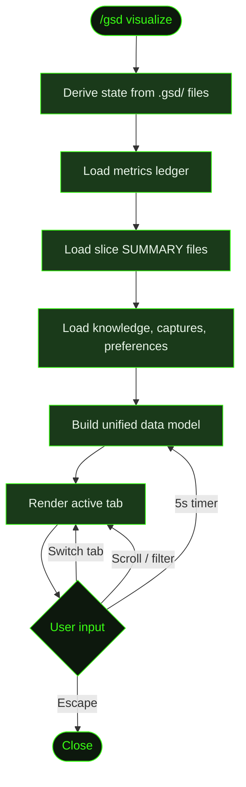

## What It Does

`/gsd visualize` opens a full-featured TUI visualizer that goes far beyond the simple progress dashboard of [`/gsd status`](../status/). It provides 10 tabs, each offering a different view of your project's execution data: a filterable progress overview with risk heatmap, a Gantt timeline, dependency graphs and critical path, cost and token metrics with projections, session health with provider and skill status, live agent activity, a changelog of completed slices, the KNOWLEDGE.md knowledge base, pending captures, and export to JSON, markdown, or plain text.

The visualizer is completely read-only. It reads `.gsd/` state files, metrics ledger, slice summaries, and preference files — it never modifies anything. It auto-refreshes every 5 seconds while open.

## Usage

```
/gsd visualize
```

No flags. Requires an interactive terminal. Works best at 90+ columns wide (enables Gantt view in the Timeline tab).

## How It Works

The visualizer loads all project data on startup, then renders the 10-tab interface. Each tab draws from the same underlying data model. It auto-refreshes every 5 seconds so live execution is visible in real-time.



### The 10 tabs

**1. Progress** — A filterable overview of all milestones, slices, and tasks. Leads with a **Risk Heatmap** (color-coded blocks per milestone — green for low, amber for medium, red for high — plus a legend and count of high-risk slices not yet started), a **Feature Snapshot** (missing slices, slices updated in the last 7 days, and recent completions), and **Discussion Status** (which milestones have been discussed, drafted, or are still pending). Each slice shows a verification badge (✓/✗/?) and a blocker warning if one was found during verification. Milestones can be `active`, `complete`, `pending`, or `parked`. The active slice expands to show individual tasks with estimates. Press **Enter** or **Space** to collapse/expand a milestone.

**2. Timeline** — A Gantt-style view of the last 20 executed units. On terminals ≥ 90 columns wide, renders as a proportional Gantt chart with phase-colored bars (research, planning, execution, summary) and time axis labels. On narrower terminals, falls back to a list view with duration bars. Shows tier tags and model labels per unit.

**3. Deps** — Dependency graphs at two levels. Milestone-level arrows show which milestones depend on each other. Slice-level arrows show dependencies within the active milestone. Also renders a **Critical Path** section (the longest path through incomplete work, with slack for non-critical nodes) and a **Data Flow** section derived from slice verification metadata (what each slice provides and requires).

**4. Metrics** — Cost and token breakdown with bar charts. **By Phase** (research/planning/execution/summary), **By Model**, and **By Tier**. A **Projections** section calculates average cost per completed slice, projects remaining spend, shows burn rate, and draws a sparkline of per-slice cost trends. Displays a warning if projected total exceeds 2× current spend.

**5. Health** — Session health in six sections. **Budget**: visual progress bar against the configured ceiling (if set) and the active token profile. **Pressure**: truncation rate and continue-here rate as color-coded bars (green/yellow/red). **Routing**: tier breakdown with downgrade counts and savings summary. **Session**: raw tool call and message counts. **Environment**: any failing environment checks (missing tools, configuration issues) surfaced from the doctor checks. **Providers**: status of configured LLM, notification, search, and tool providers. **Skills**: a summary of installed skills with warning/critical counts and the top issue, with a link to `/gsd skill-health` for the full report.

**6. Agent** — Live agent activity. Shows current unit type and ID if auto-mode is active, elapsed time, a completion progress bar (completed units vs total slices), units/hr rate, and session cost and token totals. Also surfaces truncation and continue-here rates, and flags any pending captures. Shows the **Recent (last 5)** completed units with timestamps, type, ID, duration, and cost.

**7. Changes** — Changelog of all completed slices, ordered by completion date. Each entry shows the slice title, one-liner summary, files modified with descriptions, key decisions, and patterns established (sourced from slice `SUMMARY.md` verification metadata).

**8. Knowledge** — Contents of `.gsd/KNOWLEDGE.md` rendered in three sections: **Rules** (ID, scope, content), **Patterns** (ID, content), and **Lessons Learned** (ID, content). Shows a message if the file doesn't exist yet.

**9. Captures** — All entries from `CAPTURES.md`, with a summary line showing total, pending, and resolved counts. Entries are grouped by status (pending first, then triaged, then resolved). Shows each capture's ID, status badge, text preview, and classification badge.  The tab label shows a live count of pending captures when there are any.

**0. Export** — Three export options: **[m]** Markdown report, **[j]** JSON report, **[s]** Snapshot of the current active tab as plain text. Exports are written to `.gsd/` with a timestamped filename. The last export path is shown after a successful export.

### Navigation

The visualizer supports full keyboard and mouse navigation:

| Key | Action |
|-----|--------|
| `Tab` / `Shift+Tab` | Next / previous tab |
| `1`–`9`, `0` | Jump to tab directly |
| `j` / `k`, `↑` / `↓` | Scroll one line |
| `PgUp` / `PgDn` | Scroll one page |
| `Ctrl+U` / `Ctrl+D` | Scroll half-page |
| `g` / `G` | Jump to top / bottom |
| `/` | Enter filter mode (type to filter, Enter to confirm, Esc to clear) |
| `f` | Cycle filter field (all / status / risk / keyword on Progress; all / keyword on others) |
| `Enter` / `Space` | Toggle collapse on focused milestone (Progress tab only) |
| `?` | Toggle keyboard shortcut help overlay |
| Mouse wheel | Scroll the active tab |
| Mouse click on tab | Switch to that tab |
| `Esc` | Close the visualizer |

### Data sources

The visualizer aggregates from several sources:

- **Derived state** — Calls `deriveState()` which reads the `.gsd/` directory tree to determine the current phase, active milestone/slice/task, and the milestone registry (status, dependencies, titles).
- **Roadmap and plan files** — `*-ROADMAP.md` and `*-PLAN.md` files for slice/task structure, dependencies, and risk levels. Parsed with mtime-based caching to avoid re-reading unchanged files.
- **Slice summaries** — `*-SUMMARY.md` files for changelog entries, verification results, key decisions, patterns established, and data flow (provides/requires). Also cached by mtime.
- **Metrics ledger** — In-memory ledger (or disk fallback) containing per-unit records of cost, token counts, model, tier, start/end times. Powers the Metrics, Timeline, Agent, and Health tabs.
- **Captures** — `.gsd/CAPTURES.md` for all capture entries and pending count.
- **Knowledge** — `.gsd/KNOWLEDGE.md` for rules, patterns, and lessons.
- **Preferences** — Project and global GSD preferences for budget ceiling and token profile (shown in Health tab).
- **Discussion state** — Milestone `*-CONTEXT.md` and `*-CONTEXT-DRAFT.md` files to determine which milestones have been through [`/gsd discuss-phase`](../discuss-phase/).
- **Provider and environment checks** — Auth config files and environment variables (no network calls) for the Providers and Environment sections of the Health tab.

## What Files It Touches

Entirely read-only.

### Reads

| File | Purpose |
|------|---------|
| `.gsd/milestones/M*/M*-ROADMAP.md` | Slice structure, dependencies, risk levels |
| `.gsd/milestones/M*/slices/S*/S*-PLAN.md` | Task structure and estimates (active slice only) |
| `.gsd/milestones/M*/slices/S*/S*-SUMMARY.md` | Changelog entries, verification metadata |
| `.gsd/milestones/M*/M*-CONTEXT.md` / `M*-CONTEXT-DRAFT.md` | Discussion status per milestone |
| `.gsd/KNOWLEDGE.md` | Rules, patterns, lessons |
| `.gsd/CAPTURES.md` | Capture entries and pending count |
| Metrics ledger (in-memory or `.gsd/`) | Per-unit cost, tokens, model, timing |
| GSD preferences (project + global) | Budget ceiling, token profile |

### Writes

| File | Purpose |
|------|---------|
| `.gsd/snapshot-<timestamp>.txt` | Written when **[s]** Snapshot is triggered on the Export tab |
| `.gsd/<timestamp>-export.md` | Written when **[m]** Markdown export is triggered |
| `.gsd/<timestamp>-export.json` | Written when **[j]** JSON export is triggered |

## Examples

Opening the visualizer on a project with multiple milestones:

```
> /gsd visualize

  [1 Progress] [2 Timeline] [3 Deps] [4 Metrics] [5 Health]
  [6 Agent] [7 Changes] [8 Knowledge] [9 Captures] [0 Export]

  Tab 4: Metrics

  Summary
    Cost: $3.66  Tokens: 242K  Units: 7

  By Phase
    research       ████████░░░░░░  $0.41  11.2%  38K
    planning       ██████████████  $1.22  33.3%  82K
    execution      ████████████░░  $1.89  51.6%  117K
    summary        ███░░░░░░░░░░░  $0.14   3.9%   5K

  By Tier
    opus           ████████████░░  $2.84  77.6%  4 units
    sonnet         ███░░░░░░░░░░░  $0.82  22.4%  3 units
    Saved ~$1.10 by routing 3 units to sonnet

  Projections
    Avg cost/slice: $0.61
    Projected remaining: $2.44 ($0.61/slice × 4 remaining)
    Burn rate: $4.80/hr
    Cost trend: ▄▆▃▇▅
```

Jumping to the Progress tab and filtering for high-risk slices:

```
> press 1, then /, type "high", Enter

  [1 Progress ✱] [2 Timeline] ...

  Filter (all): high

  Risk Heatmap
    M01  ██ ██ ██ ██ ██ ██
    M02  ██ ██ ██ ██

  M01: Authentication and core data       ● active
    ● S01: User auth and session mgmt           high
    ✓ S02: Recipe CRUD                          high
```

Checking the Health tab for environment and provider status:

```
> press 5

  Tab 5: Health

  Budget
    No budget ceiling set
    Token profile: standard

  Pressure
    Truncation:    ████░░░░░░░░░░  8.3%
    Continue-here: ██░░░░░░░░░░░░  4.2%

  Environment
    ⚠ git not found on PATH
      Install git and ensure it is in your PATH

  Providers
    LLM
      ✓ Configured
    Notifications
      ✗ Slack bot token not set

  Skills
    12 skills tracked  ·  1 warning
    ⚠ gsd:execute-phase: missing required prompt permission
    → /gsd skill-health for full report
```

## Related Commands

- [`/gsd status`](../status/) — Simpler progress dashboard (no metrics or multi-tab interface)
- [`/gsd auto`](../auto/) — The execution engine that generates the data this visualizer displays
- [`/gsd capture`](../capture/) — Add a capture that appears in the Captures tab
- [`/gsd health`](../health/) — CLI health diagnosis (non-interactive alternative to the Health tab)
