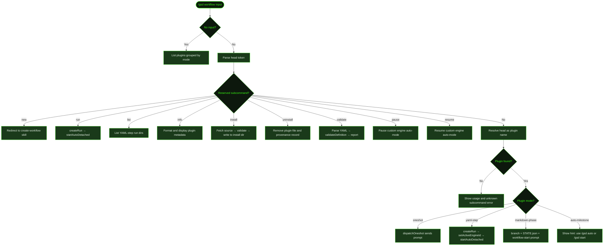

## What It Does

`/gsd workflow` is GSD's plugin system for running structured processes that don't need the full milestone-planning pipeline. A workflow plugin is a self-contained definition — a markdown phase template or a YAML step graph — that encodes a repeatable process like a bugfix, a spike, or a dependency upgrade.

Plugins run in four modes depending on how they're defined:

| Mode | What it does |
|------|-------------|
| `oneshot` | Sends a single prompt and returns. No state, no scaffolding. |
| `yaml-step` | Runs a YAML-defined step graph through the custom workflow engine. Creates a run dir and enters auto-mode. |
| `markdown-phase` | Phase-gated template with a `STATE.json` artifact dir and a git branch. Same execution path as [`/gsd start`](../start/). |
| `auto-milestone` | Hooks into the full `/gsd auto` pipeline. Use `/gsd auto` or `/gsd start <name>` to run these. |

Bare `/gsd workflow` lists all discovered plugins grouped by mode.

## Usage

```
/gsd workflow
/gsd workflow <name> [args]
/gsd workflow run <name> [key=value ...]
/gsd workflow list [name]
/gsd workflow info <name>
/gsd workflow validate <name>
/gsd workflow install <source> [--project] [--name <n>]
/gsd workflow uninstall <name>
/gsd workflow pause
/gsd workflow resume
/gsd workflow new
```

| Subcommand / Argument | Effect |
|-----------------------|--------|
| *(none)* | List all discovered plugins grouped by mode |
| `<name> [args]` | Resolve and dispatch a plugin directly; args passed as overrides or context |
| `run <name> [k=v ...]` | Explicit YAML-step run — creates a new run dir with optional param overrides |
| `list [name]` | List YAML-step workflow runs, optionally filtered by plugin name |
| `info <name>` | Show plugin details: source, mode, phases, description |
| `validate <name>` | Parse and validate a YAML workflow definition |
| `install <source>` | Fetch and install a plugin from a URL, `gist:<id>`, or `gh:owner/repo/path[@ref]` |
| `uninstall <name>` | Remove an installed plugin (global or project scope) |
| `pause` | Pause a running `yaml-step` custom workflow |
| `resume` | Resume a paused `yaml-step` custom workflow |
| `new` | Redirect to the `create-workflow` skill |

### Install flags

| Flag | Effect |
|------|--------|
| `--project` | Install to the project plugin dir instead of global |
| `--name <n>` | Override the inferred plugin name |

## How It Works



### Plugin discovery

GSD discovers plugins from three sources, in precedence order:

1. **Project plugins** — `.gsd/plugins/` inside the current project root
2. **Global plugins** — `~/.gsd/plugins/` (user-wide)
3. **Bundled plugins** — shipped with `gsd-pi` and declared in the plugin registry

When two sources define a plugin with the same name, the higher-precedence source wins. `install --project` writes to the project scope; the default writes to global.

Plugin files are either `.yaml` (YAML step graph) or `.md` (markdown phase template). The declared `mode` field in the file header determines how it's executed. Markdown files without a `mode` declaration default to `markdown-phase`; YAML files default to `yaml-step`.

### Direct dispatch: `/gsd workflow <name>`

The first token is checked against the reserved subcommand list. If it's not reserved, GSD resolves it as a plugin name and dispatches according to the plugin's mode:

- **`oneshot`** — sends a single formatted prompt and returns immediately. No run dir, no git branch.
- **`yaml-step`** — calls `createRun` to set up a timestamped run directory, sets the active engine to `"custom"`, and starts auto-mode detached. The engine processes each step in dependency order.
- **`markdown-phase`** — creates an artifact directory, creates a `gsd/<name>/<slug>` git branch (unless `isolation: none` is set in preferences), writes a `STATE.json` tracking file, and dispatches the `workflow-start` prompt.
- **`auto-milestone`** — shows a hint message. These plugins are designed to run inside [`/gsd auto`](../auto/) or [`/gsd start`](../start/), not directly.

### Auto-mode conflict guard

`yaml-step` and `markdown-phase` dispatches are blocked while `/gsd auto` (the dev workflow engine) is active. GSD shows an error asking you to stop auto-mode first with `/gsd stop`. `oneshot` dispatches are not blocked.

### `yaml-step` run model

`/gsd workflow run <name>` and the direct `<name>` dispatch for `yaml-step` plugins both call `createRun`. This creates a directory under `.gsd/workflow-runs/` containing the definition, a step dependency graph, and a `STATE.json` tracking current step status and any param overrides.

`/gsd workflow list [name]` reads these run directories and reports step progress: completed steps, total steps, and current status.

`/gsd workflow pause` and `resume` target the custom engine only — they're separate from [`/gsd pause`](../pause/) which targets the dev workflow (milestone) engine.

### Install and uninstall

`/gsd workflow install <source>` accepts three source formats:

- `https://…` — direct URL to a `.yaml` or `.md` file
- `gist:<id>` — GitHub Gist (resolved to raw content URL)
- `gh:owner/repo/path[@ref]` — GitHub repository file path with optional branch or tag

GSD fetches the content, validates it, infers the plugin name from the file or the content's `name` field, and writes it to the target install directory. A provenance record is written alongside the plugin file so `uninstall` can warn if a file appears to have been hand-authored.

### Resume support (markdown-phase)

For `markdown-phase` plugins, resume is handled by [`/gsd start resume`](../start/). GSD reads the `STATE.json` written at workflow start to determine which phase to pick up from, then re-dispatches the `workflow-start` prompt with a resume-mode preamble showing completed phases and the active phase.

## What Files It Touches

### Reads

| File | Purpose |
|------|---------|
| `.gsd/plugins/` | Project-scoped plugin files (`.yaml`, `.md`) |
| `~/.gsd/plugins/` | Global plugin files |
| `.gsd/workflow-runs/<name>/<ts>/STATE.json` | Run state for listing and resuming `yaml-step` runs |
| `.gsd/workflow-defs/<name>.yaml` | Legacy fallback path used by `validate` |

### Writes

| File | Purpose |
|------|---------|
| `~/.gsd/plugins/<name>.(yaml\|md)` | Plugin file written by `install` (global scope) |
| `.gsd/plugins/<name>.(yaml\|md)` | Plugin file written by `install --project` |
| `~/.gsd/plugins/<name>.provenance.json` | Provenance record written alongside installed plugin |
| `.gsd/workflow-runs/<name>/<ts>/` | Run directory created by `yaml-step` dispatch |
| `.gsd/workflow-runs/<name>/<ts>/STATE.json` | Step progress tracking for `yaml-step` runs |

### Creates (markdown-phase mode)

| File | Condition |
|------|-----------|
| `<artifact_dir>/STATE.json` | Phase tracking file written at workflow start |
| `gsd/<name>/<slug>` git branch | Created unless `isolation: none` is set in preferences |
| Artifact directory | Path declared in the template's `artifact_dir` field |

## Examples

List all available plugins:

```
> /gsd workflow

Custom Workflow Plugins

  [markdown-phase]
    bugfix        Triage → fix → verify → ship
    spike         Scope → research → synthesize

  [yaml-step]
    dep-upgrade   Assess → upgrade → fix → verify

  [oneshot]
    quick-audit   Run a one-shot code audit prompt
```

Run a plugin directly:

```
> /gsd workflow bugfix fix the broken login redirect

● Starting workflow: Bug Fix
  Phases: triage → fix → verify → ship
  Artifacts: .gsd/workflows/bugfixes/260430-1-fix-the-broken-login-redirect
  Branch: gsd/bugfix/fix-the-broken-login-redirect
```

Run a YAML-step workflow with param overrides:

```
> /gsd workflow run dep-upgrade package=react target=18

● Created workflow run: dep-upgrade
  Run dir: .gsd/workflow-runs/dep-upgrade/20260430-143201
```

List run history for a specific plugin:

```
> /gsd workflow list dep-upgrade

• dep-upgrade [20260430-143201] — in-progress (2/5 steps)
• dep-upgrade [20260428-091512] — complete (5/5 steps)
```

Show plugin details:

```
> /gsd workflow info spike

Plugin: spike
Source: bundled
Mode:   markdown-phase
Phases: scope → research → synthesize
Description: Open-ended exploration with a structured synthesis output.
```

Install a plugin from GitHub:

```
> /gsd workflow install gh:myorg/gsd-plugins/security-audit.yaml

Fetching https://raw.githubusercontent.com/myorg/gsd-plugins/main/security-audit.yaml…

Install workflow plugin:
  Source:    https://raw.githubusercontent.com/…
  Name:      security-audit
  Format:    yaml
  Target:    ~/.gsd/plugins/security-audit.yaml
  Scope:     global

Proceeding with install. Run /gsd workflow uninstall security-audit to revert.
✓ Installed plugin "security-audit" (yaml) to ~/.gsd/plugins/security-audit.yaml
```

Validate a YAML definition:

```
> /gsd workflow validate dep-upgrade

✓ "dep-upgrade" is a valid workflow definition (~/.gsd/plugins/dep-upgrade.yaml).
```

Uninstall a plugin:

```
> /gsd workflow uninstall dep-upgrade

✓ Removed /Users/you/.gsd/plugins/dep-upgrade.yaml
```

## Related Commands

- [`/gsd start`](../start/) — Run a bundled workflow template (bugfix, spike, hotfix, etc.) with auto-detection and resume support
- [`/gsd templates`](../templates/) — List and inspect bundled workflow templates
- [`/gsd auto`](../auto/) — Full GSD milestone pipeline; required for `auto-milestone` mode plugins
- [`/gsd pause`](../pause/) — Pause the dev workflow (milestone) engine
- [`/gsd quick`](../quick/) — One-off task dispatch without workflow scaffolding

**Prompt templates used by workflow:**

- [`workflow-start`](../../prompts/workflow-start/) — Core execution prompt dispatched when a `markdown-phase` workflow starts or resumes
