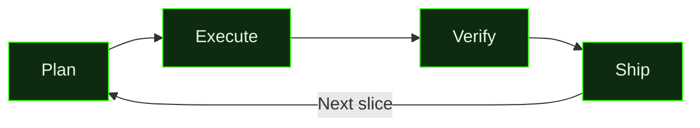

import { CardGrid, LinkCard } from '@astrojs/starlight/components';

## Explore the Documentation

<CardGrid>
  <LinkCard title="Commands" description="42 commands across 7 categories — workflow, planning, context, execution, git, system, and shortcuts." href="/gsd2-guide/reference/commands/" />
  <LinkCard title="Skills" description="8 bundled skills with capabilities and triggers — frontend design, debugging, linting, testing, code review, SwiftUI, and GitHub workflows." href="/gsd2-guide/reference/skills/" />
  <LinkCard title="Extensions" description="17 extensions with full tool inventories — browser tools, shell management, MCP servers, GitHub integration, and more." href="/gsd2-guide/reference/extensions/" />
  <LinkCard title="Agents" description="5 specialized agents with roles and capabilities — scout, researcher, worker, and language-specific pros for delegated tasks." href="/gsd2-guide/reference/agents/" />
</CardGrid>

## How GSD Works

## Deep-Dive Guides

<CardGrid>
  <LinkCard title="Getting Started" description="Install, configure, and run your first GSD session" href="/gsd2-guide/getting-started/" />
  <LinkCard title="Auto Mode" description="Autonomous agent execution — milestones, slices, and tasks" href="/gsd2-guide/auto-mode/" />
  <LinkCard title="Architecture" description="How GSD's worktree-based architecture works under the hood" href="/gsd2-guide/architecture/" />
  <LinkCard title="Troubleshooting" description="Common issues, diagnostics, and fixes" href="/gsd2-guide/troubleshooting/" />
  <LinkCard title="Changelog" description="Release history — what's new, fixed, and changed in each version" href="/gsd2-guide/changelog/" />
</CardGrid>
