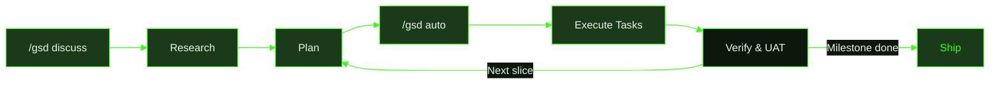

import { CardGrid, LinkCard } from '@astrojs/starlight/components';

## Learn GSD

<CardGrid>
  <LinkCard title="Developing with GSD" description="End-to-end walkthrough — follow a real project through discuss, plan, execute, verify, and ship. See the .gsd/ artifacts at every phase." href="/gsd2-guide/user-guide/developing-with-gsd/" />
  <LinkCard title="Getting Started" description="Install GSD, configure your provider, and run your first session in under 5 minutes." href="/gsd2-guide/getting-started/" />
</CardGrid>

## How GSD Works

## Commands

27 deep-dive pages covering every GSD command — what it does, how it works internally, what files it reads and writes, with Mermaid diagrams and terminal examples.

<CardGrid>
  <LinkCard title="/gsd auto" description="Autonomous execution — dispatch loop, stuck detection, crash recovery, and the state machine that drives it all." href="/gsd2-guide/commands/auto/" />
  <LinkCard title="/gsd quick" description="Skip the milestone ceremony. Run a focused task with GSD guarantees — atomic commits, state tracking, verification." href="/gsd2-guide/commands/quick/" />
  <LinkCard title="/gsd doctor" description="Three diagnostic modes — report issues, auto-fix what's safe, or let the LLM heal complex problems." href="/gsd2-guide/commands/doctor/" />
  <LinkCard title="All Commands →" description="Full command reference with deep-dive links to every GSD command." href="/gsd2-guide/commands/" />
</CardGrid>

## Recipes

Step-by-step workflows for common scenarios — the exact commands, the artifacts GSD creates, and what to expect.

<CardGrid>
  <LinkCard title="Fix a Bug" description="Full lifecycle — discuss the bug, auto-mode finds and fixes it, verify the fix." href="/gsd2-guide/recipes/fix-a-bug/" />
  <LinkCard title="Small Change" description="Use /gsd quick for changes that don't need milestone planning." href="/gsd2-guide/recipes/small-change/" />
  <LinkCard title="Error Recovery" description="When things go wrong — /gsd doctor, /gsd forensics, and manual repair." href="/gsd2-guide/recipes/error-recovery/" />
  <LinkCard title="Working in Teams" description="Parallel development with unique milestone IDs and push branches." href="/gsd2-guide/recipes/working-in-teams/" />
</CardGrid>

## Reference & Guides

<CardGrid>
  <LinkCard title="Quick Reference Cards" description="Searchable cheat-sheet cards for all 42 commands, 8 skills, 17 extensions, and 5 agents." href="/gsd2-guide/reference/" />
  <LinkCard title="Auto Mode" description="How autonomous execution works — milestones, slices, tasks, and the dispatch pipeline." href="/gsd2-guide/auto-mode/" />
  <LinkCard title="Architecture" description="Worktree isolation, state management, and how GSD's components fit together." href="/gsd2-guide/architecture/" />
  <LinkCard title="Troubleshooting" description="Common issues, diagnostics, and fixes when things go sideways." href="/gsd2-guide/troubleshooting/" />
  <LinkCard title="Changelog" description="Release history — what's new, fixed, and changed in each version." href="/gsd2-guide/changelog/" />
</CardGrid>
