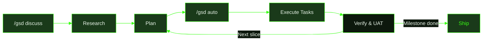

import { Card, CardGrid, LinkCard } from '@astrojs/starlight/components';

## Choose Your Starting Point

<CardGrid>
  <Card title="Solo Business Builder">
    You're not a developer but you're building real products with AI. GSD gives you a structured workflow so your AI coding sessions produce working software — not half-finished prototypes.

    [Start here → Solo Guide](/solo-guide/)
  </Card>
  <Card title="Developer New to AI Coding">
    You know how to code but you're just getting started with AI-assisted development. GSD's milestone-driven approach keeps your AI agent on track and your codebase clean.

    [Start here → Getting Started](/getting-started/)
  </Card>
  <Card title="Experienced AI Developer">
    You're already shipping with AI tools and want GSD's full power — worktree isolation, auto mode, slice replanning, and deep observability.

    [Explore → Commands & Architecture](/commands/)
  </Card>
</CardGrid>

## How GSD Works

```mermaid
%%{init: {'theme': 'base', 'themeVariables': { 'primaryColor': '#1a3a1a', 'primaryTextColor': '#e8f4e8', 'primaryBorderColor': '#39ff14', 'lineColor': '#39ff14', 'secondaryColor': '#0d180d', 'tertiaryColor': '#0d180d', 'fontSize': '14px' }}}%%
graph LR
  A["/gsd discuss"] --> B[Research]
  B --> C[Plan]
  C --> D["/gsd auto"]
  D --> E[Execute Tasks]
  E --> F[Verify & UAT]
  F -->|Next slice| C
  F -->|Milestone done| G[Ship]
  style A fill:#1a3a1a,stroke:#39ff14,color:#e8f4e8
  style B fill:#1a3a1a,stroke:#39ff14,color:#e8f4e8
  style C fill:#1a3a1a,stroke:#39ff14,color:#e8f4e8
  style D fill:#1a3a1a,stroke:#39ff14,color:#e8f4e8
  style E fill:#1a3a1a,stroke:#39ff14,color:#e8f4e8
  style F fill:#0d180d,stroke:#39ff14,color:#e8f4e8
  style G fill:#1a3a1a,stroke:#39ff14,color:#39ff14
```

## Common Tasks

<CardGrid>
  <LinkCard title="Fix a Bug" description="Full lifecycle — discuss the bug, auto mode finds and fixes it, verify the fix." href="/recipes/fix-a-bug/" />
  <LinkCard title="Small Change" description="Use /gsd quick for changes that don't need milestone planning." href="/recipes/small-change/" />
  <LinkCard title="Error Recovery" description="When things go wrong — /gsd doctor, /gsd forensics, and manual repair." href="/recipes/error-recovery/" />
  <LinkCard title="Developing with GSD" description="End-to-end walkthrough — follow a real project through discuss, plan, execute, verify, and ship." href="/user-guide/developing-with-gsd/" />
</CardGrid>

## Go Deeper

<CardGrid>
  <LinkCard title="Architecture" description="Worktree isolation, state management, and how GSD's components fit together." href="/architecture/" />
  <LinkCard title="Auto Mode" description="How autonomous execution works — milestones, slices, tasks, and the dispatch pipeline." href="/auto-mode/" />
  <LinkCard title="Quick Reference Cards" description="Searchable cheat-sheet cards for all commands, skills, extensions, and agents." href="/reference/" />
  <LinkCard title="All Commands →" description="27 deep-dive pages covering every GSD command with Mermaid diagrams and terminal examples." href="/commands/" />
</CardGrid>
