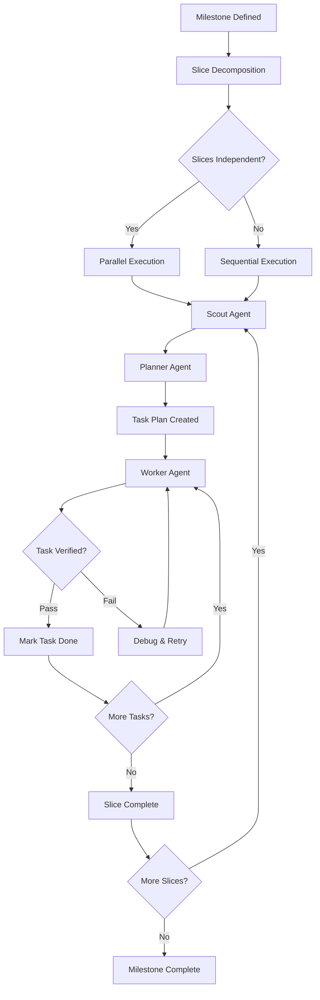
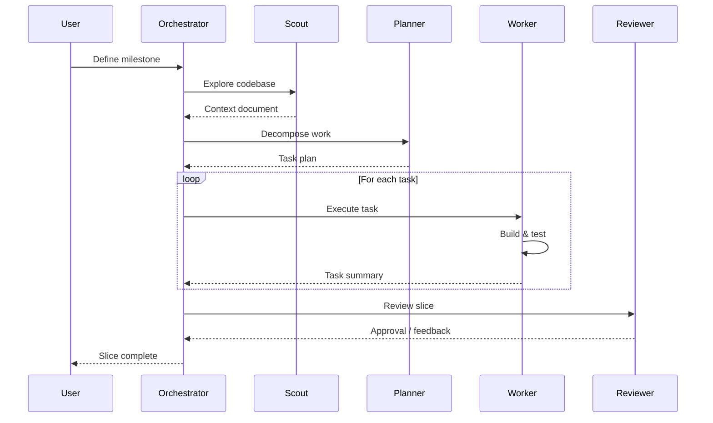
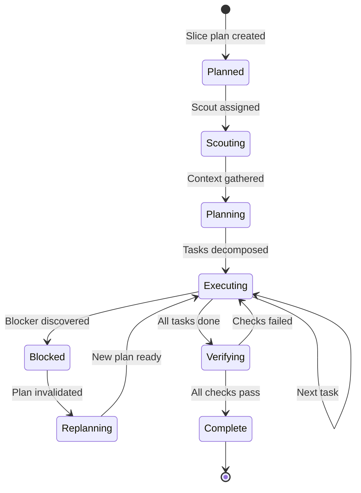

This page demonstrates Mermaid diagram rendering via the `@pasqal-io/starlight-client-mermaid` plugin. Each diagram type validates that the plugin correctly processes fenced code blocks into SVG output.

## Flowchart: GSD Auto-Mode Workflow

## Sequence Diagram: Agent Interaction

## State Diagram: Slice Lifecycle

