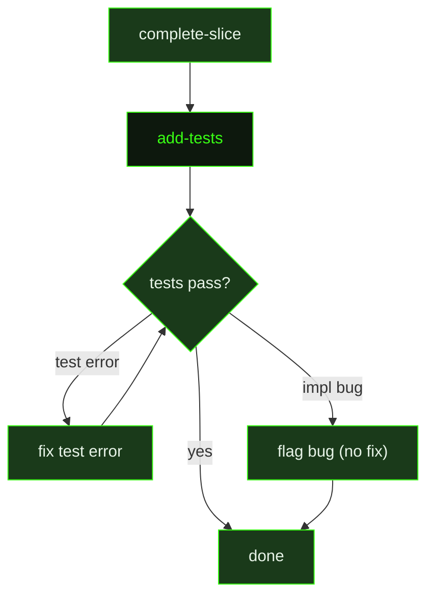

## What It Does

`add-tests` is the prompt dispatched by `/gsd add-tests` to generate tests for a recently completed slice. It operates in a fresh agent context, receiving everything it needs inline: the slice identifier and title, the full slice summary (what was built), detected test patterns from the project, and the working directory.

The agent reads the slice summary to understand what was implemented, then locates the source files that were created or modified. It reads each implementation file to understand behavior, edge cases, and error paths before writing tests that follow the project's existing framework, directory structure, and naming conventions.

Tests are written to be behavior-focused rather than implementation-coupled — covering happy paths, edge cases, error conditions, and boundary values. After writing tests the agent runs them and fixes any failures caused by test errors (bad imports, syntax mistakes). If a test reveals a genuine bug in the implementation, the agent flags it but does not fix the implementation code.

A hard rule enforced by this prompt is that tests must only reference files tracked in git. Tests must never import from `.gsd/`, `.planning/`, `.audits/`, or any path listed in `.gitignore`. If a test needs data from one of those paths, the agent replaces it with an inline fixture or a tracked sample file.

The `skillActivation` block at the end of the prompt allows the dispatcher to inject any skill-loading instructions relevant to the current task context — for example, activating a framework-specific testing skill.

## Pipeline Position

`add-tests` is invoked after a slice is complete. The command handler resolves the target slice (using the argument provided, or falling back to the last completed slice in the active milestone), assembles context by reading the slice summary and scanning for test framework configuration, then dispatches this prompt. The agent runs to completion in a single session.

## Variables

| Variable | Description | Required |
|----------|-------------|----------|
| `sliceId` | Identifier of the slice being tested (e.g. `S03`) | Yes |
| `sliceTitle` | Human-readable title of the slice, extracted from the slice summary | Yes |
| `sliceSummary` | Full content of the slice's `SUMMARY.md`, describing what was built and which files changed | Yes |
| `existingTestPatterns` | Detected test framework, test directory locations, and a sample test file excerpt scraped from the project at dispatch time | Yes |
| `workingDirectory` | Absolute path to the project working directory | Yes |
| `skillActivation` | Injected skill-loading instruction block; activates any skills that match the current task context | Yes |

## Used By

- [`/gsd add-tests`](../../commands/workflow/) — the primary entry point; resolves slice context and dispatches this prompt with assembled variables
