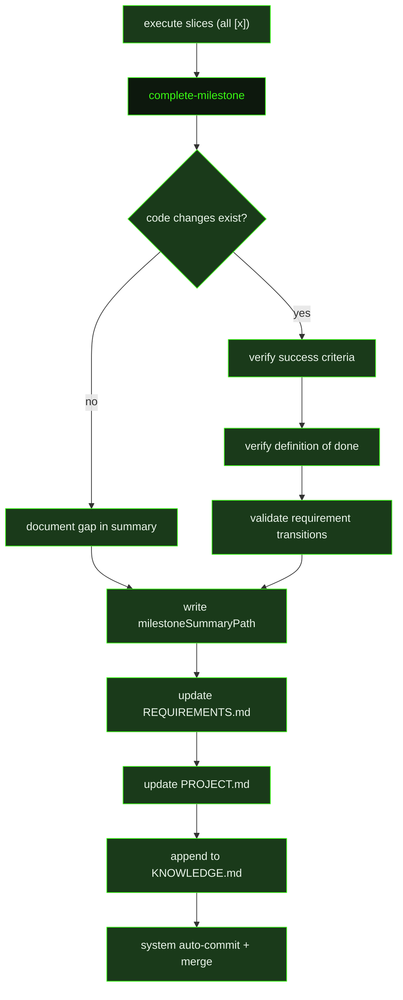

## What It Does

`complete-milestone` is the final stage of the auto-mode pipeline for a milestone. It runs after all slices are done and their summaries written. Its job is to verify that the assembled work actually delivers the promised outcome, produce a permanent milestone summary, and leave the project state in a clean, accurate condition before the system merges the worktree back to the integration branch.

The prompt begins with a hard verification step: it diffs `HEAD` against the merge-base with the integration branch, excluding `.gsd/` files, to confirm that actual code changes exist. If only planning artifacts appear in the diff and no real code was shipped, the milestone does **not** pass verification — the gap is documented explicitly in the summary rather than silently marked as success.

With that baseline established, the prompt works through each success criterion from the milestone definition in the roadmap, confirming every criterion with specific evidence from slice summaries, test results, or observable behavior, and listing any that were not met. It then checks the definition of done: all slices marked `[x]`, all slice summaries present, and cross-slice integration points working.

Requirement status transitions come next. Any requirement that changed status during the milestone (Active → Validated, Deferred, Blocked, Out of Scope, etc.) must be backed by proof before the transition is recorded. The milestone summary is then written using the milestone-summary template with all frontmatter fields filled and `requirement_outcomes` listing every validated transition. After the summary, the prompt updates `.gsd/REQUIREMENTS.md` for validated transitions, updates `.gsd/PROJECT.md` to reflect current project state, and scans all slice summaries for cross-cutting lessons worth adding to `.gsd/KNOWLEDGE.md`.

The prompt does not commit manually — the system auto-commits all changes after the unit completes. If queued milestones exist, the next one starts its own research → plan → execute cycle and uses the milestone summary as its primary record of what was already built.

## Pipeline Position

`complete-milestone` runs once per milestone in auto-mode, dispatched automatically by the system after the last slice completes. All context it needs — the roadmap, slice summaries, requirements, decisions, and project context — is preloaded via `{inlinedContext}` so the prompt can begin verifying immediately without re-reading files. The milestone summary it writes becomes the authoritative record that future milestones consult to understand what was already built.

## Variables

| Variable | Description | Required |
|----------|-------------|----------|
| `milestoneId` | Current milestone identifier (e.g. M001) | Yes |
| `milestoneTitle` | Human-readable title of the milestone being completed | Yes |
| `workingDirectory` | Absolute path to the project working directory | Yes |
| `inlinedContext` | Preloaded context block containing the roadmap, all slice summaries, requirements, decisions, and project context | Yes |
| `skillActivation` | Injected skill-loading instruction block; activates any skills relevant to milestone close-out | Yes |
| `roadmapPath` | File path to the roadmap document containing milestone success criteria (e.g. `.gsd/ROADMAP.md`) | Yes |
| `milestoneSummaryPath` | File path where the milestone summary must be written (e.g. `.gsd/milestones/M001-SUMMARY.md`) | Yes |

## Used By

- [`/gsd auto`](../../commands/auto/) — dispatched automatically as the final unit after all slices in a milestone are marked complete
