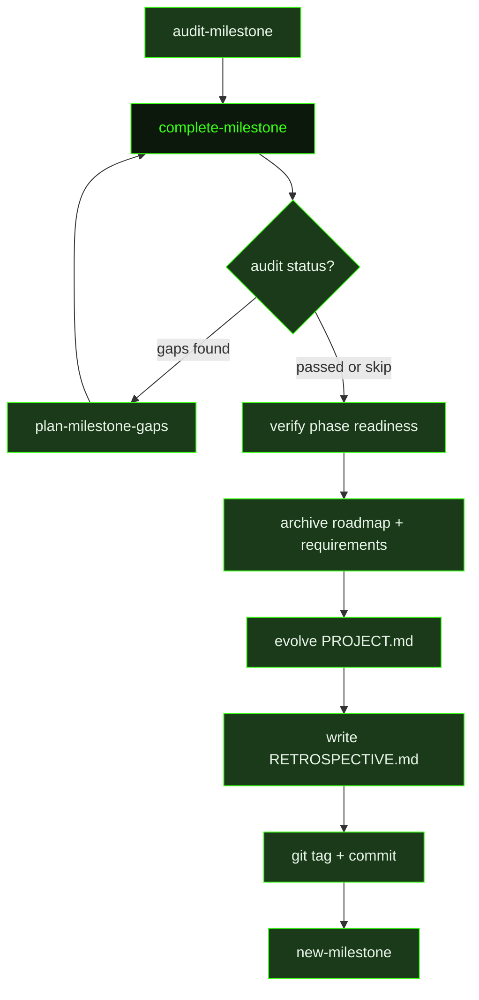

## What It Does

`complete-milestone` is the formal close-out ceremony for a shipped version. When all phases in a milestone are done and their SUMMARY.md files are written, this command assembles a permanent historical record and prepares the planning directory for the next milestone cycle.

The process begins with a pre-flight check: if no milestone audit exists, the command recommends running `/gsd:audit-milestone` first. If the audit found gaps, it offers the option to close them with `/gsd:plan-milestone-gaps` or proceed and accept the gaps as known tech debt. Once the readiness check passes, the command verifies that every phase in the milestone has a completed plan, then collects statistics from git — commit ranges, file changes, lines of code, and timeline.

Accomplishments are extracted from each phase's SUMMARY.md one-liner and presented for approval before the archive is created. The archival step uses `gsd-tools milestone complete` to create two versioned archive files — `milestones/v[X.Y]-ROADMAP.md` and `milestones/v[X.Y]-REQUIREMENTS.md` — and appends a MILESTONES.md entry. After archival, the command performs a full PROJECT.md evolution review: "What This Is" accuracy, Core Value check, requirement status transitions (Active → Validated), Out of Scope audit, tech context update, and Key Decisions extraction from all phase summaries.

With planning artifacts updated, the command reorganizes ROADMAP.md to group completed milestone phases under a collapsible section and deletes the originals. A retrospective section is written or appended to RETROSPECTIVE.md, cross-milestone trends are updated, and STATE.md is refreshed. Finally, the command handles branches (offering squash merge, merge with history, or delete), creates a semver git tag, commits the milestone completion, and closes with the next step: `/gsd:new-milestone`.

## Pipeline Position

`complete-milestone` runs once per shipped version. It is invoked manually by the user after all phases are complete, typically after `/gsd:audit-milestone` confirms coverage. The command gates on user confirmation at readiness verification (unless `yolo` mode is active) and presents three options when requirements are incomplete: proceed with known gaps, run the audit first, or abort. After a successful run, ROADMAP.md and REQUIREMENTS.md are deleted — the next milestone starts fresh via `/gsd:new-milestone`.

## Variables

| Variable | Description | Required |
|----------|-------------|----------|
| `version` | Semver version string for the milestone being completed (e.g. `1.0`, `1.1`, `2.0`) | Yes |

## Used By

- [`/gsd complete-milestone`](../../commands/complete-milestone/) — the primary entry point; users invoke this command directly with a version argument after all phases ship
