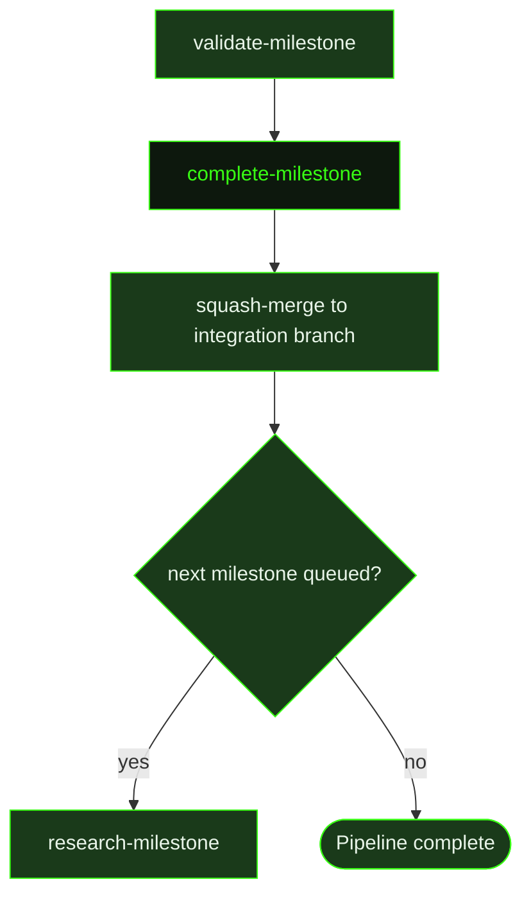

## What It Does

`complete-milestone` is the final substantive stage of the auto-mode pipeline. All slices are marked complete, all tasks are done, and all slice summaries have been written. This prompt dispatches a closing agent whose job is to verify that the assembled work actually delivers the milestone's promised outcome — not just that individual slices were marked done, but that the success criteria from the original roadmap are genuinely met.

The agent verifies each success criterion against specific evidence from slice summaries and test results, documents which criteria were met and which (if any) were not, and then writes the milestone summary. This summary is the final record of what the milestone accomplished — it is not a rehearsal of task logs but a compressed, authoritative account written for the next milestone's researcher and planner agents, who will read it as context when future work builds on this milestone's foundations.

Beyond the summary, `complete-milestone` updates project state: requirement status transitions are validated and committed, `PROJECT.md` is refreshed to reflect milestone completion, and cross-cutting lessons from all slice summaries are distilled into `KNOWLEDGE.md`. Once the milestone summary and project state updates are written, the system auto-commits everything and squash-merges the milestone branch into the integration branch.

## Pipeline Position

This prompt fires after `validate-milestone` writes a passing verdict. It is the last unit the dispatcher runs before the squash-merge. The dispatcher checks for the milestone summary file and a `PROJECT.md` update as verification artifacts before triggering the merge. If queued milestones exist, the next milestone's `research-milestone` is dispatched from the integration branch once the merge completes.

## Variables

| Variable | Description | Required |
|----------|-------------|----------|
| `milestoneId` | Current milestone identifier (e.g. M001) | Yes |
| `milestoneTitle` | Human-readable title of the milestone being completed | Yes |
| `workingDirectory` | Absolute path to the project working directory | Yes |
| `inlinedContext` | Pre-assembled context block containing relevant milestone summaries, roadmap state, and prior work artifacts for the completion agent | Yes |
| `roadmapPath` | File path to the project roadmap document for cross-referencing milestone status | Yes |
| `milestoneSummaryPath` | File path where the milestone completion summary should be written | Yes |

## Used By

- [`/gsd auto`](../../commands/auto/) — dispatched as the final pipeline stage after validation passes, in `completing-milestone` phase
