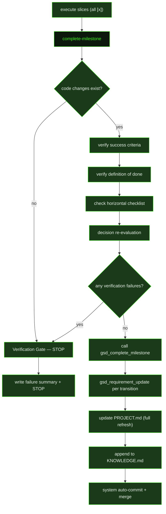

## What It Does

`complete-milestone` is the final stage of the auto-mode pipeline for a milestone. It runs after all slices are done and their summaries written. Its job is to verify that the assembled work actually delivers the promised outcome, produce a permanent milestone summary, and leave the project state in a clean, accurate condition before the system merges the worktree back to the integration branch.

All relevant context — the roadmap, all slice summaries, requirements, decisions, and project context — is preloaded via `{{inlinedContext}}` so the prompt begins working immediately without re-reading files.

The prompt opens with a hard verification sequence before any summary is written:

1. **Code changes exist.** It diffs `HEAD` against the merge-base with the integration branch, excluding `.gsd/` files. If only planning artifacts appear in the diff and no real code was shipped, a **verification failure** is recorded.
2. **Success criteria met.** Each success criterion from the milestone definition in the roadmap is confirmed with specific evidence from slice summaries, test results, or observable behavior. Any unmet criterion is recorded as a **verification failure**.
3. **Definition of done complete.** All slices must be `[x]`, all slice summaries present, and cross-slice integration points working. Unmet items are recorded as **verification failures**.
4. **Horizontal Checklist addressed.** If the roadmap includes a Horizontal Checklist, each item is checked and any unchecked items are noted in the milestone summary.
5. **Decision Re-evaluation.** For each key decision from `.gsd/DECISIONS.md` made during the milestone, the prompt evaluates whether the decision is still valid given what was actually built and flags any that should be revisited next milestone.

If any verification failure was recorded in the first three checks, a hard **Verification Gate** blocks completion. The prompt must not call `gsd_complete_milestone`, must not update `PROJECT.md` or `REQUIREMENTS.md`, writes a clear failure summary, and stops with: "Milestone `{{milestoneId}}` verification FAILED — not complete." There is no override.

If all verifications pass, the prompt calls **`gsd_complete_milestone`** with the full summary payload — one-liner, narrative, success criteria results, definition of done results, requirement outcomes, key decisions, key files, lessons learned, and `verificationPassed: true`. The tool updates the milestone status in the database, renders the milestone summary file, and validates that all slices were complete before proceeding.

Requirement status transitions come next. For each requirement that changed status during the milestone, `gsd_requirement_update` is called with the requirement ID and updated `status` and `validation` fields — the tool regenerates `.gsd/REQUIREMENTS.md` automatically. The prompt then updates `.gsd/PROJECT.md` as a full-document refresh (never a partial edit) to reflect current project state, and scans all slice summaries for cross-cutting lessons worth appending to `.gsd/KNOWLEDGE.md`.

The prompt never queries `.gsd/gsd.db` directly via `sqlite3` or `better-sqlite3` — the engine owns the WAL connection. State is read via `gsd_milestone_status` or the preloaded inlined context. It also never commits manually — the system auto-commits all changes after the unit completes.

## Pipeline Position

```mermaid
flowchart TD
    ExecuteSlices["execute slices (all [x])"] --> CompleteMilestone["complete-milestone"]
    CompleteMilestone --> CodeCheck{"code changes exist?"}
    CodeCheck -->|"no"| VerifyGate["Verification Gate — STOP"]
    CodeCheck -->|"yes"| VerifyCriteria["verify success criteria"]
    VerifyCriteria --> VerifyDoD["verify definition of done"]
    VerifyDoD --> HorizontalChecklist["check horizontal checklist"]
    HorizontalChecklist --> DecisionReeval["decision re-evaluation"]
    DecisionReeval --> AnyFailures{"any verification failures?"}
    AnyFailures -->|"yes"| VerifyGate
    AnyFailures -->|"no"| CallTool["call gsd_complete_milestone"]
    VerifyGate --> FailSummary["write failure summary + STOP"]
    CallTool --> UpdateRequirements["gsd_requirement_update per transition"]
    UpdateRequirements --> UpdateProject["update PROJECT.md (full refresh)"]
    UpdateProject --> UpdateKnowledge["append to KNOWLEDGE.md"]
    UpdateKnowledge --> AutoCommit["system auto-commit + merge"]

    style CompleteMilestone fill:#0d180d,stroke:#39ff14,color:#39ff14
    style ExecuteSlices fill:#1a3a1a,stroke:#39ff14,color:#e8f4e8
    style CodeCheck fill:#1a3a1a,stroke:#39ff14,color:#e8f4e8
    style VerifyCriteria fill:#1a3a1a,stroke:#39ff14,color:#e8f4e8
    style VerifyDoD fill:#1a3a1a,stroke:#39ff14,color:#e8f4e8
    style HorizontalChecklist fill:#1a3a1a,stroke:#39ff14,color:#e8f4e8
    style DecisionReeval fill:#1a3a1a,stroke:#39ff14,color:#e8f4e8
    style AnyFailures fill:#1a3a1a,stroke:#39ff14,color:#e8f4e8
    style VerifyGate fill:#1a3a1a,stroke:#39ff14,color:#e8f4e8
    style FailSummary fill:#1a3a1a,stroke:#39ff14,color:#e8f4e8
    style CallTool fill:#1a3a1a,stroke:#39ff14,color:#e8f4e8
    style UpdateRequirements fill:#1a3a1a,stroke:#39ff14,color:#e8f4e8
    style UpdateProject fill:#1a3a1a,stroke:#39ff14,color:#e8f4e8
    style UpdateKnowledge fill:#1a3a1a,stroke:#39ff14,color:#e8f4e8
    style AutoCommit fill:#1a3a1a,stroke:#39ff14,color:#e8f4e8
```

`complete-milestone` runs once per milestone in auto-mode, dispatched automatically by the system after the last slice completes. The milestone summary written by `gsd_complete_milestone` becomes the authoritative record that future milestones consult to understand what was already built. If verification fails, the milestone stays in its current state until issues are resolved and verification is re-run.

## Variables

| Variable | Description | Required |
|----------|-------------|----------|
| `milestoneId` | Current milestone identifier (e.g. M001) | Yes |
| `milestoneTitle` | Human-readable title of the milestone being completed | Yes |
| `workingDirectory` | Absolute path to the project working directory | Yes |
| `inlinedContext` | Preloaded context block containing the roadmap, all slice summaries, requirements, decisions, and project context | Yes |
| `skillActivation` | Injected skill-loading instruction block; activates any skills relevant to milestone close-out | Yes |
| `roadmapPath` | File path to the roadmap document containing milestone success criteria (e.g. `.gsd/ROADMAP.md`) | Yes |
| `milestoneSummaryPath` | File path where the milestone summary will be rendered by `gsd_complete_milestone` (e.g. `.gsd/milestones/M001-SUMMARY.md`) | Yes |

## Used By

- [`/gsd auto`](../../commands/auto/) — dispatched automatically as the final unit after all slices in a milestone are marked complete
