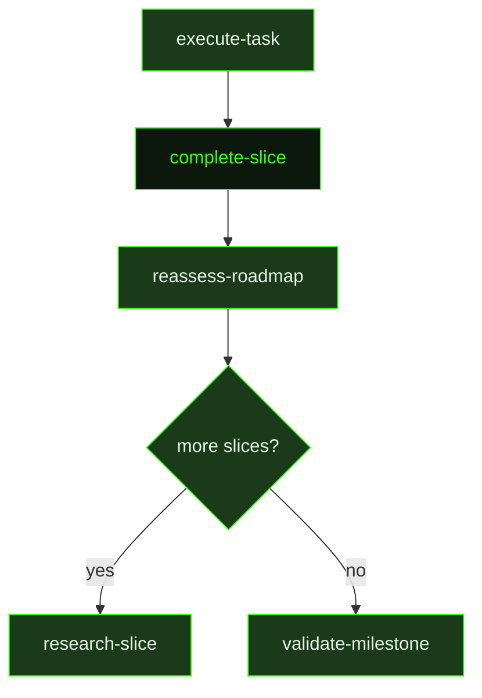

## What It Does

`complete-slice` is the closer. After all tasks in a slice are marked complete, this prompt dispatches an agent that verifies the assembled work actually delivers what the slice promised — not just that individual tasks finished, but that the whole slice goal is met end-to-end. If any slice-level verification checks fail, the closer fixes them before declaring the slice done. If the slice plan includes observability or diagnostic surfaces, the closer confirms those work too.

Beyond verification, the closer has several primary outputs. The **slice summary** compresses all task summaries into a concise record of what the slice actually delivered — written not just for archival purposes but for the `reassess-roadmap` agent that reads it next, and for future slice researchers who depend on this slice. The slice summary's **Forward Intelligence** section is particularly important: it captures hard-won knowledge about what's fragile, what assumptions changed, and what downstream slices need to watch out for.

The **UAT script** is a concrete set of test cases derived from the slice plan and task summaries — numbered steps with preconditions and expected outcomes tailored to what this slice actually built. It is not a generic template.

The closer also performs knowledge capture: it appends significant architectural decisions to `.gsd/DECISIONS.md` and non-obvious lessons learned to `.gsd/KNOWLEDGE.md`, but only when the content would genuinely save future agents from repeating investigation. If `.gsd/REQUIREMENTS.md` exists, requirement status is updated to reflect what execution actually proved. If `.gsd/PROJECT.md` exists, its current state section is refreshed. After writing all artifacts, the closer marks the slice `[x]` in the roadmap, which signals to the dispatcher that `reassess-roadmap` should be fired next.

Effort scales with complexity — a simple 1-2 task slice gets a brief summary and lightweight verification, while a complex multi-system slice gets thorough verification and a detailed summary.

## Pipeline Position

The dispatcher fires this prompt when the slice plan shows all tasks as `[x]` but the slice itself is not yet marked `[x]` in the roadmap. The closer must write both the slice summary and the UAT file before marking the slice done — the dispatcher checks for both artifacts. The unit will not be marked complete if any of the three required outputs are missing: the slice summary, the UAT file, or the `[x]` mark on the slice in the roadmap.

## Variables

| Variable | Description | Required |
|----------|-------------|----------|
| `sliceId` | Current slice identifier within the milestone (e.g. S01) | Yes |
| `sliceTitle` | Human-readable title of the slice being completed | Yes |
| `milestoneId` | Current milestone identifier (e.g. M001) | Yes |
| `workingDirectory` | Absolute path to the project working directory | Yes |
| `inlinedContext` | Pre-assembled context block containing the slice plan, all task summaries, output templates, and the milestone roadmap | Yes |
| `skillActivation` | Injected skill-loading instruction block; activates any skills that match the current slice context | Yes |
| `sliceSummaryPath` | File path where the slice completion summary should be written | Yes |
| `sliceUatPath` | File path where the UAT script should be written | Yes |
| `roadmapPath` | File path to the project roadmap document | Yes |

## Used By

- [`/gsd auto`](../../commands/auto/) — dispatched when all tasks in a slice are complete but the slice is not yet marked done in the roadmap
