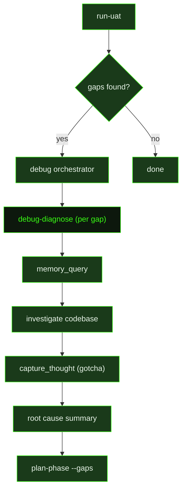

## What It Does

`debug-diagnose` is the investigation prompt dispatched for each individual debug session. Given a reported issue and an operating mode, the agent reads any prior session state, queries memory for known gotchas, investigates the codebase, and produces a structured root-cause analysis.

The agent operates in one of two modes controlled by the `goal` variable:

- **`find_root_cause_only`** — identify what failed and why, document the findings, and do not touch production code. This is the mode used during UAT gap diagnosis, where diagnosis must be separated from fix-planning so the planner can produce targeted, accurate work.
- **`find_and_fix`** — identify the root cause *and* apply a minimal, targeted fix, then verify it works. This is the mode used when the caller wants a single agent to own the full investigation-and-repair cycle.

Before investigating, the agent always calls `memory_query` with keywords from the issue — error text, subsystem names, file paths. A prior session may have already documented this exact gotcha. Finding it saves the full investigation. After identifying the root cause, the agent calls `capture_thought` with `category: "gotcha"` so future debug sessions can find it. The thought is kept to 1–3 sentences: the symptom, the root cause, and the fix or guard. Prior session context is read from `.gsd/debug/sessions/{{slug}}.json` if it exists.

The agent does not plan, replan, or commit. It investigates, surfaces a clear summary of what failed and why, and hands findings back to the caller.

## Pipeline Position

In the UAT gap flow, `debug-diagnose` is dispatched once per gap by the debug orchestrator, all running in parallel. Each agent writes its findings back so the orchestrator can enrich UAT.md before handing off to `plan-phase --gaps`. In the `/gsd debug` flow, a single `debug-diagnose` session runs in `find_and_fix` mode and owns the full investigation-and-repair cycle.

## Variables

| Variable | Description | Required |
|----------|-------------|----------|
| `slug` | Unique identifier for this debug session; used to locate the session file at `.gsd/debug/sessions/{{slug}}.json` | Yes |
| `mode` | Session mode label (e.g. `uat-gap`, `manual`) | Yes |
| `issue` | Description of the reported issue being investigated | Yes |
| `workingDirectory` | Absolute path to the project working directory | Yes |
| `goal` | Agent operating mode — either `find_root_cause_only` or `find_and_fix` | Yes |
| `skillActivation` | Injected skill-loading instruction block; activates any skills that match the current debug context | Yes |

## Used By

- [`/gsd verify`](../../commands/verify/) — invoked automatically when `run-uat` surfaces gaps; the verify-work orchestrator spawns one `debug-diagnose` agent per gap in `find_root_cause_only` mode
- [`/gsd debug`](../../commands/debug/) — dispatches `debug-diagnose` directly in `find_and_fix` mode when the user wants to investigate and repair an issue in a single session
