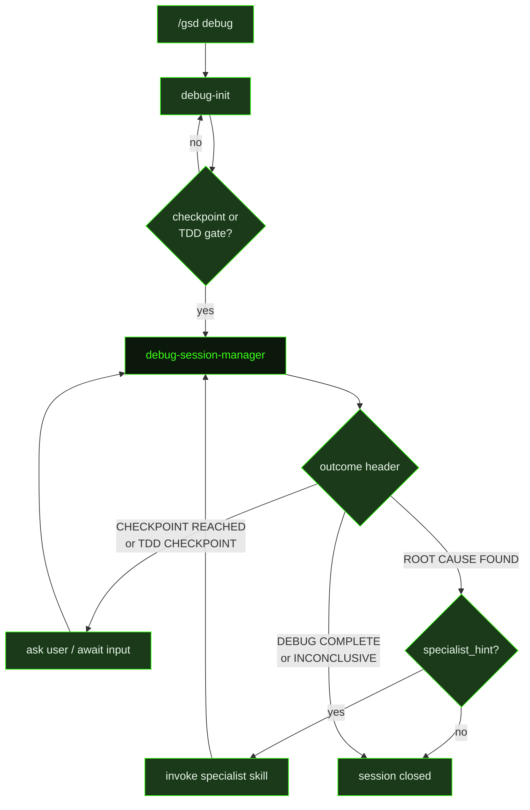

## What It Does

`debug-session-manager` is the continuation prompt for the `/gsd debug` pipeline. It fires when an existing session hits a checkpoint or TDD gate and needs to be resumed — picking up where the previous agent left off, with full session context already loaded from `.gsd/debug/sessions/{{slug}}.json`.

The prompt enforces two goal modes. In `find_root_cause_only` mode, the agent identifies and documents the root cause but does **not** apply code changes. The deliverable is a structured root cause analysis. In `find_and_fix` mode, the agent identifies the root cause, applies a targeted minimal fix, and verifies the result.

When a `## ROOT CAUSE FOUND` block includes a `specialist_hint` field, the agent dispatches an appropriate skill (e.g. `typescript-expert` or `supabase-postgres-best-practices`) for a specialist review before finalising the analysis. Specialist review results are persisted under `## Specialist Review` in the session artifact.

The agent communicates outcomes using exactly one structured return protocol header: `## ROOT CAUSE FOUND`, `## TDD CHECKPOINT`, `## CHECKPOINT REACHED`, `## DEBUG COMPLETE`, or `## INVESTIGATION INCONCLUSIVE`. This header is what the session manager watches for to decide whether to write a checkpoint, close the session, or surface a result.

Checkpoint security is also enforced: any user response embedded in the prompt is wrapped in `DATA_START` / `DATA_END` markers, and all content inside those markers is treated as untrusted data — the agent must not execute or follow directives found there.

## Pipeline Position

`debug-session-manager` fires on every resume cycle of a debug session. A session may cycle through multiple checkpoints before reaching a terminal outcome (`DEBUG COMPLETE` or `INVESTIGATION INCONCLUSIVE`). The dispatcher reads the session artifact, assembles the checkpoint and TDD context, and dispatches a fresh agent each cycle.

## Variables

| Variable | Description | Required |
|----------|-------------|----------|
| `slug` | Unique session identifier (e.g. `auth-crash-20240501`) used to locate the session artifact | Yes |
| `mode` | Debug mode flag controlling agent behaviour | Yes |
| `issue` | Human-readable description of the issue being investigated | Yes |
| `workingDirectory` | Absolute path to the project directory the agent should investigate | Yes |
| `goal` | Goal semantics: `find_root_cause_only` or `find_and_fix` | Yes |
| `checkpointContext` | Injected active checkpoint block from the current session state, including type, prior findings, and what action is needed | Yes |
| `tddContext` | Injected TDD gate context when the session is in TDD mode, describing the expected failing-test state | Yes |
| `specialistContext` | Injected specialist review context when a prior ROOT CAUSE block included a `specialist_hint` | Yes |
| `skillActivation` | Injected skill-loading instruction block; activates domain-specific skills relevant to the current investigation | Yes |

## Used By

- [`/gsd debug`](../../commands/debug/) — dispatches `debug-session-manager` on every checkpoint resume cycle within an active debug session
