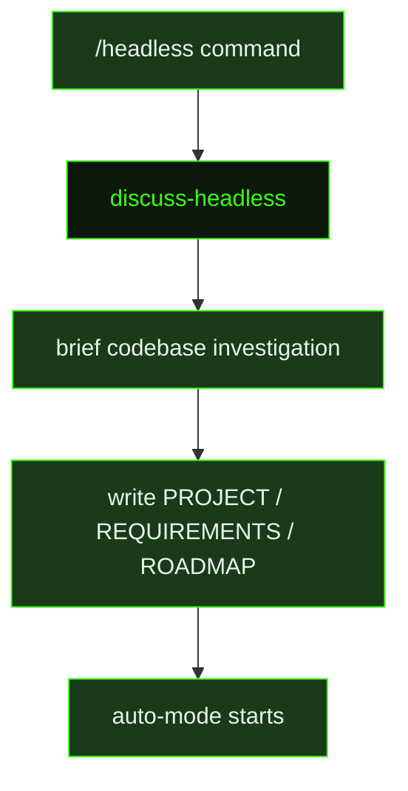

## What It Does

`discuss-headless` is the automated counterpart to the interactive `discuss` prompt. Where `discuss` opens a back-and-forth conversation, `discuss-headless` accepts a pre-written specification document and works through the full milestone creation ceremony silently — no questions, no clarification rounds, no wrapping gate. It is designed for automated pipelines that need discussion-style reasoning and artifact production without any user interaction in the loop.

The prompt executes a five-step flow: reflect on the specification to surface a concrete summary, investigate the codebase briefly (limited to 5-6 tool calls), make explicit decisions for any gaps or ambiguities, assess scope to determine single vs. multi-milestone, and then write artifacts. Any judgment calls made during that process are documented as assumptions in the context file, so a future agent or human reviewer can audit exactly what choices were made and why. The prompt explicitly prohibits asking the user questions — if information is missing from the specification, the prompt infers the most sensible default and documents it.

Artifact output mirrors the interactive `discuss` flow exactly: `PROJECT.md`, `REQUIREMENTS.md`, a context file, a roadmap, and seeded `DECISIONS.md` entries. For multi-milestone visions, the prompt calls `gsd_generate_milestone_id` for each milestone, writes full context for the primary, and produces rich context files for each remaining milestone so future sessions can pick them up without needing the original conversation. The prompt ends by saying exactly `"Milestone {{milestoneId}} ready."` — the phrase that triggers auto-mode detection downstream.

## Pipeline Position

`discuss-headless` runs once per session, invoked by the `/headless` command. It replaces the interactive discussion ceremony entirely — the specification document provided via `seedContext` plays the role of the user. After artifacts are written the session ends and auto-mode begins, making this prompt the entry point for fully automated GSD project creation.

## Variables

| Variable | Description | Required |
|----------|-------------|----------|
| `seedContext` | Initial context or question text that seeds the headless discussion without requiring interactive user input | Yes |
| `milestoneId` | Current active milestone identifier for scoping the discussion | Yes |
| `inlinedTemplates` | Pre-assembled block of GSD templates for reference during the headless discussion session | Yes |
| `contextPath` | File path to a context document providing background for the headless discussion | Yes |
| `roadmapPath` | File path to the project roadmap for reference | Yes |
| `commitInstruction` | Instruction block telling the headless agent how to commit GSD state changes at session end | Yes |
| `multiMilestoneCommitInstruction` | Extended commit instruction used when the discussion spans multiple milestones | Yes |

## Used By

- [`/gsd headless`](../../commands/headless/) — automated session that creates a GSD milestone plan from a specification document without user interaction
