## What It Does

`discuss` is the interactive front door to every GSD project. It runs when the user invokes `/gsd`, `/gsd discuss`, or `/gsd steer`, opening a structured conversation that transforms a raw idea into a complete, actionable milestone plan. The prompt is deliberately opinionated about the order of operations: reflection before questions, mandatory codebase investigation before the first question round, and a depth checklist that must be fully satisfied before any roadmap gets written.

The conversation unfolds in a fixed sequence of stages. First the prompt asks "What's the vision?" and immediately proves comprehension by reflecting back a concrete summary — including an honest size read (roughly how many milestones, roughly how many slices) and a bullet list of major capabilities. This forces the agent to demonstrate understanding before asking anything. Only after the user confirms the reflection does the prompt advance to deep questioning, which continues for as many rounds as the scope demands: simple well-defined work may need one round, a large ambiguous vision may need four or more.

For multi-milestone visions, the prompt maps the full landscape before drilling into details — proposing a milestone sequence with names, one-line intents, and rough dependencies. An **anti-reduction rule** governs scope: the prompt does not ask "what's the minimum viable version?" or try to shrink the user's ambition. When something is complex or risky, it gets phased into a later milestone — not cut. If the user describes a big vision, the prompt plans the big vision.

Before asking its first question, the prompt runs a **mandatory investigation pass** — scouting the codebase, checking library docs via `resolve_library` / `get_library_docs`, and running targeted web searches. The prompt maintains an internal web search budget across the multi-turn discussion; library lookups don't consume the budget, and searches are distributed across turns rather than clustered. The goal is that first questions reflect what is actually true, not what is assumed.

The prompt maintains a depth checklist throughout the discussion: what is being built, why it needs to exist, who it's for, what "done" looks like, the biggest technical unknowns, and what external systems it touches. When all items are satisfied, the prompt enters a **depth verification** gate — printing a structured summary in chat and then calling `ask_user_questions` with a question ID that contains `depth_verification` (e.g. `depth_verification_confirm`). This naming convention is mechanically detected downstream. If the user clarifies, the agent absorbs the correction and re-verifies before proceeding.

Once depth is confirmed the prompt moves directly to a **scope assessment** — re-checking whether the size estimate from the reflection still holds after everything discovered in the discussion. If the scope grew or shrank materially, milestone and slice counts are adjusted before any files are written. The prompt then runs a **focused research pass** — using `resolve_library`, `get_library_docs`, `search-the-web`, and `fetch_page` to surface table-stakes requirements, domain-standard behaviors, likely omissions, and scope traps — and produces a `REQUIREMENTS.md` capability contract. Requirements are organised as Active, Validated, Deferred, Out of Scope, and Traceability sections, each with a stable `R###` ID, source annotation, and slice ownership. The full requirements table is printed in chat before any file is written; the user can confirm, adjust, or add before the roadmap is generated.

Before writing files the prompt also prints a **roadmap preview** in chat — one row per slice with columns for Slice, Title, Risk, Depends, and Demo — so the user can approve the plan before it lands on disk. There is no second meta-gate asking for permission after depth verification; the depth verification is the write-gate, and the roadmap preview is a final confirmation opportunity, not an extra checkpoint.

For multi-milestone visions the prompt handles the full milestone sequence: calling `gsd_milestone_generate_id` for each milestone, writing shared artifacts (`PROJECT.md`, `REQUIREMENTS.md`, `DECISIONS.md`), producing a full `CONTEXT.md` and `ROADMAP.md` for the primary milestone, and then running a **sequential readiness gate** for each remaining milestone — one at a time — offering Discuss now, Write draft for later, or Just queue it. After every gate decision the prompt immediately updates `.gsd/DISCUSSION-MANIFEST.json` with cumulative gate state. Auto-mode is mechanically blocked until `gates_completed` equals `total` in this file. CONTEXT.md files for milestones that depend on earlier milestones must carry `depends_on` YAML frontmatter — the auto-mode state machine reads this field to enforce execution order.

## Pipeline Position

```mermaid
flowchart TD
    UserInvoke["user invokes /gsd"] --> Discuss["discuss"]
    Discuss --> Reflection["reflection + vision mapping"]
    Reflection --> Investigation["mandatory codebase investigation"]
    Investigation --> Questioning["deep questioning rounds"]
    Questioning --> DepthCheck{"depth checklist\nsatisfied?"}
    DepthCheck -->|"no"| Questioning
    DepthCheck -->|"yes"| DepthVerify["depth verification gate"]
    DepthVerify --> ScopeAssess["scope assessment"]
    ScopeAssess --> Research["focused research pass"]
    Research --> Requirements["REQUIREMENTS.md written"]
    Requirements --> RoadmapPreview["roadmap preview in chat"]
    RoadmapPreview --> MultiMilestone{"multi-milestone?"}
    MultiMilestone -->|"no"| WriteFiles["write planning artifacts"]
    MultiMilestone -->|"yes"| MilestoneGates["sequential readiness gates\n+ DISCUSSION-MANIFEST.json"]
    MilestoneGates --> WriteFiles
    WriteFiles --> AutoMode["auto-mode starts"]

    style Discuss fill:#0d180d,stroke:#39ff14,color:#39ff14
    style UserInvoke fill:#1a3a1a,stroke:#39ff14,color:#e8f4e8
    style Reflection fill:#1a3a1a,stroke:#39ff14,color:#e8f4e8
    style Investigation fill:#1a3a1a,stroke:#39ff14,color:#e8f4e8
    style Questioning fill:#1a3a1a,stroke:#39ff14,color:#e8f4e8
    style DepthCheck fill:#1a3a1a,stroke:#39ff14,color:#e8f4e8
    style DepthVerify fill:#1a3a1a,stroke:#39ff14,color:#e8f4e8
    style ScopeAssess fill:#1a3a1a,stroke:#39ff14,color:#e8f4e8
    style Research fill:#1a3a1a,stroke:#39ff14,color:#e8f4e8
    style Requirements fill:#1a3a1a,stroke:#39ff14,color:#e8f4e8
    style RoadmapPreview fill:#1a3a1a,stroke:#39ff14,color:#e8f4e8
    style MultiMilestone fill:#1a3a1a,stroke:#39ff14,color:#e8f4e8
    style MilestoneGates fill:#1a3a1a,stroke:#39ff14,color:#e8f4e8
    style WriteFiles fill:#1a3a1a,stroke:#39ff14,color:#e8f4e8
    style AutoMode fill:#1a3a1a,stroke:#39ff14,color:#e8f4e8
```

`discuss` runs once at the start of a project or whenever the user wants to plan new work. It is the only GSD prompt that owns the milestone planning ceremony — all downstream prompts operate on the artifacts this prompt produces. When `/gsd steer` is used mid-project, this same prompt re-enters the discussion flow with existing milestone context already loaded.

## Variables

| Variable | Description | Required |
|----------|-------------|----------|
| `preamble` | Opening context paragraph describing the current project state and the intended scope of this discussion | Yes |
| `milestoneId` | Current active milestone identifier for scoping the discussion and naming output files | Yes |
| `contextPath` | File path to the CONTEXT.md document to write upon completion of the discussion | Yes |
| `roadmapPath` | File path to the ROADMAP.md document to write upon completion of the discussion | Yes |
| `commitInstruction` | Instruction block telling the agent how to commit GSD state changes at the end of a single-milestone discussion | Yes |
| `multiMilestoneCommitInstruction` | Extended commit instruction used when the discussion spans multiple milestones | Yes |
| `inlinedTemplates` | Pre-assembled block of GSD output templates (context, roadmap, requirements, decisions, project) for use during the output phase | Yes |

## Used By

- [`/gsd`](../../commands/gsd/) — primary invocation; opens the project planning wizard
- [`/gsd discuss`](../../commands/discuss/) — explicit discuss invocation; same prompt, surfaced directly
- [`/gsd steer`](../../commands/steer/) — mid-project steering; re-enters the discussion flow with current milestone context
