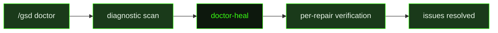

## What It Does

`doctor-heal` runs after the `/gsd doctor` command has already completed its diagnostic scan and identified issues that require agentic intervention. The doctor command itself handles deterministic, mechanical fixes automatically. `doctor-heal` takes over for the remainder — the issues that require reading context, making judgment calls, or generating real artifact content to resolve.

The prompt is deliberately scoped and conservative. It prioritises the active milestone or the explicitly requested scope, refusing to fan out into unrelated historical milestones unless the diagnostic report explicitly covers them. Each repair cluster is followed by a direct verification step — reading the affected file or running the relevant check from disk — rather than assuming the fix was applied correctly. The prompt prefers fixing the authoritative artifact over masking the warning: if a task summary is missing, it generates the real content from existing slice context rather than creating a placeholder.

After working through the issue list, the prompt mentally re-runs the doctor scan on the in-scope items, confirming the remaining issue set has been reduced or cleared. It calls out any out-of-scope issues briefly rather than silently ignoring them, and ends with "GSD doctor heal complete." to signal successful closure to the command layer.

## Pipeline Position

`doctor-heal` is dispatched once per healing session by the `/gsd doctor` command, after the deterministic fix pass is complete. It is the only prompt in GSD that operates on the output of the doctor diagnostic system, and it runs outside the auto-mode pipeline — it is invoked interactively by the user, not as part of a milestone execution sequence.

## Variables

| Variable | Description | Required |
|----------|-------------|----------|
| `doctorCommandSuffix` | Additional arguments or flags to append to the /doctor command invocation during healing | Yes |
| `doctorSummary` | Full output summary from the doctor diagnostic run that identified the issues to heal | Yes |
| `structuredIssues` | Structured list of diagnostic issues found by the doctor command, formatted for the healing agent | Yes |
| `scopeLabel` | Human-readable label describing the scope of issues being healed (e.g. 'workspace', 'slice S02') | Yes |

## Used By

- [`/gsd doctor`](../../commands/doctor/) — invoked after a diagnostic run surfaces issues that require agentic repair
