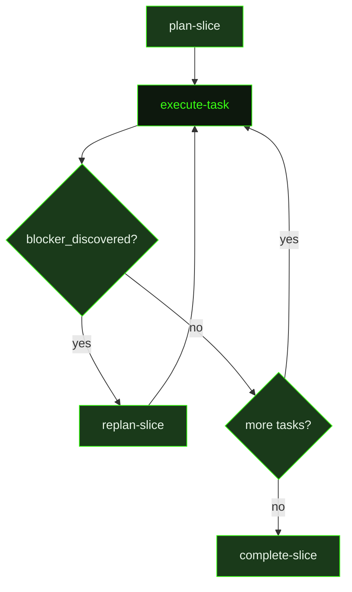

## What It Does

`execute-task` is the workhorse of the auto-mode pipeline. It dispatches a fresh agent session for every individual task in a slice, giving it a single focused job: implement what the task plan says, verify it works, and document what happened. The executor has no memory of prior sessions — everything it needs is assembled into this prompt, including the full task plan, relevant slice context, resume state if the task is being retried, and summaries of tasks that already completed in this slice.

Unlike the research and planning stages, the executor is not permitted to re-research or re-plan. The task plan is the authoritative contract. The executor's job is to build the real thing — not a stub, not a hardcoded success response, not a component that renders mock props. If the plan says "create a login endpoint", the endpoint must authenticate against a real store. If the plan says "build a dashboard", it must render real data from the API. Stubs and mocks are for tests, not for shipped features.

The executor also handles skill loading, observability, and blocker detection. If it discovers that the remaining slice plan is fundamentally invalid — not a bug or minor deviation, but a plan-invalidating finding like a wrong API or missing capability — it sets `blocker_discovered: true` in its task summary, which triggers a `replan-slice` dispatch before the next task runs. After completing its work, the executor writes a task summary that becomes context for subsequent tasks in the same slice and feeds into the slice completion summary.

## Pipeline Position

`execute-task` is the most frequently dispatched prompt in the pipeline — it fires once per task, and a typical milestone has dozens of tasks. The dispatcher evaluates the slice plan to find the next incomplete task (`[ ]` checkbox), assembles context, and dispatches a fresh session. After the session completes, the dispatcher checks that the expected artifacts were written (task summary + `[x]` checkbox) before moving on. If artifacts are missing, the unit is re-dispatched up to 3 times before stuck detection triggers.

## Variables

| Variable | Description | Required |
|----------|-------------|----------|
| `taskId` | Current task identifier within the slice (e.g. T01) | Yes |
| `taskTitle` | Human-readable title of the task being executed | Yes |
| `sliceId` | Current slice identifier within the milestone (e.g. S01) | Yes |
| `sliceTitle` | Human-readable title of the slice containing this task | Yes |
| `milestoneId` | Current milestone identifier (e.g. M001) | Yes |
| `workingDirectory` | Absolute path to the project working directory | Yes |
| `overridesSection` | Optional override instructions that supersede or amend the default task plan behavior | Yes |
| `runtimeContext` | Injected runtime context block (available tools, model info, environment state) assembled by the dispatcher | Yes |
| `resumeSection` | Resume state block indicating where execution should pick up if this is a continuation run | Yes |
| `carryForwardSection` | Context carried forward from a previous partial execution of this task, if the task is being resumed | Yes |
| `taskPlanInline` | Full task plan content inlined directly into the prompt for the executor agent | Yes |
| `slicePlanExcerpt` | Relevant excerpt from the slice plan providing goal and verification context for the executor | Yes |
| `planPath` | File path to the full slice plan document (e.g. S01-PLAN.md) | Yes |
| `taskPlanPath` | File path to the task plan document for reference (e.g. T01-PLAN.md) | Yes |
| `priorTaskLines` | Summary lines from previously completed tasks in this slice, providing continuity context | Yes |
| `skillActivation` | Injected skill-loading instruction block; activates any skills that match the current task context | Yes |
| `verificationBudget` | Maximum number of verification attempts the executor agent is allowed for this task | Yes |
| `taskSummaryPath` | File path where the task summary should be written upon completion | Yes |

## Used By

- [`/gsd auto`](../../commands/auto/) — dispatched repeatedly throughout the `executing` phase, once per incomplete task
- [`/gsd hooks`](../../commands/hooks/) — can dispatch `execute-task` directly for hook-triggered task execution
