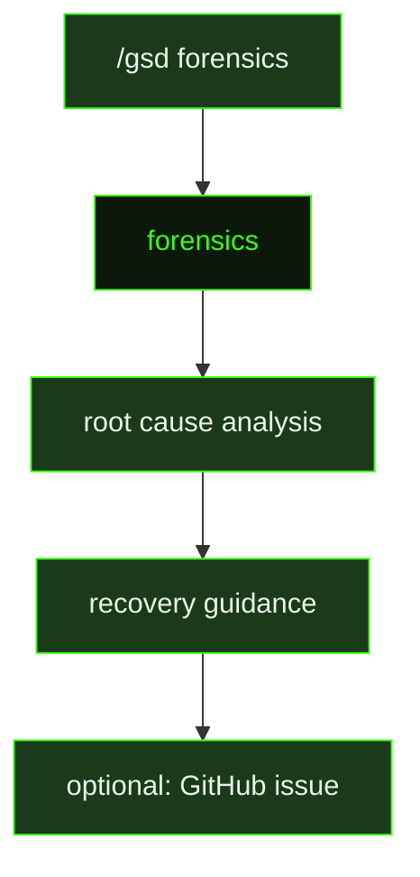

## What It Does

`forensics` is GSD's failure analysis engine. It runs when the user invokes `/gsd forensics` to investigate a specific problem — typically an auto-mode failure, a stuck session, or an unexpected artifact state. The prompt receives a structured diagnostic report assembled automatically by the forensics command, and uses it alongside the GSD source code to identify exactly what went wrong.

The investigation protocol is deliberate and follows six steps: analyze the pre-parsed forensic report, form hypotheses about which module and code path is responsible, read the actual GSD source code at `{gsdSourceDir}` to confirm or deny each hypothesis, trace the code path from entry point to failure, identify the specific file and line where the bug lives, and only then ask clarifying questions — at most two — if the report is genuinely insufficient. The prompt never guesses what code does; it reads the source.

The prompt has access to a comprehensive source map organized by domain. The auto-mode engine alone spans over a dozen files: `auto.ts`, `auto-loop.ts`, `auto-dispatch.ts`, `auto-start.ts`, `auto-supervisor.ts`, `auto-timers.ts`, `auto-timeout-recovery.ts`, `auto-unit-closeout.ts`, `auto-post-unit.ts`, `auto-verification.ts`, `auto-recovery.ts`, `auto-worktree.ts`, `auto-worktree-sync.ts`, `auto-model-selection.ts`, `auto-budget.ts`, and `dispatch-guard.ts`. State and persistence lives in `state.ts`, `types.ts`, `files.ts`, `paths.ts`, `json-persistence.ts`, and `atomic-write.ts`. Forensics and recovery uses `forensics.ts`, `session-forensics.ts`, `crash-recovery.ts`, and `session-lock.ts`. Health diagnostics draws from `doctor.ts`, `doctor-types.ts`, `doctor-checks.ts`, `doctor-format.ts`, and `doctor-environment.ts`.

The prompt also embeds a full runtime path reference for `.gsd/` — including the crash lock format (`auto.lock` with fields `pid`, `unitType`, `unitId`, `sessionFile`), the metrics ledger format (`metrics.json`, where a unit dispatched more than once signals a stuck loop), and the activity log format (`{seq}-{unitType}-{unitId}.jsonl`, where `isError: true` tool results and the preceding assistant reasoning text are the primary failure trace).

Findings are presented in a structured format: **what happened** (failure sequence from activity logs), **why it happened** (root cause with `file:line` references into GSD source), **code snippet** (the problematic code and what it should do instead), and **recovery** (what the user can do right now to get unstuck).

After presenting its analysis, the prompt offers to create a GitHub issue on the `gsd-build/gsd-2` repository. If the user agrees, it generates a well-formed bug report using `gh issue create --repo gsd-build/gsd-2` via the bash tool — never via the `github_issues` tool, which targets only the current user's repository. The issue includes environment details, reproduction context, forensic findings, and a concrete fix suggestion, with strict redaction rules applied to strip absolute paths, API keys, and user code before submitting. The full forensic report is always saved locally, and the prompt reminds the user of the saved path.

## Pipeline Position

`forensics` runs outside the auto-mode pipeline — it is invoked explicitly by the user when something has gone wrong and normal recovery paths are insufficient. It is the most investigation-oriented prompt in GSD and the only one with read access to GSD's own source code as part of its analytical contract.

## Variables

| Variable | Description | Required |
|----------|-------------|----------|
| `problemDescription` | Plain-language description of the problem or anomaly triggering the forensic investigation | Yes |
| `forensicData` | Structured diagnostic data collected for the problem under investigation (stack traces, logs, state dumps) | Yes |
| `gsdSourceDir` | Absolute path to the GSD source directory for cross-referencing during forensic analysis | Yes |
| `dedupSection` | Optional deduplication context injected to prevent filing duplicate issues for known bugs | Yes |

## Used By

- [`/gsd forensics`](../../commands/forensics/) — launched by the user when auto-mode fails or produces unexpected behavior; assembles and delivers the forensic data packet before dispatching this prompt
