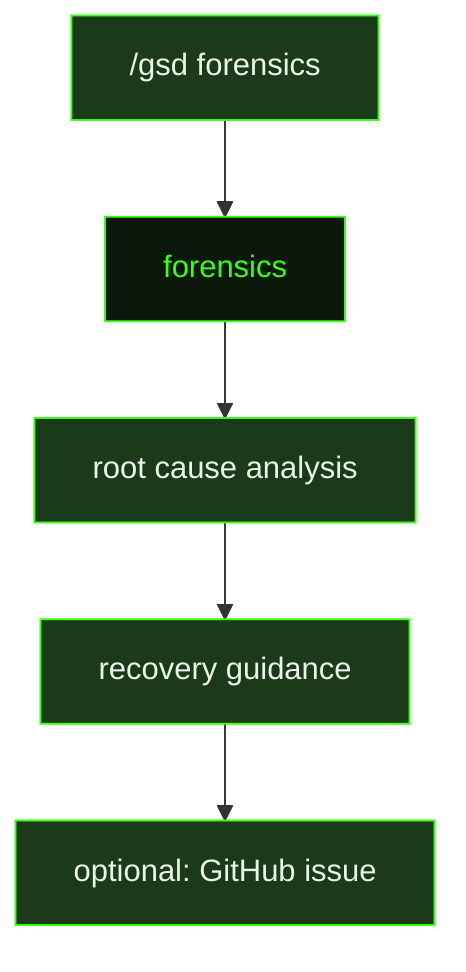

## What It Does

`forensics` is GSD's failure analysis engine. It runs when the user invokes `/gsd forensics` to investigate a specific problem — typically an auto-mode failure, a stuck session, or an unexpected artifact state. The prompt receives a structured diagnostic report assembled automatically by the forensics command, and uses it alongside the GSD source code to identify exactly what went wrong.

The investigation protocol is deliberate: analyze the forensic report first, ask at most two clarifying questions if the report is genuinely insufficient, and then present findings in a structured format covering what happened, why it happened (root cause in GSD's logic), and what the user can do to recover. The prompt has direct access to key GSD source files — `auto.ts` for the unit dispatch loop, `session-forensics.ts` for trace extraction, `auto-recovery.ts` for artifact verification, `crash-recovery.ts` for crash lock lifecycle, and `doctor.ts` for state integrity checks — and it reads these to pinpoint the specific code path involved.

After presenting its analysis, the prompt offers to create a GitHub issue on the `gsd-build/gsd-2` repository. If the user agrees, it generates a well-formed bug report with environment details, reproduction context, forensic findings, and suggested fix areas — applying strict redaction rules to strip absolute paths, API keys, and user code before submitting. The full forensic report is always saved locally, and the prompt reminds the user of the saved path.

## Pipeline Position

`forensics` runs outside the auto-mode pipeline — it is invoked explicitly by the user when something has gone wrong and normal recovery paths are insufficient. It is the most investigation-oriented prompt in GSD and the only one with read access to GSD's own source code as part of its analytical contract.

## Variables

| Variable | Description | Required |
|----------|-------------|----------|
| `problemDescription` | Plain-language description of the problem or anomaly triggering the forensic investigation | Yes |
| `forensicData` | Structured diagnostic data collected for the problem under investigation (stack traces, logs, state dumps) | Yes |
| `gsdSourceDir` | Absolute path to the GSD source directory for cross-referencing during forensic analysis | Yes |

## Used By

- [`/gsd forensics`](../../commands/forensics/) — launched by the user when auto-mode fails or produces unexpected behavior; assembles and delivers the forensic data packet before dispatching this prompt
