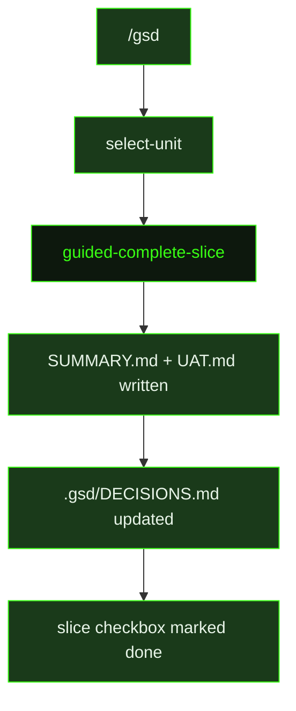

## What It Does

`guided-complete-slice` closes out a completed slice in the guided (user-facing) workflow. It performs the same operations as the auto-mode `complete-slice` prompt: compress all task summaries into `{{sliceId}}-SUMMARY.md`, produce `{{sliceId}}-UAT.md` with the `UAT Type` and `Not Proven By This UAT` sections explicitly filled in, audit task summaries for `key_decisions` and ensure significant ones land in `.gsd/DECISIONS.md`, mark the slice checkbox done in the roadmap, and update the milestone summary. The system handles commit and merge after the unit completes — the agent does not commit or merge manually.

The slice summary is the primary record of what was built. Downstream agents — `reassess-roadmap`, future slice researchers, and plan generators — read it to understand what this slice delivered and what to watch out for. Because downstream context depends on this artifact, the summary must be substantive: what was built, key decisions made, and anything that remains unproven by the UAT.

The prompt is a compact dispatch: one instruction block followed by `{{inlinedTemplates}}`, which supplies the Slice Summary and UAT output templates inline so the agent has the exact format contract at hand.

## Pipeline Position

The `/gsd` command dispatches `guided-complete-slice` when the user wants to close out a slice from the guided workflow. The resulting summary artifacts are identical in format to auto-mode outputs and are consumed by the same downstream agents.

## Variables

| Variable | Description | Required |
|----------|-------------|----------|
| `sliceId` | Slice identifier being completed (e.g. S01) | Yes |
| `sliceTitle` | Human-readable title of the slice being completed | Yes |
| `milestoneId` | Current milestone identifier (e.g. M001) | Yes |
| `workingDirectory` | Absolute path to the project working directory | Yes |
| `skillActivation` | Injected skill-loading instruction block; activates any skills relevant to the completion context | Yes |
| `inlinedTemplates` | Slice Summary and UAT output template content inlined directly into the prompt | Yes |

## Used By

- [`/gsd`](../../commands/gsd/) — dispatched when the user completes a slice in guided (interactive) mode
