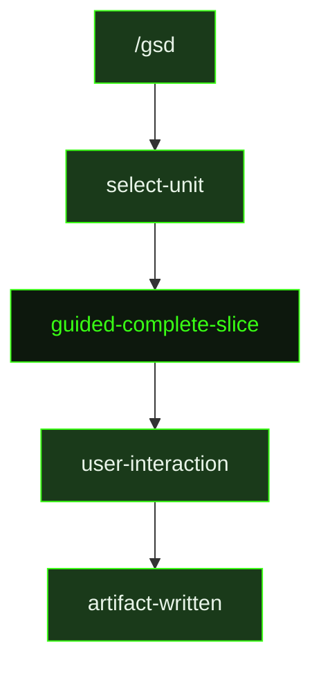

## What It Does

`guided-complete-slice` is the interactive counterpart to [`complete-slice`](../complete-slice/). In auto-mode, the agent compresses task summaries and writes the slice summary and UAT artifact without pausing. The guided version walks through the same completion steps but surfaces key decisions recorded during task execution and asks the user to review them before finalizing the slice summary.

This is a compact dispatch wrapper — the guided session loads the same templates as auto-mode but adds interactive checkpoints. The source file is 3 lines and delegates directly to the same completion conventions: compress task summaries, write `{sliceId}-SUMMARY.md` and `{sliceId}-UAT.md`, review key decisions for `.gsd/DECISIONS.md`, and mark the slice checkbox done in the roadmap.

## Pipeline Position

The `/gsd` command dispatches `guided-complete-slice` when the user wants to close out a slice interactively. The resulting summary artifacts are identical in format to auto-mode outputs.

## Variables

| Variable | Description | Required |
|----------|-------------|----------|
| `sliceId` | Slice identifier being completed (e.g. S01) | Yes |
| `sliceTitle` | Human-readable title of the slice being completed | Yes |
| `milestoneId` | Current milestone identifier (e.g. M001) | Yes |
| `workingDirectory` | Absolute path to the project working directory | Yes |
| `inlinedTemplates` | Output template content inlined directly into the prompt | Yes |

## Used By

- [`/gsd`](../../commands/gsd/) — dispatched when the user completes a slice in guided (interactive) mode
