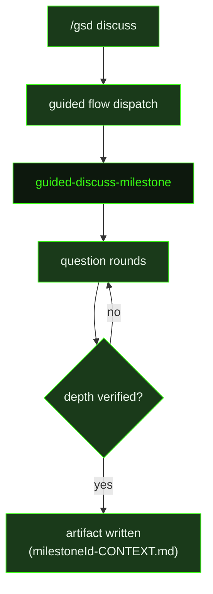

## What It Does

`guided-discuss-milestone` is a structured discovery session. Before planning a milestone, there are almost always gray areas — things that look clear in a feature title but branch into different implementation paths depending on what the user actually wants. This prompt surfaces those gray areas through a focused interview and captures the answers in a `{milestoneId}-CONTEXT.md` file that downstream planning prompts treat as the authoritative scope brief.

The prompt starts with a lightweight codebase investigation — using `rg`, `find`, or the `scout` subagent to understand what already exists that the milestone touches. It also uses `resolve_library` / `get_library_docs` for unfamiliar libraries, and `search_and_read` for one-shot topic research, with a limited web search budget distributed across the investigation pass and subsequent rounds. This ensures questions are grounded in reality rather than generic assumptions.

The agent then runs an interview in rounds of 1–3 questions each, covering six areas: what is being built (concrete enough to explain to a stranger), why it needs to exist, who it's for, what "done" looks like, the biggest technical unknowns and risks, and what external systems the milestone touches. When `structuredQuestionsAvailable` is true, each round uses `ask_user_questions` for interactive selection UI. When false, questions are posed in plain text.

The agent does **not** ask a "ready to wrap up?" gate after every round — it continues immediately into the next round unless the depth checklist is genuinely satisfied. A single wrap-up prompt is used only when the agent believes all six areas are covered or the user signals they want to stop. Before writing, the agent prints a structured depth summary using the user's exact terminology and runs a confirmation gate — when structured questions are available, the question ID must contain `depth_verification` to enable the write-gate downstream.

The output is a `{milestoneId}-CONTEXT.md` file that preserves the user's exact wording, emphasis, and framing. It is not a paraphrase — downstream agents read it as their only window into this conversation. After writing, the prompt says exactly `"{milestoneId} context written."` and nothing else. When a milestone has a context file, it is the first thing planning prompts read and the authoritative answer to scope questions.

## Pipeline Position

`guided-discuss-milestone` runs before `guided-plan-milestone` or `plan-milestone`. The context file it writes is read by both planning prompts and, via the slice-level planning prompts, by `research-slice` and `plan-slice` to ground their work in the user's stated intent. In the auto pipeline, it is dispatched whenever a milestone is in the `needs-discussion` phase or enters `pre-planning` without an existing context file.

## Variables

| Variable | Description | Required |
|----------|-------------|----------|
| `milestoneId` | Current milestone identifier (e.g. M001) | Yes |
| `milestoneTitle` | Human-readable title of the milestone being discussed | Yes |
| `structuredQuestionsAvailable` | Whether `ask_user_questions` UI is available for interactive selection | Yes |
| `inlinedTemplates` | Output template content inlined directly into the prompt | Yes |
| `commitInstruction` | Instruction for how to commit the context file after writing | Yes |

## Used By

- [`/gsd discuss`](../../commands/discuss/) — the primary entry point; dispatches this prompt for the active milestone
- [`/gsd`](../../commands/gsd/) — dispatched as part of the smart-entry guided flow when starting or resuming a milestone discussion
- [`/gsd auto`](../../commands/auto/) — dispatched automatically by the auto-dispatch rules when a milestone enters `needs-discussion` or `pre-planning` without a context file
