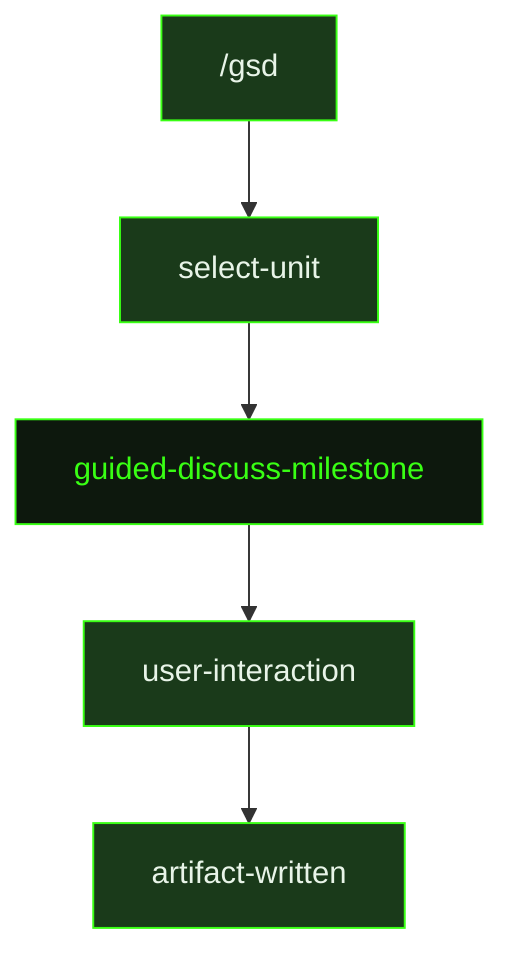

## What It Does

`guided-discuss-milestone` is a structured discovery session. Before planning a milestone, there are almost always gray areas — things that look clear in a feature title but branch into different implementation paths depending on what the user actually wants. This prompt surfaces those gray areas through a focused interview and captures the answers in a `{milestoneId}-CONTEXT.md` file that downstream planning prompts treat as the authoritative scope brief.

The prompt starts with a lightweight codebase investigation — using `rg`, `find`, or the `scout` subagent to understand what already exists that the milestone touches. This ensures questions are grounded in reality rather than generic assumptions. The agent then runs an interview in rounds of 1–3 questions each, covering six areas: what is being built (concrete enough to explain to a stranger), why it needs to exist, who it's for, what "done" looks like, the biggest technical unknowns and risks, and what external systems the milestone touches.

When `structuredQuestionsAvailable` is true, each round uses `ask_user_questions` for interactive selection UI. When false, questions are posed in plain text. After each round the agent asks whether to continue or wrap up, and performs a depth check before concluding — the agent prints a structured summary using the user's exact terminology and asks for confirmation before writing the context file.

The output is a `{milestoneId}-CONTEXT.md` file that preserves the user's exact wording, emphasis, and framing. It is not a paraphrase — downstream agents read it as their only window into this conversation. When a milestone has a context file, it is the first thing planning prompts read and the authoritative answer to scope questions.

## Pipeline Position

`guided-discuss-milestone` typically runs before `guided-plan-milestone` or `plan-milestone`. The context file it writes is read by both planning prompts and, via the slice-level planning prompts, by `research-slice` and `plan-slice` to ground their work in the user's stated intent.

## Variables

| Variable | Description | Required |
|----------|-------------|----------|
| `milestoneId` | Current milestone identifier (e.g. M001) | Yes |
| `milestoneTitle` | Human-readable title of the milestone being discussed | Yes |
| `structuredQuestionsAvailable` | Whether `ask_user_questions` UI is available for interactive selection | Yes |
| `inlinedTemplates` | Output template content inlined directly into the prompt | Yes |
| `commitInstruction` | Instruction for how to commit the context file after writing | Yes |

## Used By

- [`/gsd`](../../commands/gsd/) — dispatched when the user starts a milestone discussion or scoping session
