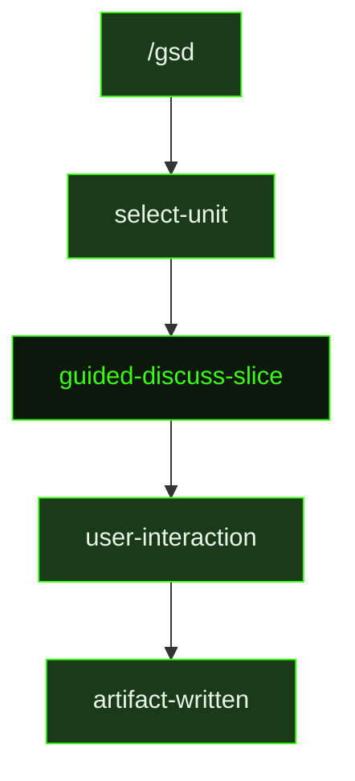

## What It Does

`guided-discuss-slice` is a focused discovery session scoped to a single slice. Where `guided-discuss-milestone` explores milestone-level goals and risks, this prompt drills into the behavioral and UX specifics of one slice: what it should feel like, how it should behave at its edges, where its scope boundary sits, and what the user cares about that won't be obvious from the roadmap entry alone.

The prompt explicitly avoids technical implementation questions — tech stack, naming conventions, and architecture are for research and planning. The discussion focuses on the human decisions: what does the user see and experience, what happens when things go wrong, what is explicitly in scope versus deferred, and what would constitute a satisfying result for a real user.

Before the first question round, the agent does a lightweight codebase investigation to understand what already exists at the slice boundary — what comes before this slice, what depends on it, and what patterns the slice is likely to touch. This makes the interview questions specific to the actual codebase rather than generic. The agent then runs 1–3 question rounds using `ask_user_questions` for structured input, asking about UX behavior, edge cases, scope boundaries, and the feel of the slice when done.

The output is a `{sliceId}-CONTEXT.md` file with six sections: Goal (one sentence), Why this Slice, In Scope (confirmed during the interview), Out of Scope (explicitly deferred or excluded), Constraints, Integration Points (what the slice consumes and produces), and Open Questions with current thinking. This context file is read by `research-slice` and `plan-slice`, making it the primary mechanism for a user to inject non-obvious scope decisions into the planning process.

## Pipeline Position

`guided-discuss-slice` runs before research begins for a slice. The context file it writes shapes what `research-slice` investigates and what constraints `plan-slice` builds around.

## Variables

| Variable | Description | Required |
|----------|-------------|----------|
| `sliceId` | Current slice identifier within the milestone (e.g. S01) | Yes |
| `sliceTitle` | Human-readable title of the slice being discussed | Yes |
| `milestoneId` | Current milestone identifier (e.g. M001) | Yes |
| `inlinedContext` | Existing context about the slice, inlined from the roadmap and any prior context artifacts | Yes |
| `sliceDirPath` | File path to the slice directory where the context file will be written | Yes |
| `contextPath` | Full file path for the output context file (`{sliceId}-CONTEXT.md`) | Yes |
| `commitInstruction` | Instruction for how to commit the context file after writing | Yes |
| `inlinedTemplates` | Output template content inlined directly into the prompt | Yes |

## Used By

- [`/gsd`](../../commands/gsd/) — dispatched when the user starts a slice discussion or scoping session
