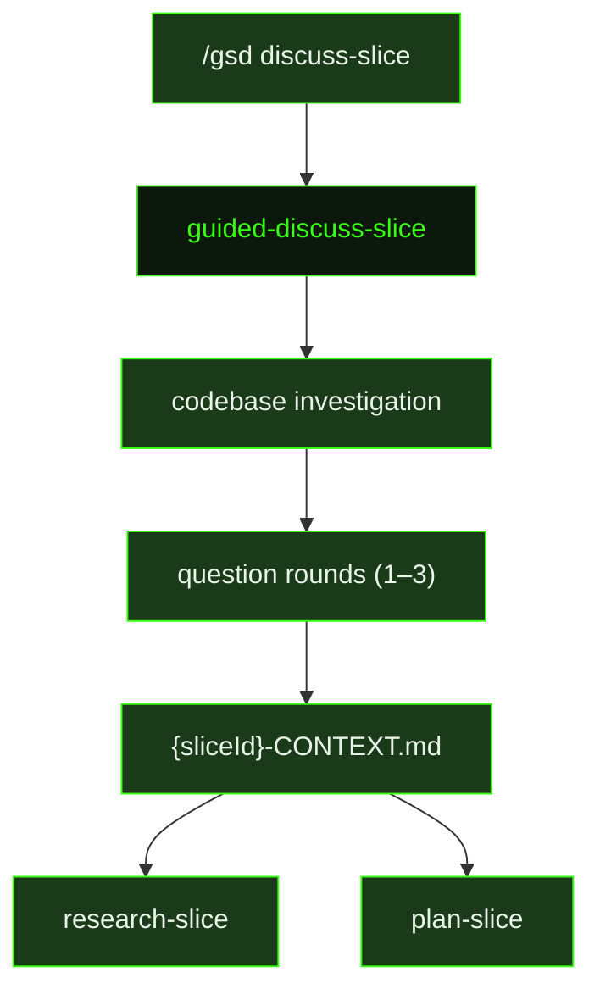

## What It Does

`guided-discuss-slice` is a focused discovery session scoped to a single slice. Where `guided-discuss-milestone` explores milestone-level goals and risks, this prompt drills into the behavioral and UX specifics of one slice: what it should feel like, how it should behave at its edges, where its scope boundary sits, and what the user cares about that won't be obvious from the roadmap entry alone.

The prompt explicitly avoids technical implementation questions — tech stack, naming conventions, and architecture are for research and planning. The discussion focuses on the human decisions: what does the user see and experience, what happens when things go wrong, what is explicitly in scope versus deferred, and what would constitute a satisfying result for a real user. If a technical choice materially changes scope, proof, or integration behavior, it is asked directly and captured.

Before the first question round, the agent does a lightweight targeted investigation to ground its questions in reality: it scouts the codebase with `rg`, `find`, or `scout` to understand what already exists at the slice boundary, checks the roadmap context to understand what surrounds this slice, uses `resolve_library` / `get_library_docs` for unfamiliar libraries rather than web search, and uses `search_and_read` for one-shot topic research. The agent has a limited web search budget (typically 3–5 per turn), so it conserves searches during investigation and distributes any remaining ones across question rounds rather than clustering them. This pass identifies the 3–5 biggest behavioral unknowns — things where the user's answer will materially change what gets built — before any questions are asked.

The agent then runs 1–3 question rounds using `ask_user_questions` for structured input, asking about UX behavior, edge cases, scope boundaries, and the feel of the slice when done. After each round it decides whether to continue or wrap up; it does not ask a meta "ready to wrap up?" question after every round. When it does ask a wrap-up question, it offers two options: "Write the context file" (recommended when the slice is well understood) and "One more pass."

The output is a `{sliceId}-CONTEXT.md` file with seven sections: Goal (one sentence), Why this Slice, In Scope (confirmed during the interview), Out of Scope (explicitly deferred or excluded), Constraints, Integration Points (what the slice consumes and produces), and Open Questions with current thinking. When writing is complete the agent says exactly `"{sliceId} context written."` and stops. This context file is read by `research-slice` and `plan-slice`, making it the primary mechanism for a user to inject non-obvious scope decisions into the planning process.

## Pipeline Position

`guided-discuss-slice` runs before research begins for a slice. The context file it produces is the primary downstream artifact — `research-slice` uses it to focus investigation and `plan-slice` builds around the constraints and scope decisions captured there.

## Variables

| Variable | Description | Required |
|----------|-------------|----------|
| `sliceId` | Current slice identifier within the milestone (e.g. S01) | Yes |
| `sliceTitle` | Human-readable title of the slice being discussed | Yes |
| `milestoneId` | Current milestone identifier (e.g. M001) | Yes |
| `inlinedContext` | Existing context about the slice, inlined from the roadmap and any prior context artifacts | Yes |
| `sliceDirPath` | File path to the slice directory where the context file will be written | Yes |
| `contextPath` | Full file path for the output context file (`{sliceId}-CONTEXT.md`) | Yes |
| `commitInstruction` | Instruction for how to commit the context file after writing | Yes |
| `inlinedTemplates` | Output template content inlined directly into the prompt | Yes |

## Used By

- [`/gsd discuss-slice`](../../commands/discuss-slice/) — dispatched when the user starts a slice discussion or scoping session before research begins
