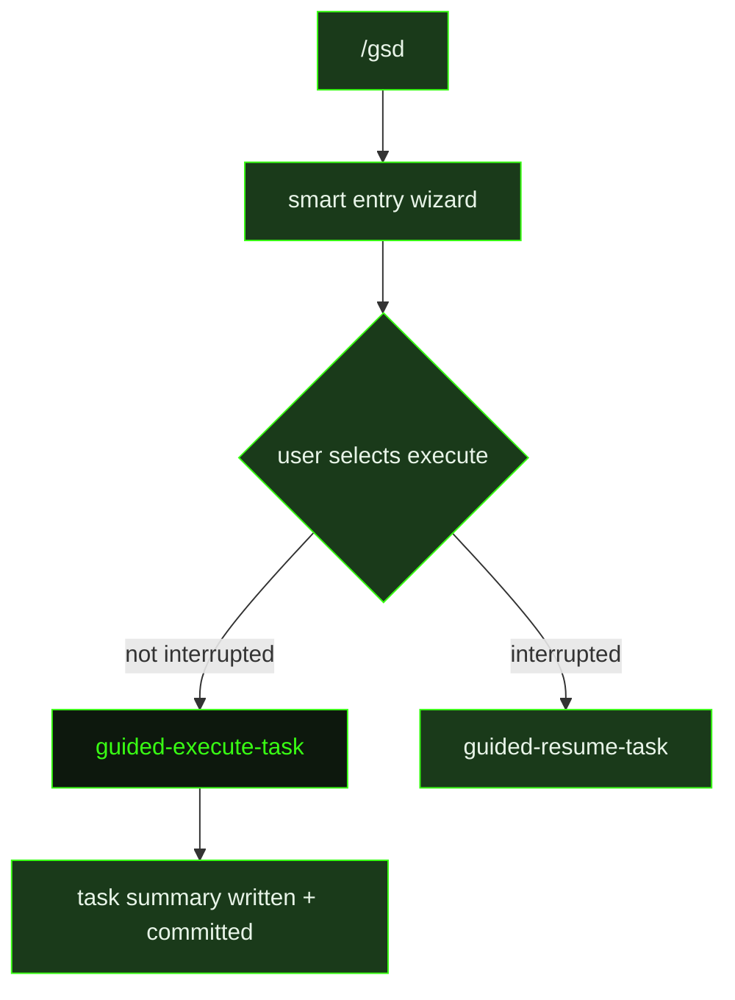

## What It Does

`guided-execute-task` is the interactive counterpart to [`execute-task`](../execute-task/). Where the auto-mode version is dispatched headlessly into a background subprocess, the guided version runs directly in the user's active Claude Code session — meaning the user sees output in real time and can intervene at any point.

The execution contract is identical to auto-mode: read the task plan (`{taskId}-PLAN.md`), load summaries from prior tasks in the slice, execute every step, verify must-haves, and write a Task Summary artifact when done. No stubs, no hardcoded responses, no mock data in place of real implementations. If the task touches UI, browser flows, DOM behavior, or user-visible web state, the agent exercises real browser flows: `browser_batch` for obvious sequences, `browser_assert` for explicit pass/fail checks, `browser_diff` when the effect of an action is ambiguous, and browser diagnostics when validating async or failure-prone UI. Architectural, pattern, or library decisions made during execution are appended to `.gsd/DECISIONS.md`. After all steps complete, the agent writes `{taskId}-SUMMARY.md`, marks the task done, commits, and advances.

The prompt also includes two runtime safety valves. If execution is running long and not all steps can be finished, the agent stops implementing and prioritises writing a clean partial summary — a recoverable handoff is more valuable than a half-finished step with no documentation. If verification fails, the agent follows a structured debugging protocol: form a hypothesis, test that specific theory, change one variable at a time, read entire functions not just the suspect line, and if three or more fixes fail without progress, stop and reassess from first principles by listing what is known for certain, what has been ruled out, and forming fresh hypotheses. Fix causes, not symptoms.

Unlike `execute-task`, guided mode does not detect blockers or trigger a `replan-slice` dispatch. The user is present to catch those situations manually.

## Pipeline Position

`guided-execute-task` fires when the user runs `/gsd` and the smart entry wizard determines that a task is ready to execute. If the task was previously interrupted mid-run, the wizard dispatches `guided-resume-task` instead. After the session completes, the dispatcher expects `{taskId}-SUMMARY.md` to exist and the task checkbox to be marked done before considering the unit complete.

## Variables

| Variable | Description | Required |
|----------|-------------|----------|
| `taskId` | Current task identifier within the slice (e.g. T01) | Yes |
| `taskTitle` | Human-readable title of the task being executed | Yes |
| `sliceId` | Current slice identifier within the milestone (e.g. S01) | Yes |
| `milestoneId` | Current milestone identifier (e.g. M001) | Yes |
| `inlinedTemplates` | Task Summary output template inlined directly into the prompt | Yes |
| `skillActivation` | Injected skill-loading instruction block; activates any skills that match the current task context | Yes |

## Used By

- [`/gsd`](../../commands/gsd/) — dispatched through the smart entry wizard when the user selects a task to execute in interactive mode
