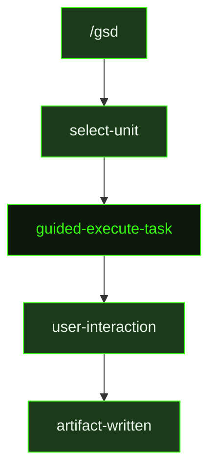

## What It Does

`guided-execute-task` is the interactive counterpart to [`execute-task`](../execute-task/). Where the auto-mode version runs headlessly — the agent executes and writes a summary with no opportunity for user input — the guided version invites collaboration at key decision points. The agent reads the task plan, loads relevant context, and works through implementation steps, but pauses to surface tradeoffs, surface unexpected findings, and let the user steer before committing to a direction.

This is a compact dispatch wrapper — the guided session loads the same templates as auto-mode but adds interactive checkpoints. The source file is 3 lines, delegating directly to the same task plan and artifact conventions that `execute-task` uses. All must-haves, verification steps, and summary requirements are identical.

## Pipeline Position

The `/gsd` command dispatches `guided-execute-task` when the user selects a task to run interactively. After the session, the same task summary artifact is written to disk and the checkbox is marked done.

## Variables

| Variable | Description | Required |
|----------|-------------|----------|
| `taskId` | Current task identifier within the slice (e.g. T01) | Yes |
| `taskTitle` | Human-readable title of the task being executed | Yes |
| `sliceId` | Current slice identifier within the milestone (e.g. S01) | Yes |
| `milestoneId` | Current milestone identifier (e.g. M001) | Yes |
| `inlinedTemplates` | Output template content inlined directly into the prompt | Yes |

## Used By

- [`/gsd`](../../commands/gsd/) — dispatched when the user selects a task to execute in guided (interactive) mode
