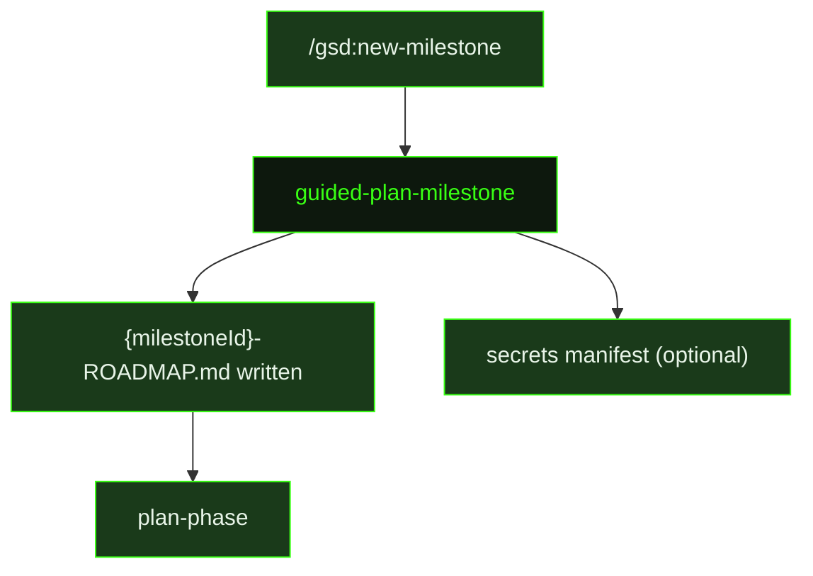

## What It Does

`guided-plan-milestone` builds a milestone roadmap by reading `.gsd/DECISIONS.md` and `.gsd/REQUIREMENTS.md`, surveying existing patterns in the codebase, and writing `{milestoneId}-ROADMAP.md` with a full slice plan. It is the counterpart to the auto-mode `plan-milestone` prompt, dispatched when the user starts a new milestone cycle interactively through [`/gsd:new-milestone`](../../commands/new-milestone/).

The prompt enforces the same planning doctrine as auto-mode: risk-first ordering, demoable vertical slices, truthful demo lines that don't overclaim proof levels, and requirement coverage that maps every active requirement to a slice, deferral, or explicit out-of-scope note. Every slice must be vertical, shippable, and demonstrable to a stakeholder as real product progress — not a developer showing a terminal command or a test runner output. Foundation-only slices are not permitted; if a slice doesn't produce something demoable end-to-end, it must be restructured into a real vertical.

Requirement coverage is enforced: every relevant Active requirement must be mapped to a primary owning slice, deferred with reason, or moved out of scope — orphaned requirements are surfaced rather than silently skipped. If planning produces structural decisions, they are appended to `.gsd/DECISIONS.md`.

After writing the roadmap, `guided-plan-milestone` performs secret forecasting: it analyzes the planned slices and boundary maps for external service dependencies. If any are found, it writes a `{secretsOutputPath}` secrets manifest listing every predicted secret with the service name, a direct dashboard URL for obtaining the key, a format hint, status (`pending`), and destination (`dotenv`, `vercel`, or `convex`). If no external secrets are required, this step is skipped entirely — no empty manifest is created.

## Pipeline Position

`guided-plan-milestone` is dispatched once at the start of each milestone cycle. Its output — `{milestoneId}-ROADMAP.md` — is the authoritative contract that drives all subsequent slice research and planning phases. The optional secrets manifest surfaces credential requirements early so they can be obtained before execution begins.

## Variables

| Variable | Description | Required |
|----------|-------------|----------|
| `milestoneId` | Current milestone identifier (e.g. M001) | Yes |
| `milestoneTitle` | Human-readable title of the milestone being planned | Yes |
| `secretsOutputPath` | File path where the secrets manifest should be written if external services are needed | Yes |
| `inlinedTemplates` | Output template content inlined directly into the prompt (Roadmap and Secrets Manifest templates) | Yes |
| `skillActivation` | Injected skill-loading instruction block; activates any skills relevant to milestone planning | Yes |

## Used By

- [`/gsd:new-milestone`](../../commands/new-milestone/) — dispatched to produce the milestone roadmap when starting a new milestone cycle
