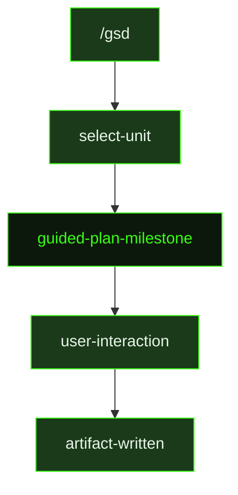

## What It Does

`guided-plan-milestone` is the interactive counterpart to [`plan-milestone`](../plan-milestone/). Where auto-mode reads requirements and decisions and writes the full milestone roadmap in one shot, the guided version structures planning as a dialogue. The agent reads `.gsd/DECISIONS.md` and `.gsd/REQUIREMENTS.md`, surveys the codebase for existing patterns, then works with the user to shape the roadmap — confirming scope, discussing risk ordering, and checking whether the slice decomposition matches what the user is actually trying to build.

The prompt enforces the same planning doctrine as auto-mode: risk-first ordering, demoable vertical slices, truthful demo lines that don't overclaim proof levels, and requirement coverage that maps every active requirement to a slice, deferral, or explicit out-of-scope note. In guided mode, the agent can surface these constraints as questions — "this looks like a foundation-only slice, should we combine it with the next one?" — rather than making those calls silently.

After the roadmap conversation concludes, `guided-plan-milestone` performs secret forecasting: it analyzes the planned slices for external service dependencies and writes a `{milestoneId}-SECRETS.md` manifest if any are found. The output artifacts (`{milestoneId}-ROADMAP.md` and optionally the secrets manifest) are identical in format to auto-mode outputs and feed directly into the slice research and planning phases.

## Pipeline Position

The `/gsd` command dispatches `guided-plan-milestone` when the user starts planning a new milestone interactively. The resulting roadmap feeds into research and planning for each subsequent slice.

## Variables

| Variable | Description | Required |
|----------|-------------|----------|
| `milestoneId` | Current milestone identifier (e.g. M001) | Yes |
| `milestoneTitle` | Human-readable title of the milestone being planned | Yes |
| `secretsOutputPath` | File path where the secrets manifest should be written if external services are needed | Yes |
| `inlinedTemplates` | Output template content inlined directly into the prompt | Yes |

## Used By

- [`/gsd`](../../commands/gsd/) — dispatched when the user starts a new milestone in guided (interactive) mode
